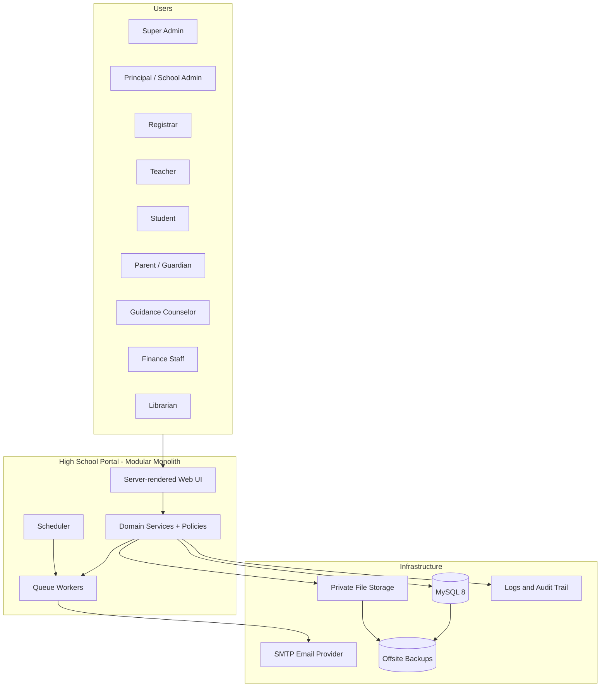
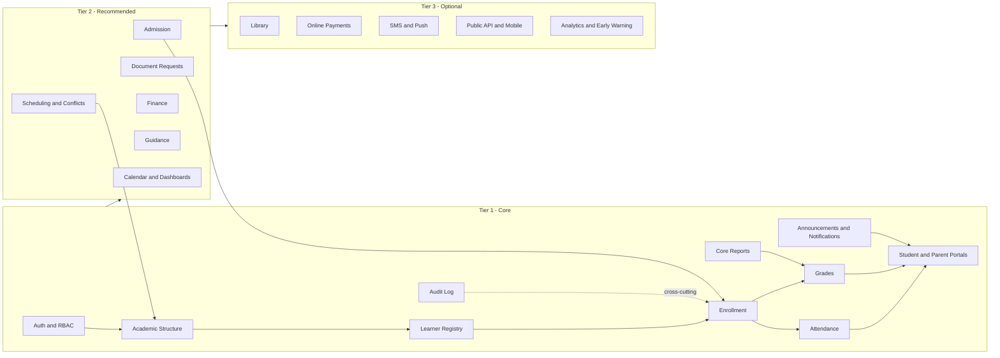
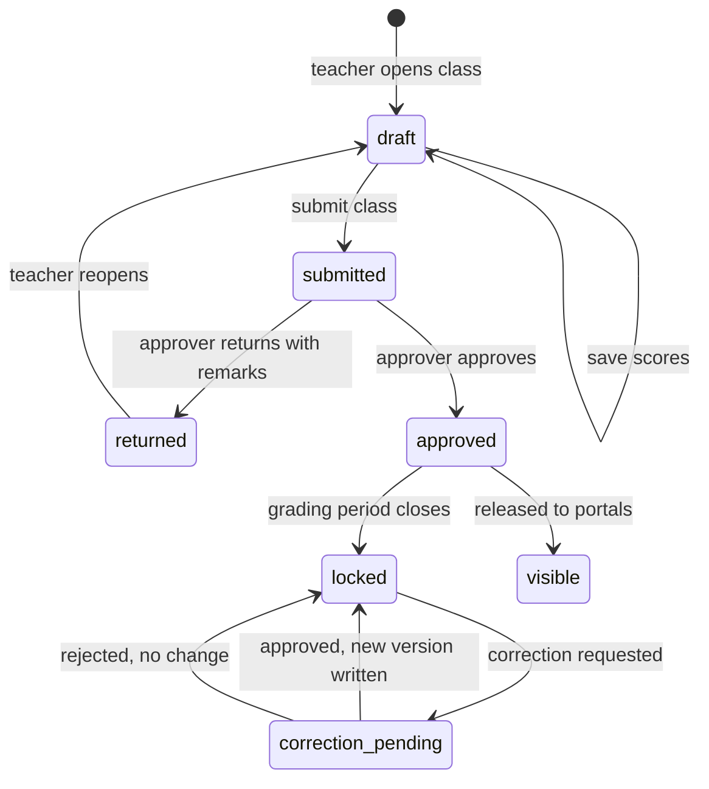
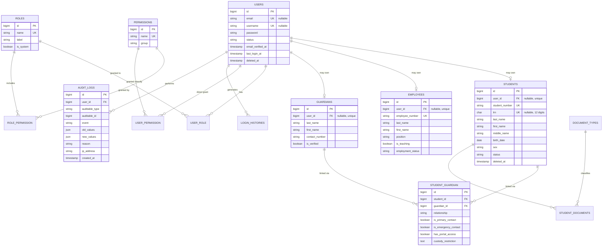
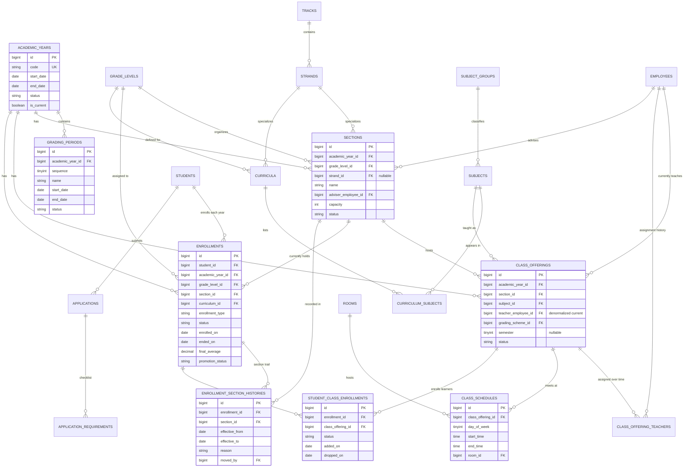
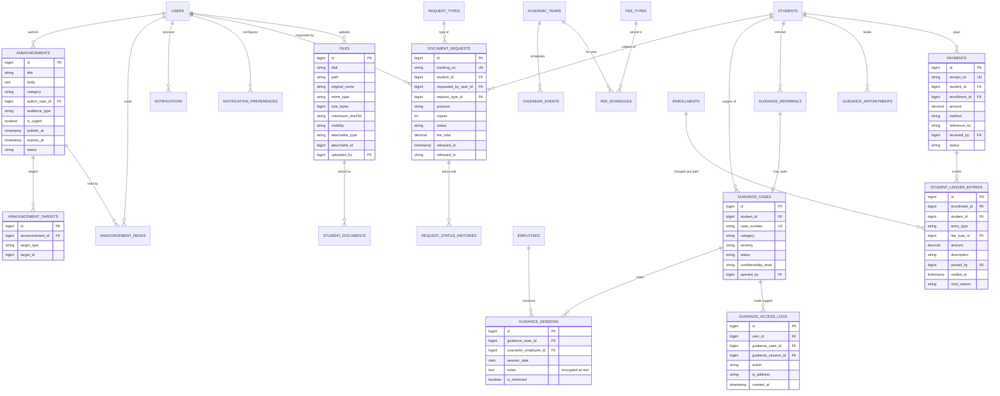
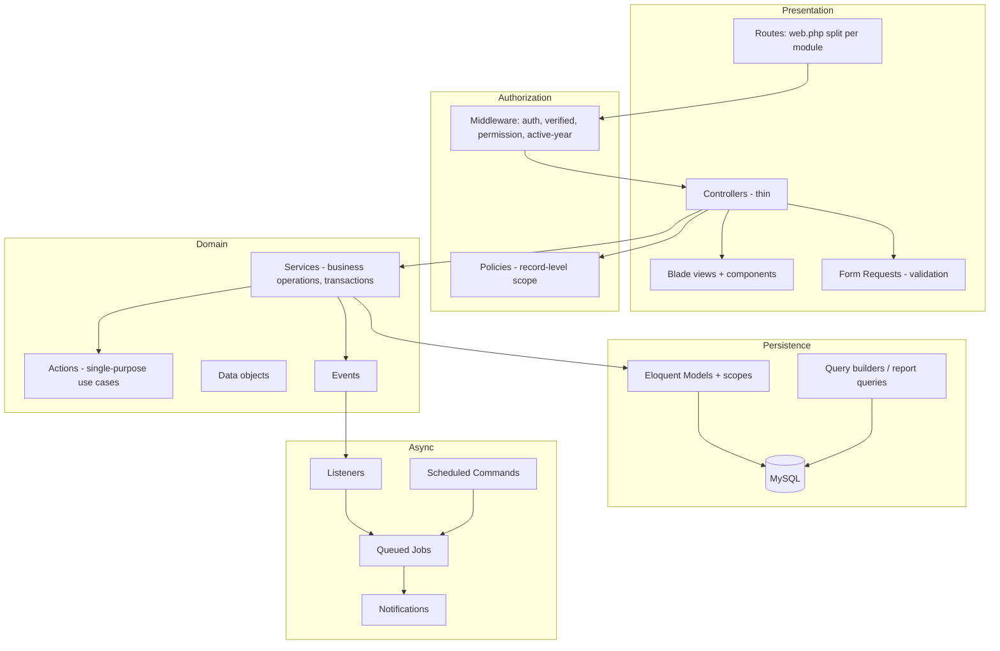
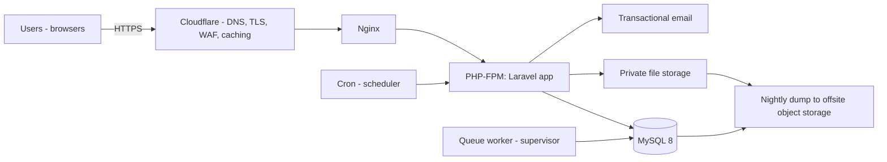
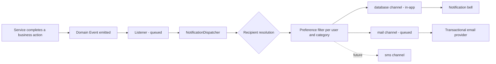
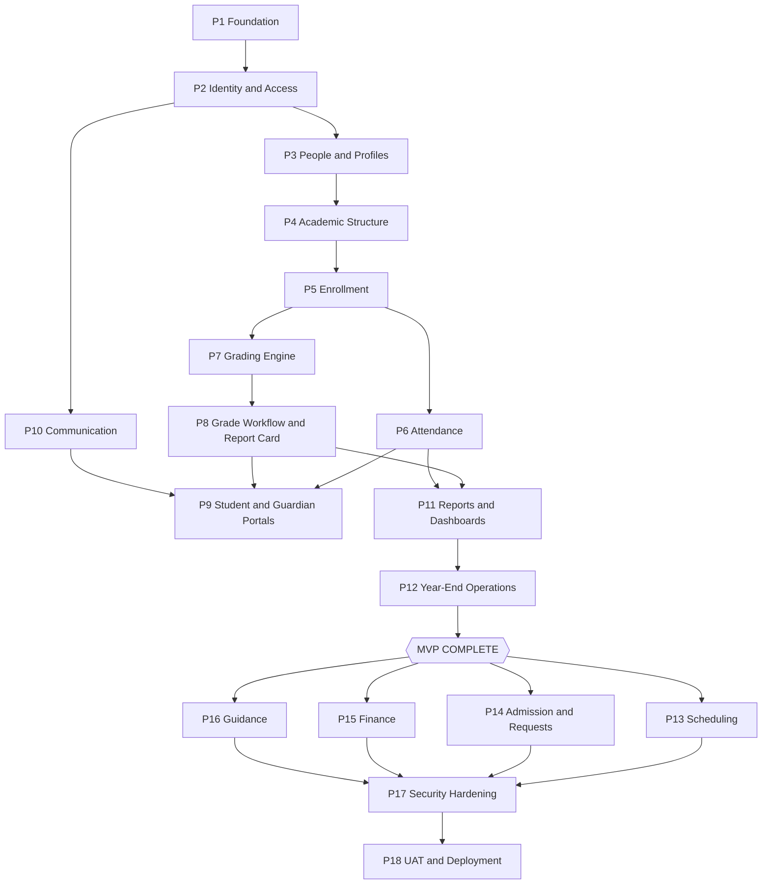

# High School Portal & School Management System
## System Architecture and Planning Document (Pre-Implementation)

**Document version:** 1.0
**Status:** For review. No implementation code is to be written until this document is reviewed and the MVP scope is confirmed.
**Audience:** Developer(s), capstone adviser, school stakeholders (registrar, principal, ICT coordinator).

---

## 0. Context, Assumptions, and Scope Boundaries

This document assumes a specific school context. If any of these assumptions are wrong, several downstream decisions change, so confirm them before Phase 1.

### 0.1 Stated assumptions

| # | Assumption | Why it matters | If wrong |
|---|---|---|---|
| A1 | Philippine high school following the DepEd K-12 program: Junior High School (Grades 7–10) and Senior High School (Grades 11–12) | Determines grade levels, tracks/strands, grading formula, report card format (SF9), permanent record (SF10) | A non-DepEd or international school changes the entire grading and reporting subsystem |
| A2 | Private school (or a school that collects fees) | Justifies the Finance module | A pure public school makes Finance optional/near-empty; drop it from MVP |
| A3 | Enrollment size: roughly 500–2,500 learners, 30–120 staff | Justifies a modular monolith on a single server; rules out microservices and heavy infrastructure | 10,000+ learners would push read-replica and queue-worker planning earlier |
| A4 | One school (one campus). Not multi-tenant SaaS | Removes tenancy scoping from every query — a large simplification | Multi-campus requires a `campus_id` on nearly every table from day one; retrofitting is expensive |
| A5 | Grading follows DepEd Order No. 8, s. 2015 (Written Work / Performance Tasks / Quarterly Assessment) with 4 quarters, transmuted, passing = 75 | Drives the grading engine design | Any other scheme still works — weights are stored as data, not code |
| A6 | Internet connectivity at school is usable but not guaranteed for every classroom; some teachers will encode grades at home | Argues for server-rendered pages, small payloads, forgiving draft-save behaviour, and offline-tolerant workflows (printable class record) | Guaranteed connectivity relaxes some UX requirements |
| A7 | Single developer (student) building with AI assistance over roughly 1–2 semesters | The single biggest constraint in this document. It is the reason for aggressive scope classification | A team of 3–4 could attempt the "Recommended" tier in the same period |
| A8 | The system is a **Student Information System (SIS)**, not a Learning Management System (LMS) | Excludes online quizzes, submissions, discussion boards, course content delivery | If the school wants an LMS, that is a separate product; integrate with Google Classroom instead of rebuilding it |

### 0.2 Explicit non-goals

These are deliberately **out of scope**, and the reason matters:

- **Online learning delivery** (lessons, quizzes, submissions, plagiarism checking) — this is LMS territory. Google Classroom already occupies it, is free, and is entrenched. Rebuilding it produces a worse product and doubles the schema.
- **Automatic timetable generation.** Building a conflict-free master schedule from constraints is an NP-hard scheduling problem. The system will do **conflict detection and prevention**, not generation. This distinction saves months.
- **Payroll / HR management.** Employee records exist for teaching assignments only, not for compensation, leave credits, or government contributions.
- **Accounting system of record.** The Finance module records student charges and payments received. It is not a general ledger and it should not be the school's BIR-registered receipting system (see §11.7 and §28).
- **Biometric / RFID hardware integration.** Designed for later (attendance import interface), not built now.
- **Native mobile apps.** The web UI will be responsive. An API layer is structured for, but not built.

---

## 1. System Overview

### 1.1 Purpose

A centralized, role-aware web application that holds the school's authoritative records for learners, staff, academic structure, enrollment, attendance, grades, and school communication — replacing the current mixture of spreadsheets, paper forms, printed class records, and Messenger group chats.

The system's core value is **a single, auditable source of truth for the learner record**, with controlled, role-appropriate access for the people who need it.

### 1.2 What the system actually does (in one paragraph)

Administrators define an academic year, its grading periods, grade levels, sections, subjects, rooms, and who teaches what. The registrar admits and enrolls learners into that structure, producing an enrollment record that is never overwritten. Teachers then take attendance and encode component scores against their assigned classes; the system computes quarterly grades from a configurable weighting scheme, and grades move through an explicit submit → review → approve → lock lifecycle. Approved grades and attendance become visible to learners and their linked guardians, and at year end they are snapshotted into report cards and a permanent academic record. Around this spine sit communication (announcements, notifications, calendar), service workflows (document requests, guidance referrals), and reporting.

### 1.3 System context diagram



### 1.4 Success criteria (how we know it worked)

The system is successful if, at the end of one full academic quarter running live:

1. Every enrolled learner has a complete attendance record for the quarter, generated from the system rather than reconciled from paper.
2. Every quarterly grade on the report card was computed by the system, not typed in from a teacher's own spreadsheet.
3. The registrar can produce a class list, master list, and report card without exporting to Excel first.
4. Any change to a finalized grade has an attributable actor, timestamp, and stated reason.
5. No guardian has ever seen a learner who is not theirs.

Criterion 5 is a hard security requirement, not an aspiration.

---

## 2. Actors and Roles

### 2.1 Actor definitions

| Role | Real-world holder | Cardinality | Primary purpose in the system | Trust level |
|---|---|---|---|---|
| **Super Admin** | ICT coordinator / developer | 1–2 | System configuration, role and permission management, break-glass access, backups. Not an everyday operational role. | Highest — must be logged intensively |
| **School Admin / Principal** | Principal, Assistant Principal, Academic Head | 1–4 | Oversight, approvals, school-wide announcements, reports. Approves grades if the school delegates it here. | High |
| **Registrar** | Registrar and staff | 1–3 | Owns the learner record: admission, enrollment, sectioning, status changes, official documents, SF10. | High — the true data owner |
| **Teacher** | Subject teachers, class advisers | 20–100 | Attendance and grade encoding for **assigned classes only**. Advisers additionally see their whole section. | Medium — scoped to assignments |
| **Student** | Enrolled learner | 500–2,500 | Read-mostly self-service: schedule, grades, attendance, announcements, requests. | Low |
| **Parent / Guardian** | Parent or legal guardian | 400–2,000 | Read-only view of **linked children only**, plus requests and acknowledgements. | Low |
| **Guidance Counselor** | Guidance office | 1–3 | Counseling cases, appointments, referrals, confidential notes. Access to a *restricted* record class. | High but narrow — separate permission domain |
| **Finance Staff** | Cashier, accounting | 1–4 | Fee assessment, payment posting, balances, clearance. | High but narrow |
| **Librarian** | Library staff | 1–2 | Catalog, borrowing, returns, fines. Optional module. | Low, isolated |
| **School Staff (generic)** | Clerks, property custodian, records aide | varies | Assistive tasks delegated by a primary role. Exists mainly so permissions can be granted narrowly instead of handing out a Registrar account. | Lowest privileged |

### 2.2 Role model design decision

Two design points, both deliberate:

**Roles are containers of permissions; permissions are checked, not roles.** Code asks `can('grade.approve')`, never `if (user.role === 'Principal')`. This is what makes "additional roles can be added later without redesigning the system" actually true. A new role — say *Academic Coordinator* — is a database row plus a permission selection, not a code change.

**A user may hold multiple roles.** This is not a hypothetical: in a real school, the Registrar frequently also teaches one subject, an Assistant Principal advises a section, and a teacher's own child studies at the school. The system must handle a user who is simultaneously Teacher, Parent, and Registrar. Consequence: **permissions union, but record scoping intersects with context.** A teacher-parent viewing their own child's grades goes through the *parent* access path (limited to that child) and does not gain teacher-level access to that child's other subjects.

### 2.3 Person vs. User — a critical modelling decision

`users` (login credentials) and `students` / `employees` / `guardians` (people) are **separate tables** with a nullable link.

Reasons:
- An applicant exists as a person before any account exists.
- A guardian may never log in (many will not) but must still be recorded as an emergency contact.
- An alumnus must retain a permanent academic record after their login is disabled.
- Deactivating a login must never delete a person's academic history.

This single decision prevents a large class of data-loss bugs later.

---

## 3. Functional Requirements

Numbered for traceability to tests and to the roadmap. `FR-<module>-<n>`.

### 3.1 Identity and Access (FR-IAM)

| ID | Requirement | Priority |
|---|---|---|
| FR-IAM-01 | Users authenticate with email (or username for learners without email) and password | Core |
| FR-IAM-02 | Passwords are hashed with bcrypt/argon2; never stored or logged in plaintext | Core |
| FR-IAM-03 | Staff accounts are created by an administrator, not self-registered | Core |
| FR-IAM-04 | Learner and guardian accounts are provisioned by the registrar upon enrollment, with a one-time activation link or first-login password change | Core |
| FR-IAM-05 | Email verification is required before a self-service account can access personal records | Core |
| FR-IAM-06 | Password reset via signed, expiring, single-use token sent to a verified address | Core |
| FR-IAM-07 | Accounts can be activated, deactivated, or locked; deactivation is reversible and never deletes records | Core |
| FR-IAM-08 | Role assignment and permission changes are restricted to Super Admin and are audited | Core |
| FR-IAM-09 | Login, logout, and failed-login attempts are recorded with timestamp, IP, and user agent | Core |
| FR-IAM-10 | Sessions expire after inactivity; users can view and terminate their other active sessions | Recommended |
| FR-IAM-11 | Two-factor authentication available for privileged roles | Recommended |
| FR-IAM-12 | Profile management: display name, contact number, profile photo, password change | Core |
| FR-IAM-13 | Forced password change on first login and after an admin reset | Core |

### 3.2 Learner Registry (FR-STU)

| ID | Requirement | Priority |
|---|---|---|
| FR-STU-01 | Maintain a learner profile: LRN, student number, full name (incl. middle name and suffix), sex, birth date, birthplace, address, contact | Core |
| FR-STU-02 | LRN is unique when present; student number is system-generated and unique | Core |
| FR-STU-03 | A learner may have multiple guardians, each with a relationship type and flags (primary contact, emergency, portal access, authorized for pickup) | Core |
| FR-STU-04 | Learner status is an explicit lifecycle value: `applicant`, `enrolled`, `inactive`, `transferred_out`, `dropped`, `graduated` | Core |
| FR-STU-05 | Enrollment history is preserved per academic year and never overwritten by the current enrollment | Core |
| FR-STU-06 | Section transfers within a year are recorded with effective dates and reason, preserving the prior assignment | Core |
| FR-STU-07 | Learner documents (birth certificate, Form 137, good moral, ID photo) can be uploaded, typed, and marked verified | Recommended |
| FR-STU-08 | Duplicate-learner detection on create (fuzzy match on name + birth date + LRN) with an explicit "confirm not a duplicate" step | Recommended |
| FR-STU-09 | Merge two duplicate learner records, preserving both histories under the surviving record | Optional |

### 3.3 Admission and Enrollment (FR-ENR)

| ID | Requirement | Priority |
|---|---|---|
| FR-ENR-01 | Public application form for new and transferring applicants, producing an applicant record with a tracking reference | Recommended |
| FR-ENR-02 | Requirements checklist per applicant type, with per-item status and optional file upload | Recommended |
| FR-ENR-03 | Registrar verifies requirements and approves/rejects with remarks | Recommended |
| FR-ENR-04 | Approval converts an applicant into a learner record | Recommended |
| FR-ENR-05 | Enrollment assigns a learner to exactly one (academic year, grade level, section) — enforced by a unique constraint | Core |
| FR-ENR-06 | Enrolling a learner in a section auto-creates their subject class enrollments from the section's offerings | Core |
| FR-ENR-07 | SHS learners may have subject enrollments that differ from the section default (added/dropped individually) | Core (SHS) |
| FR-ENR-08 | Section capacity is enforced with an explicit override that requires a reason and is audited | Recommended |
| FR-ENR-09 | Continuing learners are bulk-promoted at year-end based on final grades, with per-learner exceptions (retained, graduated, transferred) | Core |
| FR-ENR-10 | Late enrollment after the cutoff requires elevated approval and is flagged on the record | Recommended |
| FR-ENR-11 | Cancelling an enrollment sets a status and end date; it never deletes attendance or grades already recorded | Core |

### 3.4 Academic Structure (FR-ACA)

| ID | Requirement | Priority |
|---|---|---|
| FR-ACA-01 | Create academic years with start/end dates and a lifecycle (`planning` → `active` → `closed`); exactly one may be `active` | Core |
| FR-ACA-02 | Define grading periods (quarters) per academic year, each with encoding open/close dates and a lock state | Core |
| FR-ACA-03 | Maintain grade levels, and for SHS, tracks and strands | Core |
| FR-ACA-04 | Maintain subjects with a code, title, subject group, and unit/hour load | Core |
| FR-ACA-05 | Curriculum: define which subjects a given grade level (and strand) must take | Core |
| FR-ACA-06 | Sections belong to one academic year and grade level, have an adviser and optional home room and capacity | Core |
| FR-ACA-07 | A **class offering** links (academic year, section, subject, teacher) and is the unit against which attendance and grades are recorded | Core |
| FR-ACA-08 | Class meeting times are scheduled per offering with day, start/end time, and room | Recommended |
| FR-ACA-09 | The system rejects a schedule entry that double-books a teacher, a room, or a section in overlapping time | Recommended |
| FR-ACA-10 | Rooms are maintained with code, capacity, and type | Recommended |
| FR-ACA-11 | Copying/cloning last year's structure (sections, offerings, schedules) into a new year | Recommended |

### 3.5 Attendance (FR-ATT)

| ID | Requirement | Priority |
|---|---|---|
| FR-ATT-01 | Daily homeroom attendance recorded per section per school day (this is what SF2 requires) | Core |
| FR-ATT-02 | Attendance statuses: Present, Absent, Late, Excused, plus a system value for non-school days | Core |
| FR-ATT-03 | A teacher may record attendance only for classes/sections they are assigned to | Core |
| FR-ATT-04 | Attendance for a date can be saved as draft and then submitted; submitted records require a reason to amend | Core |
| FR-ATT-05 | Attendance cannot be recorded for a date outside the academic year, on a holiday, or in the future | Core |
| FR-ATT-06 | Excuse requests with supporting documents convert an Absent to Excused upon approval | Recommended |
| FR-ATT-07 | Learners and linked guardians can view attendance history and monthly summaries | Core |
| FR-ATT-08 | Configurable alert when a learner's absences in a period cross a threshold, notifying adviser and guardian | Recommended |
| FR-ATT-09 | Per-subject attendance (in addition to homeroom) can be enabled per school setting | Optional |

### 3.6 Grades (FR-GRD)

| ID | Requirement | Priority |
|---|---|---|
| FR-GRD-01 | Grade components follow a configurable weighting scheme (e.g. Written Work / Performance Task / Quarterly Assessment percentages) stored as data per subject group and grade stage | Core |
| FR-GRD-02 | Teachers record either (a) individual assessment scores that the system totals, or (b) component totals directly. Mode is configurable per school | Core |
| FR-GRD-03 | The system computes percentage score → weighted score → initial grade → transmuted grade using a stored transmutation table | Core |
| FR-GRD-04 | Grades have an explicit lifecycle: `draft` → `submitted` → `approved` → `locked`, with `returned` as a rejection path | Core |
| FR-GRD-05 | Learners and guardians see only `approved` or `locked` grades — never drafts | Core |
| FR-GRD-06 | A locked grade can only change through a grade-correction request with a stated reason and an approver; both old and new values are retained permanently | Core |
| FR-GRD-07 | Encoding is blocked when the grading period is closed, unless explicitly reopened by an authorized role (audited) | Core |
| FR-GRD-08 | Final subject grade = average of the four quarterly grades, with pass/fail remarks at a configurable passing mark | Core |
| FR-GRD-09 | Report card generation (SF9-equivalent) per learner per year, printable | Core |
| FR-GRD-10 | Permanent record (SF10-equivalent) accumulating all years | Recommended |
| FR-GRD-11 | Honor roll computation using configurable thresholds and eligibility rules | Recommended |
| FR-GRD-12 | Teacher-facing class record printout matching the DepEd class record layout | Recommended |

### 3.7 Portals and Communication (FR-COM)

| ID | Requirement | Priority |
|---|---|---|
| FR-COM-01 | Role-specific dashboards showing only actionable information | Core |
| FR-COM-02 | Announcements with a targeted audience (all, role, grade level, section, class, individual), scheduled publish, and expiry | Core |
| FR-COM-03 | Per-recipient read tracking for announcements | Recommended |
| FR-COM-04 | In-app notification centre with unread count | Core |
| FR-COM-05 | Email notification for a defined set of events, sent asynchronously via queue | Core |
| FR-COM-06 | Per-user notification preferences by channel and category | Recommended |
| FR-COM-07 | School calendar with typed events (holiday, exam, deadline, activity) visible per audience | Recommended |
| FR-COM-08 | A guardian account linked to multiple children can switch context between them | Core |
| FR-COM-09 | Structured message/inquiry from guardian to adviser or office (not a general chat system) | Optional |

### 3.8 Services and Records (FR-SVC)

| ID | Requirement | Priority |
|---|---|---|
| FR-SVC-01 | Learners/guardians submit document requests (certificate of enrollment, good moral, Form 137, etc.) with purpose and copies | Recommended |
| FR-SVC-02 | Requests have a tracked status pipeline with timestamps and an assigned processor | Recommended |
| FR-SVC-03 | Requests requiring clearance are blocked while an outstanding obligation exists | Optional |
| FR-SVC-04 | Guidance: counseling cases, session notes, appointments, referrals | Recommended |
| FR-SVC-05 | Guidance notes are readable only by counselors (and explicitly named delegates), never by teachers or general admin | Core (if guidance is built) |
| FR-SVC-06 | Every read of a guidance note is logged | Core (if guidance is built) |
| FR-SVC-07 | Finance: fee schedules per grade level, per-learner assessment, payment posting, running balance, statement of account | Recommended |
| FR-SVC-08 | Payments are append-only; corrections are made by voiding with a reason, never by editing or deleting | Core (if finance is built) |
| FR-SVC-09 | Library: catalog, copies, borrow/return, due dates, fines | Optional |

### 3.9 Reporting and Administration (FR-REP)

| ID | Requirement | Priority |
|---|---|---|
| FR-REP-01 | Standard reports: master list, class list, enrollment summary, attendance summary, grade sheet, honor roll, teacher load, outstanding balances, request log | Core (subset) |
| FR-REP-02 | Every report supports on-screen view with filters, and export to PDF and/or CSV/Excel | Core |
| FR-REP-03 | Audit log viewer with filters by actor, entity, action, and date range | Core |
| FR-REP-04 | System settings screen for school profile, grading configuration, thresholds, and feature toggles | Core |

---

## 4. Non-Functional Requirements

| Category | Requirement | Target / Rationale |
|---|---|---|
| **Performance** | Standard page render (server-side, incl. query time) | < 800 ms at p95 on the target host for pages with pagination |
| | Grade encoding screen for a class of 50 | < 1.5 s initial load; saving a full class < 2 s |
| | Report generation (class-level) | < 5 s synchronous; anything longer runs as a queued job with download notification |
| **Concurrency** | Simultaneous active users | 150 concurrent (peak = card-release day and enrollment week). This is the sizing driver, not average load. |
| **Availability** | Uptime during school hours | 99% target. This is a school system, not a payment gateway; a planned maintenance window is acceptable |
| **Data integrity** | Financial and grade records | No hard deletes. All mutations of finalized data are versioned and attributable |
| | Multi-step operations | Wrapped in DB transactions; partial enrollment or partial grade submission must be impossible |
| **Security** | See §11 in full | OWASP Top 10 addressed explicitly; least privilege enforced server-side |
| **Privacy** | Personal data handling | Compliant with RA 10173 (Data Privacy Act of 2012) principles: transparency, legitimate purpose, proportionality |
| **Auditability** | Sensitive actions | Actor, action, entity, timestamp, IP, before/after values retained ≥ 3 years |
| **Usability** | Teacher core tasks (attendance for one class, grades for one class) | Completable in ≤ 3 clicks from the dashboard, on a phone screen if necessary |
| | Learning curve | A teacher should complete attendance unaided after a 10-minute demo |
| **Accessibility** | WCAG 2.1 AA as a target | Keyboard navigable, 4.5:1 contrast, labelled form controls, no colour-only status indication |
| **Responsiveness** | Breakpoints | Functional at 360 px width. Teachers and parents *will* use phones. Data-dense admin tables may require horizontal scroll below 768 px — that is acceptable and expected |
| **Browser support** | Chrome, Edge, Firefox, Safari (current − 2 versions) | No IE11 |
| **Maintainability** | Code organisation | Feature-oriented modules, thin controllers, domain services, policies. A new developer should locate the code for a given feature in under 5 minutes |
| **Testability** | Coverage targets | 100% of authorization policies, 100% of grade computation, ≥ 80% of enrollment/attendance service logic. Overall line coverage is *not* a target — targeted coverage is |
| **Backup / Recovery** | RPO / RTO | RPO 24 h (nightly offsite DB dump), RTO 4 h. During grading week, RPO 6 h |
| **Localization** | Language | English UI. Names and addresses must support Filipino naming conventions (long names, `Ñ`, multiple given names, suffixes: Jr., III) — use `utf8mb4` throughout |
| **Retention** | Academic records | Permanent (SF10 is a lifetime record). Operational logs: 1–3 years. Applicant data for unenrolled applicants: 1 year then archive/purge |

---

## 5. Feature Classification: Core / Recommended / Optional

The single most important section for a project of this scope. Attempting all 15 modules in one capstone is the most likely cause of failure.

### 5.1 Tier 1 — Core (the system is not a High School Portal without these)

| Module | Justification |
|---|---|
| Authentication, RBAC, account lifecycle | Nothing else can be safely built on top. Every other module depends on it |
| Academic structure (year, periods, levels, sections, subjects, class offerings) | The skeleton. Attendance, grades, and schedules are all meaningless without it |
| Learner registry + guardian linking | The primary entity of the entire system |
| Enrollment (with preserved history) | The join between a learner and the academic structure; the source of every class list |
| Attendance (daily homeroom) | Legally required record-keeping (SF2), and a daily-use feature that proves adoption |
| Grades (encode → submit → approve → lock → report card) | The highest-value feature for every stakeholder and the hardest to get right |
| Announcements + in-app/email notifications | The reason parents and students log in between card-release days |
| Student portal and Parent portal (read-focused) | Without these it is an internal admin tool, not a "portal" |
| Audit logging | Non-negotiable given grades, money, and minors' data. Retrofitting audit is painful |
| Core reports (master list, class list, grade sheet, attendance summary, report card) | The registrar's actual daily job |

### 5.2 Tier 2 — Recommended (build after Core is stable and live)

| Module | Justification for the tier |
|---|---|
| Admission / online application | High value to the school, but the school can enroll learners without it (registrar creates records directly). It is a *front door*, not a *spine*. Also seasonally used — only correct for a few weeks a year, which makes it a poor early proving ground |
| Class scheduling with conflict detection | Genuinely valuable and the conflict-detection logic is a strong thesis talking point. But grades and attendance work without a stored timetable (the offering-teacher link suffices). Building it early risks blocking on the school's messy real schedule |
| Document requests | Clear workflow value, but it is an add-on service. Low risk to defer |
| School calendar | Cheap to build, moderate value. Sequence it with announcements |
| Finance (assessment, payments, balances, SOA) | Valuable and often demanded — but see §28: recording money creates accountability obligations. Build it after the academic core is trustworthy, and keep it as a *record of payments received*, not a receipting authority |
| Guidance module | Real need, but the highest privacy risk in the entire system. It should be built only when access control and audit are proven, and ideally with the counselor's direct involvement. A half-built guidance module is worse than none |
| Role dashboards with real KPIs | Depends on data that only exists once the Core modules run |
| Honor roll / ranking | Depends on complete, locked grades for a full year |
| Excuse handling, absence alerts | Refinements on attendance |

### 5.3 Tier 3 — Optional / Future

| Module | Why deferred |
|---|---|
| Library management | A complete, self-contained system of its own with almost zero coupling to the academic spine. It adds ~6 tables and a full CRUD surface for marginal thesis value. Strong candidate to cut entirely, or to build last as a demonstration of the modular architecture |
| Online payments (gateway integration) | Requires merchant onboarding, reconciliation logic, refund handling, and PCI-adjacent care. Not justified unless the school explicitly requires cashless collection. A payment gateway that half-works is a liability |
| SMS / push notifications | Recurring cost and provider onboarding. Design the channel abstraction now, implement later |
| Mobile app / public REST API | No consumer exists yet. Structure for it (§17), do not build it |
| Analytics, at-risk prediction, "AI features" | Requires several years of historical data to be anything other than decoration. A rules-based early-warning rule (e.g. "3+ absences in 2 weeks AND a failing quarter grade") delivers 90% of the practical value with 2% of the complexity and no false sophistication. **Do not add machine learning to satisfy a thesis panel's appetite for buzzwords — a defensible rules engine is the stronger engineering answer** |
| Biometric / RFID attendance | Hardware dependency. Design an attendance import endpoint as the seam |
| Multi-campus support | Assumption A4. Deliberately excluded |
| LMS features | Out of scope per §0.2 |

### 5.4 Classification summary



---

## 6. Role and Permission Matrix

### 6.1 The two-layer authorization model

A permission matrix alone is insufficient and is where most school systems leak data. Authorization has **two independent layers**, and both must pass:

1. **Capability (permission):** *May this user perform this kind of action at all?* — e.g. `grade.encode`. Handled by a permission table attached to roles.
2. **Record scope (policy):** *May this user perform it on **this specific record**?* — e.g. "only for class offerings where `teacher_id = me`". Handled by framework policies that receive the actual model instance.

A teacher with `grade.encode` must still fail `GradePolicy::encode($user, $classOffering)` for a class that is not theirs. **Hiding the menu item is not authorization.** Every controller action, every route, and every export must run both checks server-side.

### 6.2 Permission naming convention

`<domain>.<action>[.<qualifier>]` — lowercase, dot-separated.

Standard actions: `view`, `view.any`, `view.own`, `create`, `update`, `delete`, `restore`, `approve`, `submit`, `export`, `manage`.

Examples: `student.view.any`, `student.view.assigned`, `grade.approve`, `guidance.note.read`, `finance.payment.void`, `user.role.assign`.

### 6.3 Master permission matrix

Legend: **F** = full / all records · **S** = scoped (only records the user is related to) · **A** = approve/authorize only · **R** = read-only · **–** = no access · **!** = requires elevated confirmation + reason, always audited

| Capability | Super Admin | Principal | Registrar | Teacher | Adviser* | Student | Guardian | Guidance | Finance | Librarian | Staff |
|---|---|---|---|---|---|---|---|---|---|---|---|
| **Users & Access** |
| View user accounts | F | R | R | – | – | – | – | – | – | – | – |
| Create / edit user account | F | – | S¹ | – | – | – | – | – | – | – | – |
| Activate / deactivate account | F | ! | S¹ | – | – | – | – | – | – | – | – |
| Assign roles / permissions | F! | – | – | – | – | – | – | – | – | – | – |
| Reset another user's password | F! | – | S¹! | – | – | – | – | – | – | – | – |
| View audit log | F | R | R² | – | – | – | – | R² | R² | – | – |
| Edit own profile | F | F | F | F | F | F | F | F | F | F | F |
| **Learner records** |
| View learner profile | F | F | F | S | S | own | S(children) | F³ | R⁴ | R⁵ | – |
| Create learner record | F | – | F | – | – | – | – | – | – | – | – |
| Edit learner personal info | F! | – | F | – | – | request | request | – | – | – | – |
| Edit learner contact info | F | – | F | – | – | S(own) | S(children) | – | – | – | – |
| Change learner status | F! | A | F | – | – | – | – | – | – | – | – |
| Delete learner record | – | – | – | – | – | – | – | – | – | – | – |
| Archive learner record | F! | A | ! | – | – | – | – | – | – | – | – |
| View learner documents | F | R | F | – | S⁶ | own | children | R | – | – | – |
| Upload learner documents | F | – | F | – | – | S(own) | S(children) | – | – | – | – |
| Link / unlink guardian | F | – | F | – | – | – | – | – | – | – | – |
| **Admission** |
| View applications | F | R | F | – | – | – | own | – | R | – | S |
| Verify requirements | F | – | F | – | – | – | – | – | – | – | S |
| Approve / reject application | F | A | A | – | – | – | – | – | – | – | – |
| **Enrollment** |
| View enrollment records | F | F | F | S | S | own | children | R | R | – | – |
| Enroll a learner | F | – | F | – | – | – | – | – | – | – | – |
| Change section | F! | A | F | – | – | – | – | – | – | – | – |
| Cancel / drop enrollment | F! | A | F! | – | – | – | – | – | – | – | – |
| Year-end promotion run | F! | A | F! | – | – | – | – | – | – | – | – |
| **Academic structure** |
| View structure | F | F | F | R | R | R | R | R | R | – | R |
| Manage academic year / periods | F | A | F | – | – | – | – | – | – | – | – |
| Open / close grading period | F | A | F | – | – | – | – | – | – | – | – |
| Manage subjects / curriculum | F | A | F | – | – | – | – | – | – | – | – |
| Manage sections | F | A | F | – | – | – | – | – | – | – | – |
| Assign teachers to classes | F | A | F | – | – | – | – | – | – | – | – |
| Manage schedule / rooms | F | A | F | – | – | – | – | – | – | – | – |
| **Attendance** |
| Record attendance | F | – | – | S | S | – | – | – | – | – | – |
| Amend submitted attendance | F! | A | ! | S! | S! | – | – | – | – | – | – |
| View attendance | F | F | F | S | S | own | children | R | – | – | – |
| Approve excuse request | F | A | A | – | S | – | – | A | – | – | – |
| Attendance reports | F | F | F | S | S | own | children | R | – | – | – |
| **Grades** |
| Encode / save draft grades | F | – | – | S | S | – | – | – | – | – | – |
| Submit grades | – | – | – | S | S | – | – | – | – | – | – |
| Approve / return grades | – | A | A | – | – | – | – | – | – | – | – |
| Lock grading period | F! | A | F | – | – | – | – | – | – | – | – |
| View approved grades | F | F | F | S | S | own | children | R⁷ | – | – | – |
| View draft grades | – | – | – | S(own class) | S | – | – | – | – | – | – |
| Request grade correction | – | – | – | S | S | – | – | – | – | – | – |
| Approve grade correction | – | A! | A! | – | – | – | – | – | – | – | – |
| Generate report card | F | F | F | S(adviser) | S | own | children | – | – | – | – |
| Honor roll computation | F | A | F | – | – | – | – | – | – | – | – |
| **Guidance (restricted domain)** |
| Create referral | F | S | – | S | S | – | – | F | – | – | – |
| View own submitted referral | – | S | – | S | S | – | – | F | – | – | – |
| View guidance case list | – | R⁸ | – | – | – | – | – | F | – | – | – |
| Read guidance session notes | – | – | – | – | – | – | – | F(logged) | – | – | – |
| Edit / close guidance case | – | – | – | – | – | – | – | F | – | – | – |
| Book counseling appointment | – | – | – | S | S | own | children | F | – | – | – |
| **Finance** |
| View fee schedule | F | F | R | – | – | R | R | – | F | – | – |
| Manage fee schedule | F | A | – | – | – | – | – | – | F | – | – |
| Assess learner fees | F | – | – | – | – | – | – | – | F | – | – |
| Post payment | – | – | – | – | – | – | – | – | F | – | – |
| Void payment | – | A! | – | – | – | – | – | – | !⁹ | – | – |
| View balance / SOA | F | F | R | – | – | own | children | – | F | – | – |
| Financial reports | F | F | – | – | – | – | – | – | F | – | – |
| **Communication** |
| Post school-wide announcement | F | F | F | – | – | – | – | S | S | S | – |
| Post class/section announcement | F | F | F | S | S | – | – | – | – | – | – |
| Manage calendar events | F | F | F | – | – | – | – | S | – | – | S |
| View announcements | F | F | F | F | F | S | S | F | F | F | F |
| **Requests & documents** |
| Submit document request | – | – | – | – | – | own | children | – | – | – | – |
| Process / release request | F | R | F | – | – | – | – | – | R | – | S |
| Track own request | – | – | – | – | – | own | children | – | – | – | – |
| **Library (optional)** |
| Manage catalog | F | – | – | – | – | – | – | – | – | F | – |
| Issue / return / fine | F | – | – | – | – | – | – | – | R | F | – |
| View own borrowing history | – | – | – | own | own | own | children | – | – | F | – |
| **System** |
| Manage system settings | F | – | – | – | – | – | – | – | – | – | – |
| Manage grading configuration | F | A | F | – | – | – | – | – | – | – | – |
| Trigger backup / view health | F | – | – | – | – | – | – | – | – | – | – |
| Impersonate a user | F! | – | – | – | – | – | – | – | – | – | – |

\* **Adviser** is not a separate role — it is a *contextual capability* held by a Teacher who is the `adviser_id` of a section. It broadens their scope from "my subject classes" to "my whole advisory section", without granting school-wide access.

Footnotes:
1. Registrar may manage **learner and guardian** accounts only — never staff accounts, never role assignment.
2. Scoped audit view: only entries for entities within their own domain (registrar sees enrollment/record events; finance sees financial events).
3. Guidance sees the learner's basic profile and contact info; they do **not** get edit rights on the academic record.
4. Finance sees name, section, grade level, status — the minimum needed to bill and clear. Not grades, not attendance detail, not guidance.
5. Librarian sees name, section, and borrowing status only.
6. Adviser sees documents flagged as adviser-visible (e.g. requirements checklist), not sensitive documents such as medical or legal records.
7. Guidance sees grades because academic decline is a primary counseling trigger — but read-only and logged.
8. Principal sees that a case exists and its status, for oversight — **not the session notes**. This is deliberate and should be confirmed with the school; some schools will disagree, and that is a policy decision to record, not an engineering one.
9. Voiding a payment requires a second authorizer (maker–checker). A single finance user must not be able to both post and void.

### 6.4 Actions requiring elevated authorization (the `!` set)

These require: (a) a re-entered password or a confirmation modal, (b) a mandatory free-text reason, (c) an audit entry with before/after values, and (d) a notification to the Principal or Super Admin.

- Assigning or revoking any role or permission
- Approving a grade correction on a locked grade
- Reopening a closed grading period
- Voiding a posted payment
- Cancelling an enrollment that already has grades or attendance
- Archiving a learner record
- Overriding section capacity
- Impersonating another user
- Bulk operations affecting more than 50 records

### 6.5 Restricted record classes

Not all records are equal. The system recognises four sensitivity classes, and they drive both permissions and audit depth:

| Class | Examples | Default visibility | Audit on read? |
|---|---|---|---|
| **Public-internal** | Announcements, calendar, subject catalog, section list | All authenticated users | No |
| **Standard learner data** | Name, section, schedule, attendance, approved grades | Owner, linked guardians, assigned teachers, registrar, admin | No (writes only) |
| **Sensitive** | Address, birth date, guardian contact, health notes, financial balance, learner documents | Registrar, admin, and the specific office that needs it | Writes + bulk exports |
| **Restricted** | Guidance case notes, referral details, disciplinary records | Guidance only, plus named delegates | **Yes — every read** |

---

## 7. Business Workflows

Each workflow below specifies actors, preconditions, main flow, alternates, validation, failures, notifications, and audit events.

### 7.1 WF-01 — Student Admission

**Actors:** Applicant/Guardian (public), Registrar, Admission Staff, Principal
**Preconditions:** An academic year exists with status `planning` or `active`; admission is open for the target grade level; requirement types are configured.

**Main flow**
1. Applicant submits the public application form (personal data, target grade level and strand, previous school, guardian details).
2. System creates an `application` with status `submitted` and a unique tracking reference; sends acknowledgement email with the reference.
3. System generates a requirements checklist from the requirement template for the applicant type (new / transferee / returning).
4. Applicant uploads documents or presents them physically.
5. Registrar reviews each requirement item and marks it `verified` or `rejected` with remarks. Application moves to `under_review`.
6. When all mandatory items are verified, the application becomes `for_approval`.
7. Registrar (or Principal, per school policy) approves.
8. On approval the system, in one transaction: creates the `student` record, generates the student number, provisions a learner user account and a guardian account, and links them.
9. Application status → `approved`; applicant is notified with enrollment instructions.

**Alternative flows**
- **A1 — Incomplete requirements:** status → `pending_requirements`; applicant notified of specific missing items; a configurable reminder fires after N days.
- **A2 — Rejected:** status → `rejected` with a mandatory reason; applicant notified; record retained for the retention period, then archived.
- **A3 — Walk-in applicant:** registrar creates the application directly on behalf of the applicant; same pipeline from step 3.
- **A4 — Returning learner (former student):** system matches on LRN/name/birth date and reuses the existing `student` record instead of creating a duplicate.
- **A5 — Waitlist:** approved but no slot in the target level; status → `waitlisted`, ordered by submission time.

**Validation rules**
- Target grade level must exist and be open for admission in the target year.
- LRN, when supplied, must be 12 digits and must not already belong to a *currently enrolled* different learner.
- Birth date must yield a plausible age for the grade level (warn, do not block — over-age and under-age learners are real).
- File uploads: allowed types and size limits per §16.
- Approval requires all mandatory requirement items in `verified` state — enforced server-side, not just in the UI.

**Failure scenarios**
- Duplicate applicant detected → flag for manual review, block auto-creation.
- Account provisioning fails (e.g. email already used) → whole transaction rolls back; application remains `for_approval`; error surfaced to registrar with the specific conflict.
- Email delivery fails → application still succeeds; notification is retried by the queue; registrar sees a "notification failed" indicator.

**Notifications:** applicant (submitted, missing requirements, approved/rejected), registrar (new application), principal (daily digest of pending approvals).
**Audit events:** `application.submitted`, `requirement.verified`, `requirement.rejected`, `application.approved`, `application.rejected`, `student.created`, `user.provisioned`.

---

### 7.2 WF-02 — Enrollment

**Actors:** Registrar, Adviser (view), Learner/Guardian (confirmation)
**Preconditions:** Learner record exists; academic year is `active`; grade level, sections, and class offerings for that year exist.

**Main flow**
1. Registrar selects the learner and the academic year.
2. System checks for an existing enrollment in that year (unique constraint on `student_id + academic_year_id`).
3. Registrar selects grade level, then section (system shows current occupancy vs capacity), and enrollment type (`new`, `continuing`, `transferee`, `returning`).
4. System previews the subject load derived from the curriculum for that grade level/strand and the section's class offerings.
5. Registrar confirms. In a single transaction the system creates the `enrollment`, creates one `student_class_enrollment` per offering, writes the initial section-history row, and sets the learner's status to `enrolled`.
6. System issues an enrollment confirmation (printable) and notifies the learner/guardian.

**Alternative flows**
- **A1 — SHS subject adjustment:** registrar adds or drops individual subject enrollments; each carries a date and reason.
- **A2 — Section full:** blocked unless the user holds the capacity-override permission; override demands a reason and is audited.
- **A3 — Late enrollment:** past the configured cutoff → requires elevated approval; enrollment is flagged `late` (relevant for attendance denominators).
- **A4 — Learner has an outstanding balance from a prior year:** system warns and (if the setting is on) blocks until finance clears it. Never silently blocks — the reason must be shown.
- **A5 — Mid-year section transfer:** does **not** edit the enrollment's section in place. It writes a new `enrollment_section_history` row (closing the previous one with an end date), updates the current pointer, and re-points forward-dated class enrollments. Attendance and grades already recorded under the old section remain attached to the offerings where they were earned.

**Validation rules**
- One enrollment per learner per academic year (DB unique constraint, not just application logic).
- Section's grade level must match the enrollment's grade level.
- Section must belong to the same academic year.
- Cannot enroll a learner whose status is `graduated`, `transferred_out`, or `archived` without an explicit status change first.
- Cannot enroll into a `closed` academic year.

**Failure scenarios**
- Partial failure while creating subject enrollments → full rollback; no orphaned enrollment.
- Curriculum missing for the grade level → block with a clear message pointing at the configuration screen.

**Notifications:** learner and guardians (enrolled, with section and schedule), adviser (new learner added to your section).
**Audit events:** `enrollment.created`, `enrollment.section_changed`, `enrollment.subject_added`, `enrollment.subject_dropped`, `enrollment.cancelled`, `capacity.overridden`.

---

### 7.3 WF-03 — Attendance Recording

**Actors:** Teacher (subject or adviser), Learner, Guardian, Registrar
**Preconditions:** Learner enrolled; class offering assigned to the teacher; date is a valid school day.

**Main flow**
1. Teacher opens Attendance from the dashboard; the system pre-selects today's date and the teacher's classes/advisory.
2. System loads the roster from active enrollments as of that date, defaulting everyone to Present (the statistically dominant case — this is a deliberate UX choice that cuts input time by ~90%).
3. Teacher marks exceptions (Absent, Late, Excused) with optional remarks.
4. Teacher saves as **draft** (auto-saved) and then **submits**.
5. On submit, the session locks to normal editing; records become visible to learners and guardians.
6. Summaries and reports aggregate from the submitted records.

**Alternative flows**
- **A1 — Backdated entry:** allowed within a configurable window (e.g. 7 days); beyond that requires adviser/registrar authorization and a reason.
- **A2 — Amendment after submission:** teacher opens the session, changes a status, supplies a mandatory reason; the old value is preserved in the audit log and the record is flagged `amended`.
- **A3 — Excuse request:** guardian submits an excuse with a supporting file; on approval the status flips Absent → Excused and the guardian is notified.
- **A4 — Class suspension / holiday declared retroactively:** admin marks the date non-instructional; existing records for that date are neutralised (excluded from denominators) but not deleted.
- **A5 — Teacher absent / substitute:** an adviser or registrar with the appropriate permission records on their behalf; `recorded_by` reflects the actual user, not the assigned teacher. This distinction matters for accountability.

**Validation rules**
- Date must fall within the academic year and within an existing grading period.
- Date must not be in the future.
- Date must not be a holiday or declared non-instructional day.
- One attendance record per learner per session (unique constraint).
- Teacher must be assigned to the class/section (policy check on the model instance).
- Learner must have an active enrollment covering that date — a learner who transferred in on the 15th has no attendance obligation on the 10th.

**Failure scenarios**
- Duplicate submission (double-click / retry) → idempotent upsert on `(session_id, student_id)`; no duplicate rows.
- Network drop mid-encoding → draft auto-save means at most the last unsaved change is lost.
- Roster changed after the session was created (learner transferred out) → the session shows the roster as of the session date, not as of now.

**Notifications:** guardian (absence on the day, if the setting is enabled), adviser + guardian (consecutive-absence threshold crossed), teacher (reminder for unsubmitted attendance at end of day).
**Audit events:** `attendance.submitted`, `attendance.amended` (with old/new), `attendance.excused`, `attendance.backdated`, `attendance.recorded_by_proxy`.

---

### 7.4 WF-04 — Grade Encoding and Approval

The most business-critical workflow in the system. It must be impossible to change a final grade without a trace.

**Actors:** Teacher, Adviser, Principal/Registrar (approver), Learner, Guardian
**Preconditions:** Class offering exists with the teacher assigned; grading period is `open`; learners have subject enrollments; a weighting scheme is bound to the offering.

**Main flow**
1. Teacher opens a class offering for a grading period.
2. Teacher records component data — either individual assessment scores (Written Work items, Performance Tasks, the Quarterly Assessment) or the component totals directly, depending on the school's configured mode.
3. System computes, per learner: component percentage score (`total_raw ÷ total_highest_possible × 100`), weighted score (`percentage × component_weight`), initial grade (sum of weighted scores), and transmuted grade (via the stored transmutation table).
4. Teacher reviews; the screen flags anomalies (missing scores, scores above maximum, learners with no data, computed grades below the passing mark).
5. Teacher **submits** the class. Status `draft` → `submitted`. Editing is now blocked for the teacher.
6. Approver (Principal or Registrar, per configuration) reviews the class summary: distribution, failure count, missing entries.
7. Approver **approves** (→ `approved`) or **returns** with mandatory remarks (→ `returned`, editable again by the teacher).
8. Once all classes for a learner are approved, the quarterly grade becomes visible in the student and parent portals.
9. When the grading period closes, approved grades become `locked`.

**Alternative flows**
- **A1 — Returned for correction:** teacher edits and resubmits; the return reason and both submission timestamps are retained.
- **A2 — Grade correction after lock:** teacher (or registrar) files a correction request specifying the learner, subject, period, current value, proposed value, and reason. Approver decides. On approval the system writes a new grade version, preserves the old one, marks the record `corrected`, and notifies the learner/guardian if the grade was already released. **The original value is never overwritten.**
- **A3 — Learner with no scores (transferred in mid-quarter):** teacher marks the learner as `no_grade` with a reason code (`transferred_in`, `dropped`, `excused`). This is a valid state and must not be represented as a zero.
- **A4 — Transferee with grades from a previous school:** registrar enters the prior grade as an *externally sourced* grade with the source school recorded; it is visibly distinguished from internally computed grades.
- **A5 — Period reopened:** an authorized user reopens a closed period with a reason; all affected classes revert to editable; every subsequent change is audited against the reopening event.

**Validation rules**
- A raw score may not exceed the assessment's maximum.
- Negative scores rejected.
- Component weights for a scheme must total exactly 100%.
- A class cannot be submitted with missing scores unless every gap is explicitly marked with a no-grade reason.
- Computed grade must fall within the valid range after transmutation (60–100 in the DepEd scheme).
- Encoding is rejected if the grading period is not `open` — checked server-side on every save, not only when rendering the page.
- The approver must not be the same user as the submitter (separation of duties). If the school is too small to allow this, it must be an explicit, logged configuration choice.

**Failure scenarios**
- Concurrent editing by two users → optimistic locking on the grade row (version column); the second save is rejected with a clear conflict message rather than silently overwriting.
- Computation change mid-year (school revises weights) → schemes are versioned and bound to the class offering at creation; changing a scheme never retroactively alters an approved grade.
- Bulk import with malformed rows → all-or-nothing per file, with a row-level error report.

**Notifications:** approver (class submitted for review), teacher (returned with remarks / approved), learner + guardian (quarterly grades released — one consolidated notification per learner, not one per subject), guardian (grade corrected after release).
**Audit events:** `grade.saved`, `grade.submitted`, `grade.returned`, `grade.approved`, `grade.locked`, `grade.correction_requested`, `grade.correction_approved` (with old/new/reason), `grading_period.reopened`.



---

### 7.5 WF-05 — Student / Guardian Request

**Actors:** Learner or Guardian, Registrar/Records Staff, Finance (for clearance), Approver
**Preconditions:** Requester is authenticated and linked to the learner; the request type is active.

**Main flow**
1. Requester selects a document type, states the purpose, and sets the number of copies.
2. System shows the fee (if any) and the expected processing time, then creates the request with a tracking number; status `submitted`.
3. System runs automatic eligibility checks (active enrollment, clearance status if required).
4. Records staff verifies and moves the request to `processing`.
5. If a fee applies, the requester pays; finance posts the payment and the request is marked `paid`.
6. Staff prepares the document; an authorized signatory approves; status → `ready_for_release`.
7. Requester collects (or the file is released digitally, watermarked); staff records the release with the recipient's name; status → `released`.

**Alternative flows**
- **A1 — Rejected:** with a mandatory reason (e.g. record incomplete, unpaid obligation).
- **A2 — Cancelled by requester** before processing begins.
- **A3 — Requires a prerequisite:** e.g. Form 137 requires the learner's SF10 to be complete; system blocks with a specific explanation and notifies the registrar.
- **A4 — Digital release:** signed, expiring, single-use download link; the download event is logged.

**Validation rules:** requester must be the learner or a linked guardian with portal access; no duplicate open request of the same type for the same learner; clearance required flag enforced server-side.
**Failure scenarios:** payment posted but request not advanced (reconciliation report catches orphans); document generation fails (queued retry, staff alerted).
**Notifications:** requester at each status transition; staff on new request; escalation if a request sits beyond its SLA.
**Audit events:** `request.created`, `request.status_changed`, `request.released` (with recipient), `document.downloaded`.

---

### 7.6 WF-06 — Announcement and Notification

**Actors:** Author (admin/teacher/office), Recipients
**Preconditions:** Author holds the relevant posting permission for the intended audience.

**Main flow**
1. Author composes: title, body, category, optional attachment.
2. Author selects the audience — All, by Role, by Grade Level, by Section, by Class, or specific individuals. The system shows the resolved recipient count *before* publishing.
3. Author chooses immediate publish or schedules a publish time, and optionally an expiry.
4. On publish, a queued job resolves the audience into recipients and creates in-app notifications; email is dispatched per each recipient's preferences, in batches.
5. Recipients see the announcement; opening it records a read receipt.
6. Author sees read statistics; may pin, edit (creating a revision note), or unpublish.

**Alternative flows:** urgent/alert flag bypasses digest batching and forces immediate email; scheduled announcement is cancelled before its publish time; a recipient set that resolves to zero people warns the author instead of silently publishing.
**Validation rules:** a teacher may only target their own classes/sections; body sanitised against XSS; attachments validated; scheduled time must be in the future.
**Failure scenarios:** email provider failure → job retries with backoff, then dead-letters; the in-app notification is still delivered, so the message is never entirely lost. This is why in-app is the primary channel and email is the amplifier.
**Audit events:** `announcement.published`, `announcement.edited`, `announcement.unpublished`, `announcement.audience_resolved` (count only, not the full list).

---

### 7.7 WF-07 — Account Lifecycle

**States:** `pending_verification` → `active` → (`locked` | `suspended` | `deactivated`) → `active` (reactivation) → `archived`

**Main flow**
1. Account created by an administrator (staff) or provisioned on enrollment (learner/guardian), with a one-time activation token.
2. User verifies their email and sets their own password; account becomes `active`.
3. On repeated failed logins, the account is temporarily `locked` (time-based auto-unlock plus admin unlock).
4. Administrative `suspension` (e.g. policy violation) blocks login until lifted; requires a reason.
5. `deactivation` on separation (graduation, resignation, transfer out) — the login is disabled but every record is preserved.
6. After the retention window, the account is `archived`: credentials and contact details are scrubbed while the person and academic records remain intact and linked.

**Validation rules:** activation tokens are single-use and expire (24–72 h); a user cannot deactivate their own account; the last remaining Super Admin cannot be deactivated or demoted (system-enforced guard).
**Notifications:** activation link, password changed, account locked, account reactivated, new-device login (recommended).
**Audit events:** `user.created`, `user.verified`, `user.locked`, `user.unlocked`, `user.suspended`, `user.deactivated`, `user.reactivated`, `user.role_changed`, `user.password_reset_requested`, `user.impersonated`.

---

### 7.8 Additional workflows that must exist (commonly missed)

| ID | Workflow | Why it is essential |
|---|---|---|
| **WF-08** | **Year-end rollover / promotion** | The single most-forgotten workflow. Compute final grades, determine promoted/retained/graduated, close the year, clone structure into the new year, bulk-create next-year enrollments. Without it, year two of operation is a manual disaster |
| **WF-09** | **Section transfer mid-year** | Must preserve history and re-point future attendance/grades correctly (see WF-02 A5) |
| **WF-10** | **Learner withdrawal / transfer out** | Freeze the record, compute grades to date, generate Form 137/SF10, clear obligations, set status, preserve everything |
| **WF-11** | **Teacher reassignment mid-year** | The class offering's teacher changes; grades already encoded stay attributed to the original encoder. Requires a teaching-assignment history, not an in-place update |
| **WF-12** | **Grading period open/close** | Explicit, audited state transitions that gate all encoding |
| **WF-13** | **Guardian linking and verification** | A guardian claiming a child must be verified by the registrar. This is the control that prevents the worst privacy failure in the system |
| **WF-14** | **Guidance referral → case → session** | Teacher refers (write-only into guidance); counselor triages; notes stay restricted |
| **WF-15** | **Bulk import** (learners, grades from spreadsheets) | Real schools have existing spreadsheets. Validate → preview → confirm → commit, with a row-level error report. Never import directly |
| **WF-16** | **Data-correction request from learner/guardian** | Learners cannot edit their own name or birth date, but they must be able to *request* a correction. Required by data-privacy principles (right to rectification) |
| **WF-17** | **Backup verification / restore drill** | A backup that has never been restored is a hypothesis, not a backup |

---

## 8. Business Rules

Rules are numbered `BR-nnn` and must each map to at least one automated test. Enforcement column: **DB** = database constraint, **APP** = application/service layer, **POL** = authorization policy, **UI** = interface affordance (never the only enforcement).

### 8.1 Identity and access

| ID | Rule | Enforcement |
|---|---|---|
| BR-001 | An email address may be used by at most one active user account | DB (unique) + APP |
| BR-002 | Passwords must meet the configured complexity policy and are never stored in reversible form | APP |
| BR-003 | A user must verify their email before accessing any personal or learner data | APP + middleware |
| BR-004 | The system must always have at least one active Super Admin | APP guard |
| BR-005 | A user cannot modify their own roles or permissions | POL |
| BR-006 | Deactivating an account never deletes, hides, or alters the linked person's records | APP |
| BR-007 | Failed login attempts beyond the threshold lock the account for a configured cooldown | APP + rate limiter |
| BR-008 | Password reset tokens are single-use and expire within 60 minutes | APP |
| BR-009 | Sessions invalidate on password change, on all devices | APP |

### 8.2 Learner and guardian

| ID | Rule | Enforcement |
|---|---|---|
| BR-010 | LRN, where present, is unique across all learners | DB (unique, nullable) |
| BR-011 | Student number is system-generated, unique, and immutable once issued | DB + APP |
| BR-012 | A learner must have at least one guardian linked before enrollment is confirmed | APP |
| BR-013 | Exactly one guardian per learner is flagged as primary contact | APP |
| BR-014 | A guardian account can only view learners explicitly linked and verified by the registrar | POL (mandatory) |
| BR-015 | A learner record is never hard-deleted; it is archived | DB (no delete route) + APP |
| BR-016 | Learners may not edit their own name, birth date, LRN, or academic data — only contact details, and only where policy allows | POL |
| BR-017 | Two learner records with the same LRN cannot both be `enrolled` | DB partial-unique / APP |
| BR-018 | Custody restrictions on a guardian link (if flagged) suppress that guardian's portal access without deleting the relationship | APP + POL |

### 8.3 Academic structure

| ID | Rule | Enforcement |
|---|---|---|
| BR-020 | At most one academic year may have `is_current = true` | DB (unique index on a generated column) + APP |
| BR-021 | Grading periods within a year must not overlap and must fall within the year's date range | APP |
| BR-022 | A section belongs to exactly one academic year and one grade level | DB (FK) |
| BR-023 | Section names are unique within (academic year, grade level) | DB (unique composite) |
| BR-024 | A class offering is unique per (academic year, section, subject) | DB (unique composite) |
| BR-025 | A teacher cannot be scheduled in two places at the same time on the same day | APP (overlap check) + DB exclusion where supported |
| BR-026 | A room cannot host two classes at overlapping times | APP + DB |
| BR-027 | A section cannot have two classes at overlapping times | APP + DB |
| BR-028 | Component weights in a grading scheme must sum to exactly 100 | APP + DB check constraint |
| BR-029 | A closed academic year is read-only for all operational data | APP middleware |
| BR-030 | Deleting a subject is forbidden once any grade references it; deactivate instead | APP |

### 8.4 Enrollment

| ID | Rule | Enforcement |
|---|---|---|
| BR-031 | A learner may hold at most one enrollment per academic year | **DB (unique composite)** — the canonical example of why this must be at the database layer |
| BR-032 | Enrollment grade level must match the assigned section's grade level | APP + DB check |
| BR-033 | Section occupancy may not exceed capacity without an audited override | APP |
| BR-034 | Historical enrollment records are immutable except for status and end date | APP |
| BR-035 | Changing a section writes a history row; it never destroys the prior assignment | APP (service-enforced, single entry point) |
| BR-036 | A learner cannot be enrolled into a `closed` or `planning` academic year | APP |
| BR-037 | Dropping an enrollment preserves all attendance and grade records already recorded | APP |
| BR-038 | Subject enrollments must belong to class offerings within the enrollment's section (or be explicitly flagged as an individual override) | APP |
| BR-039 | Promotion to the next grade level requires a computed final average at or above the passing mark, or an explicit override with a reason | APP |

### 8.5 Attendance

| ID | Rule | Enforcement |
|---|---|---|
| BR-040 | One attendance record per learner per attendance session | DB (unique composite) |
| BR-041 | Attendance cannot be recorded for a future date | APP |
| BR-042 | Attendance cannot be recorded on a declared non-instructional day | APP |
| BR-043 | Attendance is only recordable by a user assigned to that class or section, or by an authorized proxy whose identity is recorded separately | POL |
| BR-044 | Amending submitted attendance requires a reason and preserves the prior value | APP + audit |
| BR-045 | Attendance is only counted for dates within the learner's active enrollment window | APP (query-level) |
| BR-046 | Excused status may only be set through an approved excuse or by an authorized role | POL |

### 8.6 Grades

| ID | Rule | Enforcement |
|---|---|---|
| BR-050 | A raw score may not exceed the assessment's maximum score | APP + DB check |
| BR-051 | Grades may only be encoded while the grading period is `open` | APP (checked on every write) |
| BR-052 | A submitted grade set is not editable by the teacher until returned | APP |
| BR-053 | A locked grade can only be changed via an approved correction request | APP |
| BR-054 | Every grade change retains the prior value, actor, timestamp, and reason, permanently | DB (history table) |
| BR-055 | Learners and guardians never see `draft`, `submitted`, or `returned` grades | POL + query scope |
| BR-056 | The grade approver must differ from the submitter unless overridden by a logged configuration | APP |
| BR-057 | A missing grade must carry an explicit reason code and must never be stored or displayed as zero | APP |
| BR-058 | Final subject grade = configured aggregation of the period grades; the formula is data, not code | APP + config |
| BR-059 | Changing a grading scheme never retroactively alters an already-approved grade | APP (scheme bound at offering creation) |
| BR-060 | Honor eligibility requires complete, locked grades for all subjects in all periods | APP |
| BR-061 | A grade cannot exist for a learner without a corresponding subject enrollment | DB (FK) |

### 8.7 Guidance, finance, files

| ID | Rule | Enforcement |
|---|---|---|
| BR-070 | Guidance session notes are visible only to guidance users and named delegates | POL (deny by default) |
| BR-071 | Every read of a guidance note is logged with actor, record, and timestamp | APP |
| BR-072 | A teacher may create a referral but may never read the resulting case notes | POL |
| BR-073 | Guidance records are excluded from all general reports and exports | APP (explicit exclusion, tested) |
| BR-074 | Posted payments are immutable; correction is by void + repost, with reason | APP |
| BR-075 | Voiding a payment requires an approver different from the poster | POL |
| BR-076 | A learner's balance is derived from ledger entries, never from a directly editable field | APP |
| BR-077 | Fees may not be assessed against a non-enrolled learner for the current year | APP |
| BR-078 | Private files are never served from a public path; access always passes an authorization check | APP + storage config |
| BR-079 | Uploaded files are validated by MIME type and extension, size-capped, and stored with a generated name | APP |
| BR-080 | Bulk exports containing personal data are logged with actor, filters, and row count | APP |

### 8.8 Cross-cutting

| ID | Rule | Enforcement |
|---|---|---|
| BR-090 | Every state-changing action records an audit entry with actor, entity, and timestamp | APP (base observer) |
| BR-091 | Multi-step critical operations execute inside a single database transaction | APP |
| BR-092 | No user-supplied input reaches a query, a template, or the filesystem unvalidated | APP |
| BR-093 | Any operation affecting more than 50 records requires explicit confirmation and is audited as a bulk action | APP |
| BR-094 | All timestamps are stored in UTC and rendered in Asia/Manila | APP |

---

## 9. Database Schema

### 9.1 Design principles applied

1. **Model business entities, not screens.** Tables come from the domain (learner, enrollment, class offering, grade), not from the pages that display them.
2. **The temporal spine is `academic_year`.** Almost every operational record hangs off an academic year, directly or transitively. This is what makes history queryable rather than merely retained.
3. **Never overwrite history.** Current state is a pointer; change is an append. Section changes, grade corrections, and teaching reassignments all write history rows.
4. **Selective soft deletes.** Soft delete is applied where an accidental delete is plausible and reversal is meaningful (users, students, announcements, subjects). It is **not** applied to grades, attendance, payments, or audit logs — those use explicit status/void semantics instead, because a `deleted_at` on a financial or academic record invites "just filter it out" bugs and destroys the append-only guarantee.
5. **Constraints live in the database where they express an invariant.** Application-only validation fails under concurrency, bulk imports, and direct SQL fixes.
6. **`utf8mb4_unicode_ci`, `InnoDB`, UTC timestamps** everywhere.

### 9.2 Standard column conventions

Every table unless noted otherwise:

| Column | Type | Notes |
|---|---|---|
| `id` | `BIGINT UNSIGNED AUTO_INCREMENT` PK | Auto-increment integers, not UUIDs. UUIDs cost index locality and readability for zero benefit in a single-tenant system. Where a public identifier is needed (a request tracking code), a separate short human-readable code column is used |
| `created_at`, `updated_at` | `TIMESTAMP NULL` | Framework-managed |
| `created_by`, `updated_by` | `BIGINT UNSIGNED NULL` FK → `users.id` | On records where accountability matters |
| `deleted_at` | `TIMESTAMP NULL` | Only on soft-deletable tables |
| `status` | `VARCHAR(30)` or `ENUM` | Explicit lifecycle values, never booleans like `is_active` where more than two states exist |

Money: `DECIMAL(12,2)` — never floats. Grades: `DECIMAL(6,2)` for computed values, `TINYINT UNSIGNED` for transmuted final marks.

### 9.3 Domain A — Identity and access control

| Table | Purpose | Key columns | Constraints & indexes |
|---|---|---|---|
| `users` | Login credentials only. Deliberately thin | `id`, `email` (unique, nullable for learner-username accounts), `username` (unique, nullable), `password`, `status` (`pending`,`active`,`locked`,`suspended`,`deactivated`,`archived`), `email_verified_at`, `must_change_password`, `last_login_at`, `failed_login_count`, `locked_until`, `two_factor_secret`, `remember_token`, soft deletes | UQ(`email`), UQ(`username`), IDX(`status`) |
| `roles` | Role definitions | `id`, `name` (unique), `label`, `description`, `is_system` | UQ(`name`) |
| `permissions` | Capability catalog | `id`, `name` (unique, dotted), `group`, `label` | UQ(`name`), IDX(`group`) |
| `role_permission` | M:N role↔permission | `role_id`, `permission_id` | PK composite |
| `user_role` | M:N user↔role | `user_id`, `role_id`, `assigned_by`, `assigned_at` | PK composite |
| `user_permission` | Direct grants/denies for exceptions | `user_id`, `permission_id`, `effect` (`allow`/`deny`), `expires_at`, `reason` | UQ(`user_id`,`permission_id`) |
| `login_histories` | Auth events | `id`, `user_id` (nullable — failed logins on unknown emails), `attempted_identifier`, `event` (`login`,`logout`,`failed`,`locked`,`password_reset`), `ip_address`, `user_agent`, `succeeded`, `created_at` | IDX(`user_id`,`created_at`), IDX(`ip_address`) |
| `sessions` | Framework session store (DB driver) | standard | IDX(`user_id`), IDX(`last_activity`) |
| `audit_logs` | See §14 | `id`, `user_id`, `auditable_type`, `auditable_id`, `event`, `old_values` JSON, `new_values` JSON, `reason`, `ip_address`, `user_agent`, `created_at` | IDX(`auditable_type`,`auditable_id`), IDX(`user_id`,`created_at`), IDX(`event`,`created_at`) |
| `settings` | Key-value configuration | `key` (unique), `value` (JSON), `group`, `type`, `is_public` | UQ(`key`) |

**Direct user permissions (`user_permission`) are an escape hatch, not a pattern.** They exist because real schools always have one person who needs one extra thing, and forcing a new role for each such case produces role sprawl. The `deny` effect and `expires_at` make temporary elevation possible and self-cleaning.

### 9.4 Domain B — People

| Table | Purpose | Key columns | Constraints & indexes |
|---|---|---|---|
| `students` | Learner master record. Exists independently of any login | `id`, `user_id` (nullable, unique), `student_number` (unique), `lrn` CHAR(12) (unique, nullable), `last_name`, `first_name`, `middle_name`, `suffix`, `sex`, `birth_date`, `birth_place`, `nationality`, `religion` (nullable), `mother_tongue`, `address_*`, `contact_number`, `email`, `photo_path`, `is_pwd`, `is_ip` (indigenous peoples), `is_4ps` (subsidy programme), `status`, `admitted_at`, `archived_at`, audit fields, soft deletes | UQ(`student_number`), UQ(`lrn`), UQ(`user_id`), IDX(`last_name`,`first_name`), IDX(`status`), FULLTEXT(name fields) for search |
| `employees` | Staff master record | `id`, `user_id` (nullable, unique), `employee_number` (unique), name fields, `sex`, `birth_date`, `contact_number`, `email`, `position`, `department`, `employment_type`, `employment_status`, `date_hired`, `date_separated`, `photo_path`, `is_teaching`, soft deletes | UQ(`employee_number`), IDX(`is_teaching`,`employment_status`) |
| `guardians` | Parent/guardian person record | `id`, `user_id` (nullable, unique), name fields, `occupation`, `contact_number`, `email`, `address_*`, `is_verified`, `verified_by`, `verified_at` | IDX(`last_name`), IDX(`contact_number`) |
| `student_guardian` | M:N link with role semantics | `id`, `student_id`, `guardian_id`, `relationship` (`mother`,`father`,`grandparent`,`sibling`,`legal_guardian`,`other`), `is_primary_contact`, `is_emergency_contact`, `is_authorized_pickup`, `has_portal_access`, `custody_restriction` (nullable text), `linked_by`, `verified_at` | UQ(`student_id`,`guardian_id`), IDX(`guardian_id`) |
| `student_documents` | Uploaded learner files | `id`, `student_id`, `document_type_id`, `file_id`, `status` (`pending`,`verified`,`rejected`), `verified_by`, `verified_at`, `remarks`, `sensitivity` (`standard`,`sensitive`) | IDX(`student_id`,`document_type_id`) |
| `document_types` | Catalog of document kinds | `id`, `code`, `name`, `is_required_for` (JSON: applicant types), `sensitivity` | UQ(`code`) |

**Why one `students` table and not separate applicant/student tables:** a person's identity does not change when their application is approved; only their *status* does. Splitting them guarantees a duplicate-record problem at the exact moment of conversion.

### 9.5 Domain C — Academic structure

| Table | Purpose | Key columns | Constraints & indexes |
|---|---|---|---|
| `academic_years` | The temporal spine | `id`, `code` (e.g. `2026-2027`, unique), `start_date`, `end_date`, `status` (`planning`,`active`,`closed`), `is_current` | UQ(`code`), unique guard on one `is_current` |
| `grading_periods` | Quarters within a year | `id`, `academic_year_id`, `sequence` (1–4), `name`, `start_date`, `end_date`, `encoding_opens_at`, `encoding_closes_at`, `status` (`pending`,`open`,`closed`,`locked`) | UQ(`academic_year_id`,`sequence`), IDX(`status`) |
| `grade_levels` | G7–G12 | `id`, `code`, `name`, `stage` (`JHS`,`SHS`), `sequence`, `is_active` | UQ(`code`) |
| `tracks` | SHS tracks | `id`, `code`, `name`, `is_active` | UQ(`code`) |
| `strands` | SHS strands within a track | `id`, `track_id`, `code`, `name`, `is_active` | UQ(`code`) |
| `subjects` | Subject catalog | `id`, `code` (unique), `title`, `description`, `subject_group_id`, `stage`, `units`, `hours_per_week`, `is_active` | UQ(`code`), IDX(`subject_group_id`) |
| `subject_groups` | Grouping that drives grading weights | `id`, `code`, `name` (e.g. *Languages/AP/EsP*, *Science & Math*, *MAPEH/TLE*, *SHS Core*, *SHS Specialized*) | UQ(`code`) |
| `curricula` | A versioned subject plan | `id`, `code`, `name`, `grade_level_id`, `strand_id` (nullable), `effective_from_year_id`, `status` | UQ(`code`) |
| `curriculum_subjects` | Subjects in a curriculum | `id`, `curriculum_id`, `subject_id`, `semester` (nullable, SHS), `is_required`, `sequence` | UQ(`curriculum_id`,`subject_id`,`semester`) |
| `subject_prerequisites` | Optional prerequisite graph | `subject_id`, `prerequisite_subject_id` | PK composite; self-referential M:N |
| `rooms` | Physical rooms | `id`, `code` (unique), `name`, `building`, `floor`, `capacity`, `type`, `is_active` | UQ(`code`) |
| `sections` | A cohort within a year+level | `id`, `academic_year_id`, `grade_level_id`, `strand_id` (nullable), `name`, `adviser_employee_id` (nullable), `home_room_id` (nullable), `capacity`, `status` | UQ(`academic_year_id`,`grade_level_id`,`name`), IDX(`adviser_employee_id`) |
| `class_offerings` | **The hub table.** One subject taught to one section in one year | `id`, `academic_year_id`, `section_id`, `subject_id`, `teacher_employee_id` (nullable), `room_id` (nullable), `grading_scheme_id`, `semester` (nullable), `status` | UQ(`academic_year_id`,`section_id`,`subject_id`,`semester`), IDX(`teacher_employee_id`), IDX(`section_id`) |
| `class_offering_teachers` | Teaching assignment history | `id`, `class_offering_id`, `employee_id`, `role` (`primary`,`co_teacher`,`substitute`), `effective_from`, `effective_to`, `assigned_by`, `reason` | IDX(`class_offering_id`,`effective_from`) |
| `class_schedules` | Meeting times | `id`, `class_offering_id`, `day_of_week` (1–7), `start_time`, `end_time`, `room_id`, `effective_from`, `effective_to` | IDX(`class_offering_id`), IDX(`room_id`,`day_of_week`,`start_time`), IDX(`day_of_week`,`start_time`) |

**Why `class_offerings` is the hub:** attendance, grades, schedules, and subject enrollments all reference it. Getting this one table right makes every downstream query natural; getting it wrong (e.g. hanging grades directly off `subject_id + section_id`) forces awkward joins forever and breaks the moment a subject is taught twice to a section in different semesters.

**Note on `class_offerings.teacher_employee_id`:** the current teacher is denormalized onto the offering for query convenience, while `class_offering_teachers` holds the authoritative history. This is **intentional denormalization** — see §9.11.

### 9.6 Domain D — Admission and enrollment

| Table | Purpose | Key columns | Constraints & indexes |
|---|---|---|---|
| `applications` | Admission applications | `id`, `reference_no` (unique), `student_id` (nullable until approval/match), `academic_year_id`, `grade_level_id`, `strand_id` (nullable), `applicant_type` (`new`,`transferee`,`returning`), applicant snapshot fields, `status`, `submitted_at`, `reviewed_by`, `decided_at`, `decision_remarks` | UQ(`reference_no`), IDX(`status`,`academic_year_id`) |
| `application_requirements` | Per-application checklist items | `id`, `application_id`, `document_type_id`, `status`, `file_id` (nullable), `verified_by`, `verified_at`, `remarks` | UQ(`application_id`,`document_type_id`) |
| `enrollments` | **The historical academic record.** One row per learner per year | `id`, `student_id`, `academic_year_id`, `grade_level_id`, `section_id` (current), `curriculum_id`, `enrollment_type`, `status` (`pending`,`enrolled`,`dropped`,`transferred_out`,`completed`,`retained`,`promoted`), `enrolled_on`, `ended_on` (nullable), `is_late_enrollment`, `final_average` (nullable), `promotion_status`, `remarks`, audit fields | **UQ(`student_id`,`academic_year_id`)** ← BR-031, IDX(`section_id`), IDX(`academic_year_id`,`grade_level_id`), IDX(`status`) |
| `enrollment_section_histories` | Section assignment over time | `id`, `enrollment_id`, `section_id`, `effective_from`, `effective_to` (nullable = current), `reason`, `moved_by` | IDX(`enrollment_id`,`effective_from`), UQ(`enrollment_id`,`effective_from`) |
| `student_class_enrollments` | Learner ↔ class offering | `id`, `enrollment_id`, `class_offering_id`, `status` (`active`,`dropped`,`completed`), `added_on`, `dropped_on`, `is_override`, `remarks` | UQ(`enrollment_id`,`class_offering_id`), IDX(`class_offering_id`,`status`) |

`enrollments` is the table that makes "a student's current section should not destroy their previous enrollment history" true. Last year's enrollment row is untouched forever; this year's is a new row. Within a year, the section pointer moves but `enrollment_section_histories` retains the trail.

### 9.7 Domain E — Attendance

| Table | Purpose | Key columns | Constraints & indexes |
|---|---|---|---|
| `attendance_sessions` | One roster-taking event | `id`, `academic_year_id`, `grading_period_id`, `section_id`, `class_offering_id` (nullable — null = daily homeroom), `session_date`, `session_type` (`daily`,`subject`), `status` (`draft`,`submitted`,`amended`), `taken_by_user_id`, `submitted_at` | UQ(`section_id`,`class_offering_id`,`session_date`), IDX(`session_date`), IDX(`grading_period_id`) |
| `attendance_records` | Per-learner status in a session | `id`, `attendance_session_id`, `student_id`, `enrollment_id`, `status` (`present`,`absent`,`late`,`excused`), `minutes_late` (nullable), `remarks`, `recorded_by`, `amended_by`, `amended_at`, `amendment_reason` | UQ(`attendance_session_id`,`student_id`), IDX(`student_id`,`status`), IDX(`enrollment_id`) |
| `attendance_excuses` | Excuse requests | `id`, `student_id`, `date_from`, `date_to`, `reason`, `file_id` (nullable), `status`, `submitted_by`, `approved_by`, `approved_at`, `remarks` | IDX(`student_id`,`date_from`) |
| `non_instructional_days` | Holidays, suspensions | `id`, `academic_year_id`, `date`, `type` (`holiday`,`suspension`,`in_service`,`special`), `label`, `applies_to` (JSON: null = whole school) | UQ(`academic_year_id`,`date`,`type`) |

The `enrollment_id` on `attendance_records` is deliberate redundancy alongside `student_id`: it binds the record to the specific year's enrollment, which makes per-year attendance aggregation a simple indexed join and prevents cross-year leakage in reports.

### 9.8 Domain F — Grades

| Table | Purpose | Key columns | Constraints & indexes |
|---|---|---|---|
| `grading_schemes` | Configurable weighting | `id`, `code`, `name`, `academic_year_id`, `subject_group_id` (nullable), `stage`, `version`, `is_active` | UQ(`code`,`version`) |
| `grading_scheme_components` | Weights within a scheme | `id`, `grading_scheme_id`, `component` (`written_work`,`performance_task`,`quarterly_assessment`), `weight_percent` DECIMAL(5,2), `sequence` | UQ(`grading_scheme_id`,`component`); CHECK sum = 100 enforced in service + a DB trigger or check |
| `transmutation_table` | Initial → transmuted grade | `id`, `scheme_code`, `min_initial` DECIMAL(6,2), `max_initial`, `transmuted` TINYINT | IDX(`scheme_code`,`min_initial`,`max_initial`) |
| `class_assessments` | Individual graded items | `id`, `class_offering_id`, `grading_period_id`, `component`, `title`, `highest_possible_score`, `given_on`, `sequence`, `is_published`, `created_by` | IDX(`class_offering_id`,`grading_period_id`,`component`) |
| `assessment_scores` | Raw scores | `id`, `class_assessment_id`, `student_class_enrollment_id`, `raw_score` DECIMAL(7,2) nullable, `is_excused`, `remarks`, `recorded_by`, `version` | UQ(`class_assessment_id`,`student_class_enrollment_id`), IDX(`student_class_enrollment_id`) |
| `class_grades` | **Official quarterly grade** | `id`, `student_class_enrollment_id`, `grading_period_id`, `ww_score`, `ww_total`, `ww_ps`, `ww_ws`, `pt_*`, `qa_*`, `initial_grade` DECIMAL(6,2), `transmuted_grade` TINYINT, `no_grade_reason` (nullable), `status` (`draft`,`submitted`,`returned`,`approved`,`locked`), `submitted_by`, `submitted_at`, `approved_by`, `approved_at`, `version` | **UQ(`student_class_enrollment_id`,`grading_period_id`)**, IDX(`grading_period_id`,`status`) |
| `class_grade_histories` | Immutable change log of grades | `id`, `class_grade_id`, `old_transmuted`, `new_transmuted`, `old_initial`, `new_initial`, `change_type` (`correction`,`resubmission`,`approval`), `reason`, `changed_by`, `approved_by`, `created_at` | IDX(`class_grade_id`,`created_at`) |
| `grade_correction_requests` | Correction workflow | `id`, `class_grade_id`, `requested_by`, `current_value`, `proposed_value`, `reason`, `status`, `decided_by`, `decided_at`, `decision_remarks` | IDX(`status`), IDX(`class_grade_id`) |
| `final_subject_grades` | Year-end per-subject result | `id`, `enrollment_id`, `subject_id`, `class_offering_id`, `q1`,`q2`,`q3`,`q4` TINYINT nullable, `final_grade` TINYINT, `remarks` (`passed`,`failed`,`incomplete`), `computed_at` | UQ(`enrollment_id`,`subject_id`) |
| `report_cards` | Immutable year-end snapshot | `id`, `enrollment_id`, `general_average` DECIMAL(6,2), `promotion_status`, `honor_designation` (nullable), `attendance_summary` JSON, `snapshot` JSON, `generated_at`, `generated_by`, `is_final` | UQ(`enrollment_id`) |
| `external_grades` | Grades from a previous school | `id`, `student_id`, `academic_year_label`, `grade_level_id`, `subject_name`, `final_grade`, `source_school`, `encoded_by`, `verified_by` | IDX(`student_id`) |

`report_cards.snapshot` (JSON) is an intentional denormalization: it freezes subject names, teacher names, section name, and grades exactly as they were on issuance, so that renaming a subject in 2029 does not silently rewrite a 2026 report card. See §9.11.

### 9.9 Domain G — Communication, calendar, requests, guidance, finance, files

| Table | Purpose | Key columns |
|---|---|---|
| `announcements` | Posts | `id`, `title`, `body`, `category`, `author_user_id`, `audience_type`, `is_pinned`, `is_urgent`, `publish_at`, `expires_at`, `status`, `file_id` (nullable), soft deletes |
| `announcement_targets` | Resolved audience definition | `id`, `announcement_id`, `target_type` (`role`,`grade_level`,`section`,`class_offering`,`user`), `target_id` |
| `announcement_reads` | Read receipts | `announcement_id`, `user_id`, `read_at` — PK composite |
| `notifications` | In-app notifications (framework table) | `id` UUID, `type`, `notifiable_type`, `notifiable_id`, `data` JSON, `read_at`, `created_at` |
| `notification_preferences` | Per-user channel opt-ins | `user_id`, `category`, `in_app`, `email`, `sms` |
| `calendar_events` | School calendar | `id`, `academic_year_id`, `title`, `description`, `type`, `starts_at`, `ends_at`, `is_all_day`, `audience_type`, `created_by` |
| `request_types` | Catalog of requestable documents | `id`, `code`, `name`, `fee` DECIMAL(12,2), `processing_days`, `requires_clearance`, `is_active` |
| `document_requests` | Request instances | `id`, `tracking_no` (unique), `student_id`, `requested_by_user_id`, `request_type_id`, `purpose`, `copies`, `status`, `fee_total`, `payment_id` (nullable), `processed_by`, `released_at`, `released_to`, `remarks` |
| `request_status_histories` | Status trail | `id`, `document_request_id`, `from_status`, `to_status`, `changed_by`, `remarks`, `created_at` |
| `guidance_cases` | Counseling case | `id`, `student_id`, `case_number` (unique), `category`, `severity`, `status`, `opened_by`, `opened_at`, `closed_at`, `confidentiality_level` |
| `guidance_sessions` | Session notes (**encrypted at rest**) | `id`, `guidance_case_id`, `counselor_employee_id`, `session_date`, `session_type`, `notes` (encrypted TEXT), `follow_up_date`, `is_restricted` |
| `guidance_referrals` | Teacher → guidance write-only channel | `id`, `student_id`, `referred_by_user_id`, `reason`, `urgency`, `status`, `guidance_case_id` (nullable), `created_at` |
| `guidance_appointments` | Scheduling | `id`, `student_id`, `counselor_employee_id`, `scheduled_at`, `status`, `requested_by_user_id`, `purpose` |
| `guidance_access_logs` | Read audit for restricted records | `id`, `user_id`, `guidance_case_id`, `guidance_session_id` (nullable), `action`, `ip_address`, `created_at` |
| `fee_types` | Fee catalog | `id`, `code`, `name`, `category`, `is_recurring`, `is_active` |
| `fee_schedules` | Amounts by year/level | `id`, `academic_year_id`, `grade_level_id`, `fee_type_id`, `amount`, `installments` |
| `student_ledger_entries` | **Append-only** charges and credits | `id`, `enrollment_id`, `student_id`, `entry_type` (`charge`,`payment`,`discount`,`adjustment`,`void`), `fee_type_id` (nullable), `amount` DECIMAL(12,2) signed, `reference_type`, `reference_id`, `description`, `posted_by`, `posted_at`, `voided_by`, `voided_at`, `void_reason` |
| `payments` | Payment events | `id`, `receipt_no` (unique), `student_id`, `enrollment_id`, `amount`, `method`, `reference_no`, `received_by`, `received_at`, `status` (`posted`,`voided`), `voided_by`, `void_reason` |
| `files` | Polymorphic file registry | `id`, `disk`, `path`, `original_name`, `mime_type`, `size_bytes`, `checksum_sha256`, `visibility` (`private`,`internal`,`public`), `attachable_type`, `attachable_id`, `uploaded_by`, `created_at` |
| `books`, `book_copies`, `loans`, `fines` | Library (optional module) | Standard catalog/circulation shape; isolated from the academic spine |

**Balance is derived**, not stored: `SUM(amount)` over non-voided `student_ledger_entries` for an enrollment. If this becomes a performance problem (it will not at this scale), add a materialized `student_balances` cache updated inside the same transaction — never a directly editable field.

### 9.10 Relationship summary

**One-to-one**
- `users` ↔ `students` / `employees` / `guardians` (nullable both directions)
- `enrollments` ↔ `report_cards`

**One-to-many**
- `academic_years` → `grading_periods`, `sections`, `class_offerings`, `enrollments`
- `sections` → `class_offerings`, `enrollments`
- `class_offerings` → `class_schedules`, `class_assessments`, `student_class_enrollments`, `attendance_sessions`
- `students` → `enrollments`, `student_documents`, `guidance_cases`, `document_requests`
- `enrollments` → `student_class_enrollments`, `enrollment_section_histories`, `final_subject_grades`, `student_ledger_entries`
- `class_assessments` → `assessment_scores`
- `class_grades` → `class_grade_histories`, `grade_correction_requests`
- `guidance_cases` → `guidance_sessions`, `guidance_access_logs`

**Many-to-many (with meaningful pivot payloads)**
- `students` ↔ `guardians` via `student_guardian` (relationship, primary/emergency/portal flags)
- `users` ↔ `roles` via `user_role`; `roles` ↔ `permissions` via `role_permission`
- `enrollments` ↔ `class_offerings` via `student_class_enrollments` (status, dates)
- `curricula` ↔ `subjects` via `curriculum_subjects` (semester, required)
- `class_offerings` ↔ `employees` via `class_offering_teachers` (role, effective dates)
- `subjects` ↔ `subjects` via `subject_prerequisites` (self-referential)

### 9.11 Normalization decisions and intentional denormalization

The schema is normalized to **3NF** throughout the operational core. Four deliberate exceptions:

| Denormalization | Reason | Guard against drift |
|---|---|---|
| `class_offerings.teacher_employee_id` duplicated from `class_offering_teachers` | The "who teaches this now" query runs on nearly every screen; resolving it through date-ranged history rows every time is wasteful and error-prone | Only a single service method may change it, and it writes both rows in one transaction |
| `attendance_records.student_id` alongside `enrollment_id` | Enables direct per-learner queries without a join through enrollments; also protects reports if an enrollment is later re-pointed | FK integrity + a consistency test asserting `enrollment.student_id = record.student_id` |
| `class_grades` stores computed component totals and the initial grade rather than recomputing from `assessment_scores` | The grade is a legal record of what was computed at submission time under the then-current scheme. Recomputation on read would let a later configuration change silently rewrite history | Recompute-and-compare check available to admins; discrepancies are surfaced, never auto-corrected |
| `report_cards.snapshot` JSON | Freezes names and values at issuance so historical documents never change | `is_final` flag; regeneration produces a new version rather than mutating |

**Rejected denormalizations:** a `students.current_section_id` column (invites staleness — derive it from the active enrollment) and a `students.balance` column (see §9.9).

### 9.12 Index strategy

Beyond primary and foreign keys:

| Purpose | Index |
|---|---|
| Class list for a section | `enrollments(academic_year_id, section_id, status)` |
| Teacher's classes | `class_offerings(teacher_employee_id, academic_year_id)` |
| Attendance for a date | `attendance_sessions(session_date, section_id)` |
| Learner's attendance in a period | `attendance_records(enrollment_id, status)` |
| Grade encoding screen | `class_grades(student_class_enrollment_id, grading_period_id)` (also the UQ) |
| Pending approvals queue | `class_grades(grading_period_id, status)` |
| Learner search | `students(last_name, first_name)` + `students(lrn)` + `students(student_number)` |
| Audit lookups | `audit_logs(auditable_type, auditable_id)`, `audit_logs(user_id, created_at)` |
| Notification badge | `notifications(notifiable_type, notifiable_id, read_at)` |
| Schedule conflict detection | `class_schedules(day_of_week, start_time, end_time)`, `class_schedules(room_id, day_of_week)` |

Avoid indexing low-cardinality columns alone (`sex`, boolean flags). Composite index column order follows selectivity: equality columns first, then range.

### 9.13 Soft delete strategy

| Applied | Not applied (use status/void) |
|---|---|
| `users`, `students`, `employees`, `guardians`, `subjects`, `sections`, `announcements`, `rooms`, `books` | `enrollments`, `class_grades`, `attendance_records`, `payments`, `student_ledger_entries`, `audit_logs`, `class_grade_histories`, `login_histories` |

Rule: if a row participates in a legal, financial, or academic record, it gets a lifecycle status and is never deleted. If a row is reference data or user-generated content where an accidental delete is recoverable and meaningful, it gets `deleted_at`.

---

## 10. Entity Relationship Diagrams

Split into four diagrams. One diagram containing every table would be unreadable and therefore useless as a working document.

### 10.1 ERD — Identity, people, and access



### 10.2 ERD — Academic structure and enrollment



### 10.3 ERD — Attendance and grades

```mermaid
erDiagram
    CLASS_OFFERINGS ||--o{ ATTENDANCE_SESSIONS : "subject sessions"
    SECTIONS ||--o{ ATTENDANCE_SESSIONS : "daily sessions"
    GRADING_PERIODS ||--o{ ATTENDANCE_SESSIONS : "falls within"
    ATTENDANCE_SESSIONS ||--o{ ATTENDANCE_RECORDS : contains
    STUDENTS ||--o{ ATTENDANCE_RECORDS : "marked in"
    ENROLLMENTS ||--o{ ATTENDANCE_RECORDS : "scoped to"
    STUDENTS ||--o{ ATTENDANCE_EXCUSES : requests
    ACADEMIC_YEARS ||--o{ NON_INSTRUCTIONAL_DAYS : declares

    GRADING_SCHEMES ||--o{ GRADING_SCHEME_COMPONENTS : "weighted by"
    GRADING_SCHEMES ||--o{ CLASS_OFFERINGS : "governs"
    CLASS_OFFERINGS ||--o{ CLASS_ASSESSMENTS : "graded items"
    GRADING_PERIODS ||--o{ CLASS_ASSESSMENTS : "within"
    CLASS_ASSESSMENTS ||--o{ ASSESSMENT_SCORES : "scored per learner"
    STUDENT_CLASS_ENROLLMENTS ||--o{ ASSESSMENT_SCORES : earns
    STUDENT_CLASS_ENROLLMENTS ||--o{ CLASS_GRADES : "quarterly grade"
    GRADING_PERIODS ||--o{ CLASS_GRADES : "for period"
    CLASS_GRADES ||--o{ CLASS_GRADE_HISTORIES : "change log"
    CLASS_GRADES ||--o{ GRADE_CORRECTION_REQUESTS : "corrected via"
    ENROLLMENTS ||--o{ FINAL_SUBJECT_GRADES : summarizes
    SUBJECTS ||--o{ FINAL_SUBJECT_GRADES : "for subject"
    ENROLLMENTS ||--|| REPORT_CARDS : "snapshot"
    STUDENTS ||--o{ EXTERNAL_GRADES : "prior school"

    ATTENDANCE_SESSIONS {
        bigint id PK
        bigint section_id FK
        bigint class_offering_id FK "nullable = daily"
        bigint grading_period_id FK
        date session_date
        string session_type
        string status
        bigint taken_by_user_id FK
        timestamp submitted_at
    }
    ATTENDANCE_RECORDS {
        bigint id PK
        bigint attendance_session_id FK
        bigint student_id FK
        bigint enrollment_id FK
        string status
        int minutes_late
        string remarks
        bigint amended_by FK
        string amendment_reason
    }
    GRADING_SCHEMES {
        bigint id PK
        string code
        bigint academic_year_id FK
        bigint subject_group_id FK
        string stage
        int version
        boolean is_active
    }
    GRADING_SCHEME_COMPONENTS {
        bigint id PK
        bigint grading_scheme_id FK
        string component
        decimal weight_percent
    }
    CLASS_ASSESSMENTS {
        bigint id PK
        bigint class_offering_id FK
        bigint grading_period_id FK
        string component
        string title
        decimal highest_possible_score
        date given_on
    }
    ASSESSMENT_SCORES {
        bigint id PK
        bigint class_assessment_id FK
        bigint student_class_enrollment_id FK
        decimal raw_score "nullable"
        boolean is_excused
    }
    CLASS_GRADES {
        bigint id PK
        bigint student_class_enrollment_id FK
        bigint grading_period_id FK
        decimal ww_ws
        decimal pt_ws
        decimal qa_ws
        decimal initial_grade
        tinyint transmuted_grade
        string no_grade_reason
        string status
        bigint submitted_by FK
        bigint approved_by FK
        int version
    }
    CLASS_GRADE_HISTORIES {
        bigint id PK
        bigint class_grade_id FK
        tinyint old_transmuted
        tinyint new_transmuted
        string change_type
        string reason
        bigint changed_by FK
        timestamp created_at
    }
    FINAL_SUBJECT_GRADES {
        bigint id PK
        bigint enrollment_id FK
        bigint subject_id FK
        tinyint q1
        tinyint q2
        tinyint q3
        tinyint q4
        tinyint final_grade
        string remarks
    }
    REPORT_CARDS {
        bigint id PK
        bigint enrollment_id FK UK
        decimal general_average
        string promotion_status
        string honor_designation
        json attendance_summary
        json snapshot
        boolean is_final
    }
```

### 10.4 ERD — Communication, services, guidance, finance, files



---

## 11. Application Architecture

### 11.1 Architectural style: modular monolith

**Decision:** A single deployable Laravel application, internally organised into feature modules with enforced boundaries. Not microservices. Not a distributed system.

**Why:** Microservices solve organisational scaling (many teams deploying independently) and independent scaling of hot components. Neither applies here. The costs — network failure modes, distributed transactions, duplicated auth, service discovery, multiple deployments — would be paid in full for zero benefit, by one developer. A modular monolith gives module boundaries and testability while keeping a single database with real foreign keys and real transactions, which is exactly what a records system with strict integrity requirements needs.

The one thing to guard against is the monolith becoming a mud ball. The defence is directory-level module boundaries plus a rule that cross-module access goes through a module's public service class, never directly into another module's models.

### 11.2 Layered structure inside the monolith



**Rules of the layering:**

- **Controllers are thin.** Resolve input via a Form Request, authorize, call one service method, return a view or redirect. If a controller method exceeds ~25 lines, the logic belongs in a service.
- **Services own transactions and business rules.** `EnrollmentService::enroll()` is the only path that creates an enrollment. There is no second path. This is what makes BR-035 ("changing a section writes a history row") enforceable rather than aspirational.
- **Policies own record-level authorization.** Every policy method receives the model instance. Every controller calls `authorize()`.
- **Models own relationships and query scopes**, not business processes. `Student::scopeEnrolledIn($yearId)` is fine; `Student::promote()` is not.
- **Events for side effects, not for core logic.** Grade approval synchronously writes the grade and its history inside a transaction; it *emits* `GradesApproved`, which asynchronously sends notifications. If the notification fails, the grade is still approved. Never put a business invariant in a listener.

### 11.3 Authentication

| Aspect | Decision | Rationale |
|---|---|---|
| Mechanism | Session-based (cookie), server-rendered | No SPA, no token storage in the browser, no refresh-token complexity. HttpOnly + Secure + SameSite=Lax cookies are the most secure default available |
| Implementation | Laravel Breeze (Blade stack) as a starting point, customised | Minimal, readable scaffolding you fully own. Jetstream adds teams/Livewire/API scaffolding you do not need |
| Password hashing | bcrypt (cost 12) or Argon2id | Framework default; never MD5/SHA |
| Identifier | Email for staff and guardians; email **or** student number for learners | Many learners will not have a reliable personal email. Do not design around an assumption of universal email |
| Verification | Signed URL, expiring, single-use | Standard framework signed routes |
| 2FA | TOTP for privileged roles (Phase 13) | Grades and money justify it for admin/registrar/finance |
| Session lifetime | 120 min idle, absolute cap 12 h; DB session driver | DB driver enables "log out other devices" and session inspection |

### 11.4 Authorization

Three enforcement points, all mandatory:

1. **Route middleware** — `permission:grade.encode` blocks the route entirely.
2. **Policy check in the controller** — `$this->authorize('encode', $classOffering)` handles record scoping.
3. **Query scoping** — every list query is filtered by the user's scope (`->visibleTo($user)`), so an unfiltered index page cannot leak rows even if a policy is forgotten.

Point 3 is the safety net and is the one most often skipped. A global "visible to" scope per model, implemented once and tested, prevents the most common data-leak bug class in role-based systems.

Package: `spatie/laravel-permission` for the role/permission store, **plus** hand-written policies for scoping. The package handles capability; it does not and cannot handle "only this teacher's classes."

### 11.5 File storage

Local disk (`storage/app/private`) behind authenticated controller routes for the MVP; S3-compatible object storage (Cloudflare R2 or Backblaze B2 — both far cheaper than S3 for this workload) once storage grows or the app is deployed behind more than one node. The `files` table abstracts the disk, so the migration is a config change plus a copy job, not a rewrite. **Nothing sensitive is ever placed in `public/`.** See §19.

### 11.6 Notifications

Laravel's notification system with two channels initially (`database`, `mail`), dispatched via queue. A `NotificationDispatcher` service resolves recipients and honours per-user preferences, so controllers never call `Mail::send()` directly. Adding SMS later means writing one channel class. See §18.

### 11.7 Email

SMTP through a transactional provider. **Do not use a personal Gmail account for a production school system** — it will hit sending limits during a card-release blast, it ties school communication to a personal identity, and deliverability degrades fast. Use a free-tier transactional provider (Brevo ~300/day, Resend, Mailgun, or the school's Google Workspace SMTP relay if they have one). All mail is queued; a failed send is retried and then logged, never surfaced as a user-facing error.

### 11.8 Background jobs and scheduling

**Queue driver:** `database` initially (no Redis to run or pay for; ample for this volume), with a documented switch to Redis if queue depth becomes an issue.

Queued work: emails, bulk notification fan-out, PDF/Excel report generation, bulk imports, year-end promotion runs, report card generation.

**Scheduled tasks** (cron → `schedule:run` every minute):

| Schedule | Task |
|---|---|
| Every minute | Process due scheduled announcements |
| Hourly | Retry failed notifications; clean expired tokens |
| Daily 06:00 | Teacher reminder for unsubmitted attendance from the previous day |
| Daily 17:00 | Guardian digest of the day's absences |
| Daily 02:00 | Database backup + offsite copy |
| Weekly | Attendance threshold alerts; pending-request SLA escalation |
| Monthly | Prune old logs; archive audit entries beyond the hot window |

### 11.9 Logging and observability

- **Application log:** daily rotating files, 14-day retention, `warning` and above in production.
- **Audit log:** database table (§17) — a business record, distinct from technical logs. Never conflate the two.
- **Error tracking:** Sentry free tier, or `log` channel + a daily error digest email if no budget at all.
- **Query monitoring:** Laravel Debugbar / Telescope in local and staging **only**. Telescope in production is a data-exposure risk and must be excluded from the production dependency set.
- **Health endpoint:** `/health` returning DB connectivity, queue worker heartbeat, and last successful backup time.

### 11.10 Caching

Cache only where a measured problem exists. Justified from the start:

| Cached | Why | Invalidation |
|---|---|---|
| Permission/role resolution per user | Read on every request | On role/permission change |
| System settings | Read on nearly every request, changed rarely | On settings save |
| Current academic year + open grading period | Read constantly | On year/period state change |
| Dashboard KPI aggregates | Expensive counts, tolerate 5–15 min staleness | TTL-based |

**Not cached:** grades, attendance, balances, anything a user expects to see change immediately after they save it. A stale grade is a support ticket and a trust problem.

Driver: `file` or `database` initially; Redis only if it is already available.

### 11.11 API strategy

See §20 in full. Summary: **no public API in the MVP.** Server-rendered web routes only, plus a small number of internal JSON endpoints (`/internal/...`) for interactive screens (schedule conflict check, learner search autocomplete, grade auto-save). Because all business logic lives in services rather than controllers, adding `/api/v1` later is a new thin controller layer over the same services.

### 11.12 Deployment architecture



Single VPS (2 vCPU / 4 GB RAM) running Nginx, PHP-FPM, MySQL, one Supervisor-managed queue worker, and cron. Cloudflare in front for free TLS, DDoS protection, and a WAF. This handles the assumed load comfortably and costs roughly ₱300–700/month. Vertical scaling covers growth to several times the assumed size before any architectural change is needed.

---

## 12. Recommended Technology Stack

Each recommendation is stated with its downside, because a recommendation without a stated cost is marketing.

### 12.1 Backend framework — Laravel 12 (PHP 8.3+)

| | |
|---|---|
| **Why it fits** | Every subsystem this project needs is first-party and mature: Eloquent with real relationships, migrations, policies/gates, form-request validation, queues, scheduler, notifications with multi-channel support, mail, file storage abstraction, CSRF, and hashing. The alternative — assembling this from libraries in another ecosystem — is weeks of integration work with no thesis value. Critically, you already ship production Laravel 12 with Blade, so the learning curve is spent on the *domain* (grading, enrollment) rather than the framework |
| **Advantages** | Cohesive first-party ecosystem; excellent documentation; strong testing story (Pest/PHPUnit + database transactions); shared hosting and cheap VPS deployment are both viable; large Philippine developer community for support and for whoever maintains it after you |
| **Disadvantages** | PHP's reputation still costs points with some panels (a non-issue if the engineering is sound); Eloquent makes N+1 queries easy to write accidentally; "magic" can hide behaviour from a reader |
| **Complexity** | Low-to-moderate — and lowest available *for you specifically* |
| **Deployment** | Trivial: any VPS with PHP-FPM + Nginx, or shared hosting in a pinch |
| **Necessary?** | A framework is necessary. This particular one is the correct choice given existing skill and the feature match |

### 12.2 Database — MySQL 8.0

| | |
|---|---|
| **Why it fits** | The workload is ordinary OLTP with strict referential integrity: exactly what a mature relational engine is for. MySQL 8 provides everything needed — FKs, transactions, CHECK constraints, window functions (useful for ranking/honor roll), CTEs, JSON columns, and full-text search for learner lookup |
| **PostgreSQL comparison** | Postgres is technically the stronger engine — better constraint expressiveness (`EXCLUDE` constraints would elegantly enforce schedule non-overlap), better JSON, stricter defaults. **If you have no strong preference, Postgres is the marginally better engineering choice.** MySQL is recommended here because it is what you already run, what cheap Philippine hosting supports by default, and what a maintainer after you is most likely to know. The schema in §9 works unchanged on either |
| **Disadvantages** | Weaker constraint expressiveness than Postgres; historically lax defaults (mitigated by strict mode, which must be explicitly verified in production) |
| **Necessary?** | Yes. A document store would be actively wrong for relational academic records |

### 12.3 Frontend — Blade + Alpine.js + Vite

| | |
|---|---|
| **Why it fits** | The application is overwhelmingly forms, tables, and reports — the exact shape server-rendered HTML handles best. Server rendering also means authorization is applied where the data is fetched, which removes an entire category of "the API returned data the UI was supposed to hide" bugs. Alpine.js (~15 KB) covers the interactive needs: dropdowns, modals, tab state, inline validation, the attendance toggle grid, and grade auto-save |
| **Advantages** | One language context; no build-time type duplication between front and back; fast initial render on poor school connections; trivially debuggable; SEO-friendly public pages |
| **Disadvantages** | Full page reloads on most navigation (acceptable here); complex interactive screens (a drag-and-drop timetable builder) are harder than in a component framework; Alpine gets unwieldy past ~100 lines in a single template |
| **Complexity** | Low |
| **Necessary?** | Yes, some frontend approach is needed. This is the lowest-risk one |

**Rejected alternatives, with reasons:**

| Option | Why rejected |
|---|---|
| **React/Vue SPA (Inertia or separate)** | Doubles the surface area: client-side routing, state management, a real API with its own authorization layer, CORS, build pipeline, loading skeletons for every screen. For a forms-and-tables records system built by one person, this is a very large cost for a marginal UX gain — and it introduces the exact authorization split that causes data leaks |
| **Livewire** | Genuinely attractive for the grade-encoding grid, and worth reconsidering if you find Alpine limiting. Rejected as the default because it adds a stateful server-side component model, a network round-trip per interaction (painful on weak school connectivity), and a second mental model layered on Blade. Mixing Livewire and Alpine inconsistently across a large app is a known maintenance smell — **pick one and be consistent** |
| **htmx** | Reasonable and lighter than Livewire, but Alpine already covers the needs and you have not used htmx |

### 12.4 CSS — Bootstrap 5.3 with CSS custom properties as design tokens

| | |
|---|---|
| **Why it fits** | The system needs dense, accessible, well-tested table/form/modal components more than it needs bespoke visual design. Bootstrap 5.3 ships accessible components with sensible keyboard behaviour, a real responsive grid, and native CSS-variable theming — which is precisely the pattern you already use (a token layer of custom properties driving a consistent palette across many pages). That approach transfers directly here and is the fastest path to a coherent, non-generic look |
| **Advantages** | No design system to invent; accessible defaults; excellent table/form primitives; theming through variables keeps the palette in one file; small learning cost |
| **Disadvantages** | Default Bootstrap looks like default Bootstrap — **the token layer and a restrained type/spacing scale are mandatory, not optional** (see §14); larger CSS payload than a utility-first build unless purged |
| **Tailwind comparison** | Tailwind produces smaller CSS and more design freedom, but you must build every table, modal, and form control yourself (or adopt an unstyled component library), and utility classes in Blade templates get verbose fast. It is the better choice for a marketing site; Bootstrap is the better choice for a dense internal records system built quickly |
| **Necessary?** | Yes — hand-rolling a component CSS layer would consume weeks better spent on grading logic |

### 12.5 Supporting libraries

| Need | Choice | Justification | Watch out for |
|---|---|---|---|
| Roles & permissions | `spatie/laravel-permission` | The de-facto standard; caching built in; saves ~1 week. Wraps the tables in §9.3 | Does **not** do record scoping — policies still required |
| Audit trail | `owen-it/laravel-auditing` **or** a hand-written observer | The package covers model-level before/after cheaply. A hand-written observer gives full control over reason codes and sensitive-field redaction | Package logs *everything* by default — configure exclusions for password/token fields immediately |
| PDF generation | `barryvdh/laravel-dompdf` | Blade template → PDF; sufficient for report cards, class lists, certificates | Weak CSS support (no flex/grid); design PDF templates with tables. Use `spatie/laravel-pdf` (headless Chrome) only if layout fidelity becomes a real blocker |
| Excel/CSV | `maatwebsite/excel` | Import and export with validation hooks; needed for the bulk-import workflow | Memory-hungry on large files — queue exports over ~1,000 rows |
| Query-driven tables | Hand-rolled with framework pagination, or `spatie/laravel-query-builder` | Filter/sort/paginate consistently without a heavyweight datatable JS library | Avoid client-side DataTables on large sets — always paginate server-side |
| Testing | Pest (over PHPUnit) | Concise syntax, same engine, better readability for the many authorization tests this project needs | None material |
| Static analysis | Larastan (PHPStan) level 5 | Catches null and type errors before runtime — high value when much code is AI-generated | Level 8 is not worth the fight on a first project |
| Code style | Laravel Pint | Zero-config, run in CI | None |
| Backups | `spatie/laravel-backup` | DB + files to offsite storage with a scheduled command and failure notifications | Verify the *restore*, not just the backup job |

### 12.6 Technologies deliberately not used

| Not used | Reason |
|---|---|
| Redis | `database` cache and queue drivers are sufficient at this scale. Adds a service to run, secure, and monitor |
| Docker in production | Useful locally for parity; on a single VPS it adds operational complexity for a solo maintainer. Use Laravel Herd / Laragon locally instead |
| Elasticsearch | MySQL full-text is more than enough for a few thousand learners |
| WebSockets / real-time | No feature requires push. Polling the notification badge is fine |
| GraphQL | No client to justify it |
| Kubernetes / load balancers | Absurd at this scale |
| Blockchain credential verification | Occasionally proposed for diploma verification in capstones. A signed PDF with a QR code pointing at a verification endpoint achieves the same goal with 1% of the complexity and no token economics |

### 12.7 Stack summary

| Layer | Choice |
|---|---|
| Language / Runtime | PHP 8.3, Node 20 (build only) |
| Framework | Laravel 12 |
| Database | MySQL 8.0 (Postgres 16 acceptable and marginally preferable) |
| Templating | Blade + Blade components |
| Interactivity | Alpine.js 3 |
| CSS | Bootstrap 5.3 + CSS custom-property token layer |
| Build | Vite |
| Auth | Laravel Breeze (Blade), session-based |
| Permissions | spatie/laravel-permission + hand-written policies |
| Queue / Cache | database driver (Redis optional later) |
| PDF / Excel | dompdf / maatwebsite-excel |
| Testing | Pest, Larastan, Pint |
| Web server | Nginx + PHP-FPM |
| Hosting | Single VPS + Cloudflare |
| CI | GitHub Actions (tests + Pint + Larastan on PR) |

---

## 13. Project and Repository Structure

### 13.1 Folder organisation

Standard Laravel layout with a **feature-module layer inside `app/`**. This deliberately stops short of a full package-per-module architecture (separate composer packages, service providers per module) — that is over-engineering for this size. What is gained is navigability: everything about grading lives in one place.

```
high-school-portal/
├── app/
│   ├── Console/Commands/            # ClosePeriod, RunPromotion, SendAttendanceReminders
│   ├── Enums/                       # EnrollmentStatus, GradeStatus, AttendanceStatus, Role
│   ├── Events/                      # GradesApproved, StudentEnrolled, AttendanceSubmitted
│   ├── Exceptions/                  # Domain exceptions: GradingPeriodClosedException, etc.
│   ├── Http/
│   │   ├── Controllers/
│   │   │   ├── Admin/  Registrar/  Teacher/  Student/  Guardian/
│   │   │   ├── Guidance/  Finance/  Shared/
│   │   ├── Middleware/              # EnsureActiveAcademicYear, EnsurePasswordChanged
│   │   ├── Requests/                # One per write action, mirrors controller namespaces
│   │   └── Resources/               # Only if/when the API layer is added
│   ├── Jobs/                        # SendAnnouncementNotifications, GenerateReportCards
│   ├── Listeners/
│   ├── Models/                      # Flat. Eloquent expects it; splitting fights the framework
│   ├── Notifications/
│   ├── Observers/                   # AuditObserver and model-specific observers
│   ├── Policies/                    # One per model that needs scoping
│   ├── Providers/
│   ├── Services/                    # ← the domain layer
│   │   ├── Academic/                # AcademicYearService, SectionService, SchedulingService
│   │   ├── Admission/
│   │   ├── Attendance/
│   │   ├── Enrollment/
│   │   ├── Grading/                 # GradeComputationService, GradeWorkflowService, TransmutationService
│   │   ├── Finance/
│   │   ├── Guidance/
│   │   ├── Notification/            # NotificationDispatcher
│   │   ├── Reporting/
│   │   └── Support/                 # FileService, AuditService, SettingsService
│   ├── Support/                     # Framework-agnostic helpers, value objects
│   └── View/Components/             # Blade components: stat-card, data-table, status-badge
├── config/
│   └── school.php                   # Domain config: grading modes, thresholds, feature flags
├── database/
│   ├── migrations/
│   │   ├── 0001_01_01_*             # framework tables
│   │   └── 2026_01_*                # grouped chronologically by module, prefix in the name
│   ├── factories/
│   └── seeders/
│       ├── DatabaseSeeder.php
│       ├── Reference/               # RolesAndPermissions, GradeLevels, Subjects, Transmutation
│       └── Demo/                    # Realistic demo data (§26) — never run in production
├── resources/
│   ├── css/
│   │   ├── tokens.css               # design tokens — the single source of visual truth
│   │   └── app.css
│   ├── js/
│   │   ├── app.js
│   │   └── modules/                 # attendance-grid.js, grade-entry.js, schedule-check.js
│   └── views/
│       ├── components/              # Blade components
│       ├── layouts/                 # app, portal, auth, print, public
│       ├── admin/ registrar/ teacher/ student/ guardian/ guidance/ finance/
│       ├── reports/                 # screen + print variants
│       └── pdf/                     # dompdf-targeted templates
├── routes/
│   ├── web.php                      # thin: includes the files below
│   ├── auth.php
│   ├── admin.php  registrar.php  teacher.php  student.php  guardian.php
│   ├── guidance.php  finance.php
│   ├── internal.php                 # JSON endpoints for Alpine
│   └── console.php
├── storage/app/private/             # never web-accessible
├── tests/
│   ├── Feature/                     # by module, mirrors Services/
│   ├── Unit/                        # computation, value objects
│   └── Authorization/               # dedicated policy matrix tests
├── docs/
│   ├── architecture.md              # this document
│   ├── decisions/                   # ADR-001-modular-monolith.md, ADR-002-mysql.md, ...
│   ├── business-rules.md
│   ├── permissions.md
│   ├── runbook.md                   # deploy, restore, common incidents
│   └── erd.md
└── .github/workflows/ci.yml
```

### 13.2 Naming conventions

| Element | Convention | Example |
|---|---|---|
| Tables | `snake_case`, plural | `class_offerings` |
| Pivot tables | singular, alphabetical | `student_guardian`, `role_permission` |
| Columns | `snake_case`; FKs `<singular>_id` | `academic_year_id` |
| Booleans | `is_` / `has_` prefix | `is_current`, `has_portal_access` |
| Models | `StudlyCase`, singular | `ClassOffering` |
| Controllers | `StudlyCase` + `Controller`, resourceful actions | `GradeEncodingController` |
| Services | `<Domain><Action>Service` | `GradeComputationService` |
| Form Requests | `<Action><Model>Request` | `StoreEnrollmentRequest` |
| Policies | `<Model>Policy` | `ClassGradePolicy` |
| Routes | kebab-case URIs, dot-named | `registrar.enrollments.store` |
| Blade views | kebab-case | `teacher/grades/encode.blade.php` |
| Permissions | `domain.action[.qualifier]` | `grade.approve` |
| Migrations | descriptive verbs | `2026_02_10_120000_add_locked_at_to_class_grades.php` |
| Tests | `it_<expected behaviour>` | `it_prevents_a_teacher_from_encoding_another_teachers_class` |

**Avoid `class` as any identifier** — it is a PHP reserved word. Hence `class_offerings`, not `classes`. This alone prevents a frustrating afternoon.

### 13.3 Branch strategy

Simplified GitHub Flow — Git Flow is overkill for one developer.

```
main            ← always deployable; tagged releases
  └── develop   ← integration branch (optional for solo; keep if you want a staging gate)
        └── feature/<phase>-<slug>     e.g. feature/07-grade-encoding
        └── fix/<slug>
        └── chore/<slug>
```

Rules: no direct commits to `main`; merge via PR even when you are your own reviewer (the PR description forces you to articulate the change, which is exactly the discipline AI-assisted development needs); CI must pass; tag each completed phase (`v0.7.0-grades`) so there is always a known-good rollback point.

### 13.4 Commit conventions

Conventional Commits: `<type>(<scope>): <subject>`

Types: `feat`, `fix`, `refactor`, `test`, `docs`, `chore`, `perf`, `security`.

```
feat(grades): add quarterly grade computation with configurable weights
fix(attendance): prevent duplicate records on double submit
security(files): enforce policy check on private file download
docs(adr): record decision to defer public API
```

Commit at the smallest coherent unit. For AI-assisted work this matters more than usual: a small commit is reviewable and revertible; a 40-file "implement grading module" commit is neither, and reverting it is how you lose a week.

### 13.5 Environment configuration

`.env` is never committed. `.env.example` is committed with every key present and all values blank or safely dummy. A `config/school.php` file holds domain configuration that is not secret (grading mode, passing mark default, absence threshold, feature flags), read via `config()` and never `env()` outside config files — `env()` returns null once configs are cached in production, which is a classic and confusing production-only failure.

### 13.6 Documentation to maintain

| File | Updated when |
|---|---|
| `docs/architecture.md` | Any structural decision changes |
| `docs/decisions/ADR-*.md` | A significant decision is made or reversed — one page each: context, decision, consequences |
| `docs/business-rules.md` | A rule is added or changed (keep BR-IDs stable) |
| `docs/permissions.md` | Permission catalog changes |
| `docs/runbook.md` | Deploy, restore, and incident procedures change |
| `README.md` | Setup steps change |

---

## 14. UI/UX Architecture

### 14.1 Design intent

The target is the visual language of a **serious institutional records system**: dense, legible, quiet, and fast. The measure of success is that a registrar can scan a class list of 50 learners without squinting or scrolling horizontally, and a teacher can finish attendance on a phone in under a minute.

**Explicitly avoided** (these are the tells of a generated dashboard, and a panel will notice):

- Emoji as UI iconography
- Gradient backgrounds on cards, buttons, or headers
- Glassmorphism, heavy blur, translucent panels
- Oversized KPI cards with giant numbers and no context
- Decorative illustrations that convey nothing
- More than one accent colour competing for attention
- Rounded corners above ~8 px on data containers
- Drop shadows on everything (shadow indicates elevation; if everything is elevated, nothing is)
- Fake AI branding, "smart insights" panels backed by an average
- Layout that changes between modules

### 14.2 Layout families

| Layout | Used by | Structure |
|---|---|---|
| **Public** | Homepage, announcements, admission info, application form, request tracking | Simple header, content column (max 1100 px), footer. No app chrome |
| **Auth** | Login, register, verify, reset | Centred card (max 420 px), school logo, minimal chrome, no navigation |
| **Admin console** | Super Admin, Principal, Registrar, Finance, Guidance | Fixed left sidebar (260 px, collapsible to 64 px icons), top bar with search + academic-year selector + notifications + user menu, dense content area, breadcrumbs |
| **Staff workspace** | Teacher | Same shell as admin, but a shorter task-focused sidebar. The teacher's landing page is *today's work*, not statistics |
| **Portal** | Student, Guardian | Lighter shell: top navigation (no sidebar), card-based content, mobile-first. Guardian layout adds a child selector in the top bar |
| **Print** | Report cards, class lists, certificates, SF forms | No navigation, black on white, school letterhead, page-break control, fixed A4/Letter dimensions |

### 14.3 Design tokens

A single `tokens.css` file defines every visual value as a CSS custom property. Nothing in a template uses a literal colour or spacing value. This is the mechanism that keeps 60+ screens consistent and makes a palette change a one-file edit.

```css
:root {
  /* Neutrals — the interface is mostly this */
  --c-bg:            #f6f7f9;
  --c-surface:       #ffffff;
  --c-surface-alt:   #fafbfc;
  --c-border:        #dfe3e8;
  --c-border-strong: #c3c9d1;
  --c-text:          #1b2733;
  --c-text-muted:    #5b6875;
  --c-text-subtle:   #8994a1;

  /* One institutional accent, used sparingly */
  --c-primary:       #1e4b8f;
  --c-primary-hover: #17396d;
  --c-primary-soft:  #e8eef8;

  /* Semantic — status only, never decoration */
  --c-success:       #1f7a4d;
  --c-warning:       #9a6400;
  --c-danger:        #a32020;
  --c-info:          #1a6a86;
  --c-success-soft:  #e7f4ed;
  --c-warning-soft:  #fdf3e0;
  --c-danger-soft:   #fbeaea;

  /* Type */
  --font-sans: "Inter", system-ui, -apple-system, "Segoe UI", sans-serif;
  --font-mono: "JetBrains Mono", ui-monospace, monospace;
  --fs-xs: 0.75rem;  --fs-sm: 0.8125rem; --fs-base: 0.875rem;
  --fs-md: 1rem;     --fs-lg: 1.125rem;  --fs-xl: 1.375rem; --fs-2xl: 1.75rem;
  --lh-tight: 1.25;  --lh-base: 1.5;

  /* Spacing — 4px base */
  --s-1: 4px;  --s-2: 8px;  --s-3: 12px; --s-4: 16px;
  --s-5: 24px; --s-6: 32px; --s-7: 48px; --s-8: 64px;

  --radius-sm: 3px; --radius-md: 5px; --radius-lg: 8px;
  --shadow-sm: 0 1px 2px rgba(16,24,40,.05);
  --shadow-md: 0 4px 12px rgba(16,24,40,.08);   /* dropdowns */
  --shadow-lg: 0 12px 32px rgba(16,24,40,.14);  /* modals only */
  --sidebar-w: 260px; --topbar-h: 56px; --content-max: 1440px;
}
```

**Base font size is 14 px, not 16 px.** This is a data-dense administrative application; 14 px is the convention for this class of software (and matches spreadsheets, which is what this replaces). Public-facing and portal pages step up to 16 px for comfort.

**Note on colour semantics:** the palette above is a neutral institutional default. If the school has official colours, the accent should be derived from them — but only the accent. Semantic status colours must never be overridden by school branding, because a red that means "school colour" and a red that means "failing grade" cannot coexist.

### 14.4 Component specifications

| Component | Specification |
|---|---|
| **Buttons** | Three variants only: primary (solid accent, one per view — the main action), secondary (bordered, neutral), and text/link. Destructive uses `--c-danger` and always requires confirmation. Height 34 px (compact 28 px in table rows). Never more than two buttons in a toolbar cluster; overflow goes into a "More" menu |
| **Forms** | Labels above inputs, always visible (never placeholder-as-label — it fails accessibility and disappears on focus). Required marked with a visible indicator, not colour alone. Inline error text below the field in `--c-danger`, plus a summary banner at the top for multi-error submissions. Help text in `--fs-xs` muted. Two-column grid at ≥ 992 px, single column below. Field groups separated by a labelled fieldset, not by decorative dividers |
| **Tables** | The primary interface of this system. Sticky header; zebra striping off by default (borders are enough and stripes hurt scanning at density); row height 40 px; numeric columns right-aligned and tabular-figure; primary identifier column left-frozen on horizontal scroll; per-column sort where meaningful; a filter bar above (not a modal — filters must be visible and re-editable); server-side pagination with a visible total count; row actions in a right-aligned icon group or an overflow menu, never a wall of buttons; bulk selection with a persistent action bar that states the count |
| **Cards** | A grouping container, not decoration. Header with a title and optional action, body, optional footer. `--shadow-sm` at most. Used on dashboards and portal pages; **admin list pages should not wrap tables in cards** — it wastes horizontal space that a class list needs |
| **Modals** | Only for short, focused tasks (confirm, quick edit, single-purpose form). Anything with more than ~6 fields gets a full page — modals with scrollbars are a usability failure. Max width 560 px (720 px for a two-column form). Focus trapped, Escape closes, focus restored on close. Destructive confirmations require typing or an explicit re-click, never a lone "OK" |
| **Alerts / toasts** | Inline alerts for persistent context (e.g. "This grading period is closed"). Toasts for transient confirmation, auto-dismiss 4 s, bottom-right, never for errors that require action. Every alert carries an icon **and** a text label — colour is never the sole signal |
| **Status badges** | Small, uppercase-tracked, `--fs-xs`, soft background + strong text. One badge vocabulary shared across the whole system: draft, pending, submitted, approved, locked, active, inactive, cancelled. The same status must look identical everywhere |
| **Navigation** | Sidebar grouped by function with section labels, not a flat list of 30 items. Only items the user has permission for are rendered — **and the route is still protected server-side**. Current item is indicated by a left border and weight change, not by a filled pill. Breadcrumbs on every page below the top level |
| **Dashboards** | A compact metric row (4–6 small stat tiles, value + label + comparison, no giant numerals), then *task lists* — pending approvals, today's classes, unsubmitted attendance. Every tile links to the filtered list it summarises. If a number cannot be clicked through to its underlying rows, it does not belong on the dashboard |

### 14.5 State design

| State | Treatment |
|---|---|
| **Empty (no data yet)** | Short heading explaining what belongs here, one sentence of guidance, and the primary action button. Example: "No sections yet — create sections to organise learners by grade level." No illustration |
| **Empty (filtered to zero)** | Distinct from the above: "No learners match these filters," with a Clear Filters action. Conflating these two is a common and confusing mistake |
| **Loading (page)** | Server-rendered, so there is no page skeleton. A top progress bar during navigation is sufficient |
| **Loading (in-place)** | Button enters a disabled + spinner state with its label preserved ("Saving…"). Never a full-screen overlay |
| **Saving (auto-save)** | A quiet inline indicator near the affected region: "Saved 10:42" / "Saving…" / "Not saved — retry". Attendance and grade encoding both need this |
| **Error (validation)** | Field-level messages plus a summary; focus moves to the first invalid field; the user's input is always preserved |
| **Error (403)** | "You don't have permission to view this page." No technical detail, no hint about what exists |
| **Error (404)** | Plain message with a link back to the user's dashboard |
| **Error (500)** | Generic apology, an error reference ID for support, no stack trace. Ever |
| **Offline / connection lost** | Attendance and grade screens detect failed saves and warn prominently, retaining local input until a save succeeds |

### 14.6 Responsive behaviour

| Breakpoint | Behaviour |
|---|---|
| ≥ 1400 px | Full sidebar, multi-column forms, all table columns |
| 992–1399 px | Full sidebar, tables may hide low-priority columns behind a column toggle |
| 768–991 px | Sidebar collapses to icons or an off-canvas drawer; forms single-column |
| < 768 px | Off-canvas navigation; **admin tables convert to stacked record cards** for the key columns, with a "view details" link; dashboards stack |

Priority mobile flows (these must be excellent, not merely functional): teacher attendance, teacher grade viewing, student grade/schedule view, guardian grade/attendance view, announcements. Admin CRUD screens may reasonably assume a laptop.

### 14.7 Accessibility

- Semantic HTML: real `<table>` for tabular data, real `<button>` for actions, real `<label for>` on every input.
- Contrast ≥ 4.5:1 for text, ≥ 3:1 for UI boundaries. The token palette above satisfies this.
- Every interactive element reachable and operable by keyboard; visible focus ring that is never removed without replacement.
- Status conveyed by text or icon in addition to colour — critical for grades (a red failing mark must also read "Failed").
- Form errors linked to their fields via `aria-describedby`; error summaries in an `aria-live` region.
- Skip-to-content link; landmark regions; page titles that state the page and section.
- Tested with keyboard-only navigation on the five priority flows at minimum.

### 14.8 Screen inventory (indicative, MVP scope)

| Portal | Screens |
|---|---|
| Public | Home, announcements list/detail, calendar, admission info, application form, application status lookup |
| Auth | Login, forgot/reset password, verify email, first-login password change |
| Admin | Dashboard, users, roles & permissions, employees, academic years, grading periods, grade levels, subjects, curricula, sections, class offerings, rooms, schedule board, settings, audit log |
| Registrar | Dashboard, learner list/profile/edit, admission queue, enrollment, section transfer, promotion run, document requests, reports |
| Teacher | Dashboard (today), my classes, class roster, attendance, grade encoding, grade submission status, class announcements, my schedule |
| Student | Dashboard, profile, schedule, grades, attendance, announcements, calendar, requests |
| Guardian | Dashboard (per child), child profile, grades, attendance, schedule, announcements, requests, balance |
| Guidance | Dashboard, case list, case detail, session notes, referrals inbox, appointments |
| Finance | Dashboard, fee schedules, learner ledger, post payment, balances report, collection report |

---

## 15. Security Architecture

### 15.1 Threat model specific to a school portal

Generic OWASP checklists miss what actually goes wrong in school systems. The realistic threats, in rough order of likelihood:

| # | Threat | Likelihood | Impact | Primary control |
|---|---|---|---|---|
| T1 | **A student attempts to view or alter their own grades** — the single most attempted attack on any school system | Very high | High | Grade lifecycle + policy checks + no write path from the student role + audit |
| T2 | **Horizontal privilege escalation by ID manipulation** — changing `/students/451` to `/students/452` | Very high | High | Policy check on every record access; query scoping; never trust route parameters |
| T3 | **A guardian sees a child who is not theirs** — through a broken link, a shared device, or an unscoped query | High | Severe (privacy breach involving minors) | Verified guardian links; mandatory scoping on every guardian query; tested explicitly |
| T4 | **Credential sharing** — teachers giving their login to a student assistant to encode grades | High | High | Session visibility, login history shown to the user, audit attribution, 2FA for privileged roles, and school policy (a non-technical control that must be documented) |
| T5 | **Weak/reused passwords on learner accounts** | High | Medium | Forced first-login change, complexity policy, lockout, no password hints |
| T6 | **Bulk export of learner PII** by an over-privileged staff account | Medium | Severe | Export permission separated from view permission; every export audited with row count and filters; large exports queued and notified to admins |
| T7 | **Insider grade tampering** by staff with legitimate access | Medium | Severe | Append-only grade history; approver ≠ submitter; correction workflow with reason; immutable audit |
| T8 | **Public file URL guessing** — enrollment documents, medical records, ID photos in `public/` | Medium | Severe | All private files behind authenticated controller routes with policy checks; random storage names; never in the public disk |
| T9 | **Guidance note exposure** to teachers or administrators | Medium | Severe (potential legal and safeguarding consequences) | Separate permission domain, deny-by-default, encryption at rest, read logging, exclusion from all general reports |
| T10 | **Stored XSS via announcement or remarks fields** | Medium | High | Escape by default in Blade (`{{ }}`); sanitise any rich text server-side with an allow-list; never use `{!! !!}` on user input |
| T11 | **CSRF on state-changing actions** | Medium | High | Framework CSRF middleware on all web routes; verified in tests |
| T12 | **SQL injection via report filters or search** | Low-medium | Severe | Parameter binding everywhere; no raw SQL string concatenation; whitelisted sort/filter columns |
| T13 | **Mass assignment** — posting `role_id` or `status` into a profile update | Medium | High | Explicit `$fillable`; Form Requests as the only input source; never `$model->update($request->all())` |
| T14 | **Brute force on login / password reset enumeration** | Medium | Medium | Rate limiting per IP and per account; identical response timing and message for unknown vs known accounts |
| T15 | **Malicious file upload** (web shell disguised as a document) | Low-medium | Severe | Extension + MIME + magic-byte validation; size caps; storage outside the web root; never execute uploaded content |
| T16 | **Backup exposure** — an unencrypted DB dump in a web-accessible directory | Low | Catastrophic | Backups written outside the web root, encrypted, offsite, access-controlled |
| T17 | **Session hijacking on shared computers** (school computer labs) | Medium | High | Short idle timeouts, secure cookies, prominent logout, "log out other sessions" |
| T18 | **Enumeration of learner data via autocomplete endpoints** | Medium | High | Internal JSON endpoints are permission-gated and rate-limited; minimum query length; return only the fields the caller needs |

### 15.2 Controls by category

**Authentication**
- Argon2id/bcrypt hashing, framework-managed; no custom crypto anywhere.
- Password policy: minimum 10 characters, checked against a common-password list. Complexity theatre (forced symbols with 90-day rotation) is deliberately rejected — it produces `Password1!` and sticky notes.
- Account lockout after 5 failed attempts within 15 minutes; exponential cooldown; admin unlock available.
- Rate limits: login 5/min/IP and 10/hour/account; password reset 3/hour/email; internal search endpoints 60/min/user.
- Password reset tokens: single-use, 60-minute expiry, invalidated on use and on password change; all other sessions terminated after a reset.
- No security questions (they are weaker than passwords).

**Authorization**
- Deny by default. A route with no explicit permission is unreachable.
- Three enforcement layers per §11.4. The authorization test suite (§24) asserts the full matrix from §6.3.
- IDs in URLs are always re-authorized server-side; ownership is never inferred from the request.

**Input and output**
- Every write action has a Form Request with explicit rules — no controller-level ad-hoc validation.
- Validation is server-side first; client-side validation is a convenience only.
- Blade escapes by default. Rich text (announcements only) is sanitised server-side with an HTML allow-list on save *and* escaped appropriately on render.
- All queries use Eloquent/parameter binding. Dynamic sort and filter columns are validated against a whitelist.
- `$fillable` on every model; sensitive attributes (`status`, `role`, `approved_by`, monetary fields) are never fillable and are set explicitly in services.

**Session and transport**
- HTTPS enforced (HSTS, `max-age` 1 year after a staged rollout); HTTP redirects to HTTPS.
- Cookies: `Secure`, `HttpOnly`, `SameSite=Lax`.
- Session regeneration on login and privilege change.
- Idle timeout 120 min; absolute cap 12 h; sessions stored in the database so they can be listed and revoked.
- Security headers: `Content-Security-Policy` (start report-only, then enforce), `X-Content-Type-Options: nosniff`, `X-Frame-Options: DENY`, `Referrer-Policy: strict-origin-when-cross-origin`, `Permissions-Policy` restricting camera/mic/geolocation.

**Data at rest**
- Guidance session notes encrypted at the application layer (`encrypted` cast) so a database dump does not expose them in plaintext.
- Database credentials, mail credentials, and `APP_KEY` in `.env` only, never in the repository, never in a screenshot in the thesis document.
- Backups encrypted before leaving the server.
- Consider column-level encryption for learner contact numbers only if the school's risk assessment calls for it — note that encrypting a searchable field breaks search, so this is a real trade-off, not a free win.

**Error handling in production**
- `APP_DEBUG=false` (verify explicitly on every deploy — a debug-mode production Laravel app exposes environment variables including database credentials on any error page; this is the single most common catastrophic misconfiguration in student-built systems).
- Custom error pages for 403/404/419/429/500 with no technical detail.
- Full exception detail goes to logs and the error tracker only, with an error reference ID shown to the user.

**Backups (see also §28)**
- Nightly automated `mysqldump` + file storage archive, encrypted, pushed offsite.
- Retention: 7 daily, 4 weekly, 6 monthly.
- **A quarterly restore drill into the staging environment is mandatory.** An untested backup is not a backup.
- Before any migration on production: an on-demand backup, verified, first.

### 15.3 Security review gates

| Gate | When | What is checked |
|---|---|---|
| Per-PR | Every merge | New routes have permission middleware; new models have a policy; new write actions have a Form Request; no `dd()`/`dump()`/`{!! !!}` on user input |
| Per-phase | End of each roadmap phase | Authorization matrix tests pass for the new module; no new mass-assignable sensitive attributes |
| Pre-production | Once, before go-live | Full checklist: `APP_DEBUG=false`, `APP_ENV=production`, HTTPS + HSTS, headers present, default/seeded accounts removed, Telescope/Debugbar absent, storage permissions, backup verified by restore, rate limits active, error pages correct |

---

## 16. Privacy and Data Protection

The system holds personal data about **minors**, which raises the stakes above an ordinary business application. In the Philippine context this falls under RA 10173 (Data Privacy Act of 2012) and the school is the personal information controller.

### 16.1 Data inventory and classification

| Data category | Examples | Classification | Who may access |
|---|---|---|---|
| Directory data | Name, grade level, section, student number | Standard | All staff with a legitimate role; other learners see only their own section roster (if enabled) |
| Contact data | Address, phone, personal email | Sensitive | Registrar, admin, adviser, guidance. Not general teachers |
| Family data | Guardian names, occupations, contacts, custody notes | Sensitive | Registrar, admin, adviser (contacts only), guidance |
| Academic data | Grades, attendance, promotion status | Standard-restricted | Learner, linked guardians, assigned teachers, adviser, registrar, admin |
| Special-category data | Health notes, PWD status, indigenous-peoples status, subsidy-programme status, religion | **Sensitive personal information under RA 10173** | Registrar and guidance only, on a need-to-know basis. Never displayed on general lists or exports |
| Guidance data | Case notes, referrals, counseling records | **Restricted — highest sensitivity** | Guidance only; every read logged |
| Financial data | Balances, payments, discounts, subsidy status | Sensitive | Finance, admin, learner, linked guardians |
| Biometric / photo | ID photo | Sensitive | Registrar, admin, adviser, ID issuance |
| Authentication data | Password hashes, tokens, session data | Restricted | No human access; never displayed or logged |
| System data | Audit logs, login history, IP addresses | Sensitive (they are personal data too) | Super Admin; scoped views for others |

### 16.2 Privacy-by-default design decisions

1. **Deny by default.** A new role sees nothing until permissions are granted. New fields are not exposed on any screen until explicitly added.
2. **Minimum necessary display.** A finance user's learner search returns name, section, and status — not birth date, not address. Each role's list views are separately defined rather than sharing one "student columns" partial.
3. **Special-category fields are opt-in per screen.** `is_pwd`, `is_4ps`, `is_ip`, and religion never appear in default list views or exports; including them requires a specific permission and produces an audit entry.
4. **Guidance is architecturally separate**, not merely permission-flagged: its own tables, its own policies, its own access log, encrypted notes, and explicit exclusion from every general query and export. The design assumption is that a general report will eventually be written carelessly — the guidance data must not be reachable when that happens.
5. **Photos and documents are never public.** No exceptions for "convenience."
6. **Exports are a distinct, audited capability**, separate from viewing.
7. **Notifications carry minimal content.** An email says "New grades have been posted — log in to view", not the grades themselves. Email is not a confidential channel and forwards, screenshots, and shared inboxes are routine.
8. **No third-party analytics or tracking scripts** on authenticated pages.

### 16.3 Data subject rights (mapped to features)

| Right | How the system supports it |
|---|---|
| To be informed | Privacy notice at registration and in the footer; a data-usage page explaining what is collected and why |
| Access | Learners and guardians can view their own records; a "download my data" export is a Recommended (not MVP) feature |
| Rectification | Correction-request workflow (WF-16) — the learner requests, the registrar decides, the change is audited |
| Erasure / blocking | Constrained by the school's legal obligation to retain academic records. Non-academic data (photos, optional contact details, application data for unenrolled applicants) can be purged. This limitation must be stated in the privacy notice, not silently ignored |
| Object / withdraw consent | Notification preferences; opt-out of non-essential communications. Cannot opt out of academic record-keeping |
| Data portability | Report card and SF10 export in PDF; CSV export of the learner's own data |

### 16.4 Retention schedule

| Data | Retention | Then |
|---|---|---|
| Permanent academic record (SF10-equivalent, final grades) | Permanent | Retained indefinitely; this is a lifetime record |
| Enrollment records, report cards | Permanent | Retained |
| Attendance detail | 5 years | Aggregate to per-period summaries, purge detail |
| Assessment-level scores (individual quiz scores) | 2 years after year close | Purge detail; the computed quarterly grade is the record that matters |
| Applicant data for applications never enrolled | 1 year | Anonymise or purge |
| Guidance records | Per the school's guidance policy and applicable professional standards — typically until 5 years after the learner leaves | Restricted archive, then destroy |
| Financial records | 10 years (typical statutory retention for accounting records) | Archive |
| Audit logs | 3 years hot, then archived to cold storage | Compressed archive |
| Login history | 1 year | Purge |
| Session data | On expiry | Purge |
| Uploaded requirement documents | Duration of enrollment + 1 year, unless part of the permanent record | Purge |
| Deactivated accounts | 1 year | Archive: scrub credentials and contact data, retain the person and academic records |

Retention is implemented as scheduled commands with a dry-run mode and an admin report, not as a manual chore that never happens.

### 16.5 Breach considerations

Document, before go-live: who is notified internally, within what timeframe, how affected data subjects are informed, and how the National Privacy Commission notification requirement is handled. The audit log and login history are what make a breach investigation possible at all — which is a further argument for their completeness.

---

## 17. Audit Trail Architecture

### 17.1 Design

A single `audit_logs` table with a polymorphic target, written by a base observer attached to auditable models, plus explicit `AuditService::record()` calls for actions that are not simple model mutations (login, export, approval, impersonation, file download).

Audit logging must be **impossible to bypass accidentally**. Two mechanisms:
- Model observers catch created/updated/deleted on registered models automatically.
- Business-significant actions call `AuditService` inside the same transaction as the change, so an audit entry and its change either both exist or neither does.

### 17.2 What is recorded

| Field | Notes |
|---|---|
| `user_id` | The acting user. Null only for system/scheduled actions, which record `actor = system` |
| `impersonator_id` | Set when an admin is impersonating — the real actor is never lost |
| `event` | Dotted verb: `grade.approved`, `enrollment.section_changed`, `user.role_assigned` |
| `auditable_type` / `auditable_id` | The affected entity |
| `old_values` / `new_values` | JSON, **changed attributes only**, with a redaction list applied |
| `reason` | Required for the elevated-action set (§6.4); null otherwise |
| `ip_address`, `user_agent` | For authentication and sensitive-access events. Omitted for routine internal writes to reduce noise and PII volume |
| `context` | JSON: request ID, route, and for bulk actions, the affected count |
| `created_at` | Immutable |

### 17.3 Audited events (catalog)

| Domain | Events |
|---|---|
| Authentication | `auth.login`, `auth.logout`, `auth.failed`, `auth.locked`, `auth.password_reset_requested`, `auth.password_changed`, `auth.impersonation_started`, `auth.impersonation_ended` |
| Access control | `user.created`, `user.status_changed`, `user.role_assigned`, `user.role_revoked`, `user.permission_granted`, `permission.catalog_changed` |
| Learner records | `student.created`, `student.updated`, `student.status_changed`, `student.archived`, `guardian.linked`, `guardian.unlinked`, `document.uploaded`, `document.verified` |
| Admission | `application.submitted`, `application.approved`, `application.rejected`, `requirement.verified` |
| Enrollment | `enrollment.created`, `enrollment.section_changed`, `enrollment.subject_added`, `enrollment.subject_dropped`, `enrollment.cancelled`, `enrollment.capacity_overridden`, `promotion.run_executed` |
| Attendance | `attendance.submitted`, `attendance.amended`, `attendance.backdated`, `excuse.approved` |
| Grades | `grade.submitted`, `grade.returned`, `grade.approved`, `grade.locked`, `grade.correction_requested`, `grade.correction_approved`, `grading_period.opened`, `grading_period.closed`, `grading_period.reopened`, `grading_scheme.changed` |
| Guidance | `guidance.case_opened`, `guidance.note_created`, **`guidance.note_read`**, `guidance.case_closed`, `guidance.referral_created` |
| Finance | `fee.assessed`, `payment.posted`, `payment.voided`, `discount.applied`, `ledger.adjusted` |
| Documents/requests | `request.created`, `request.status_changed`, `request.released`, `file.downloaded` |
| Data movement | `export.generated` (with entity, filters, row count), `import.executed` (with file name, row count, error count) |
| System | `settings.changed`, `backup.completed`, `backup.failed`, `retention.purge_executed` |

### 17.4 What is deliberately NOT logged

- Read access to ordinary records (a teacher opening a class list) — the volume would be enormous and the value negligible. Reads are logged only for the **Restricted** class (guidance) and for bulk exports.
- Password values, hashes, tokens, session identifiers, or two-factor secrets — the redaction list is applied before write and is unit-tested.
- Full record contents on update; only the changed attributes.
- Guidance note *content* in the audit trail — the audit records that a read or write occurred, never what the note said. Duplicating sensitive content into a second table defeats the purpose of protecting the first.

### 17.5 Operational concerns

- **Volume:** roughly 2,000–10,000 entries per school day at the assumed size. Manageable, but the table needs its indexes from day one and a monthly archive job moving entries older than the hot window (12 months) into a compressed archive table or cold storage.
- **Immutability:** no update or delete route exists for `audit_logs`; the application's database user could additionally be denied `UPDATE`/`DELETE` on that table at the grant level for defence in depth.
- **Usability:** an audit viewer filtered by actor, entity type, entity, event, and date range, plus an "activity on this record" panel on the learner profile and grade record. An audit log nobody can read is compliance theatre.
- **Performance:** audit writes happen in the request path (they must be transactional with the change). Keep the payload small; never serialise entire models.

---

## 18. Notification Architecture

### 18.1 Design

Controllers never send notifications. They emit **domain events**; listeners translate events into notification dispatches through a single `NotificationDispatcher`, which resolves recipients, applies per-user preferences, and queues delivery per channel.



**Why events, not direct calls:** grade approval needs to notify learners, guardians, and possibly the adviser. If the controller calls three notification classes, then adding an SMS channel or a fourth recipient means editing the controller — and every other controller that notifies. With events, the business action stays unchanged and a listener is added. It also means a notification failure can never roll back a grade approval.

### 18.2 Channels

| Channel | Status | Use |
|---|---|---|
| In-app (`database`) | MVP | **Primary channel.** Always delivered, always available, no external dependency, no cost |
| Email (`mail`) | MVP | Amplifier for important events; the only channel that reaches users who are not logged in |
| SMS | Future | High reach in the Philippine context and genuinely valuable for absence alerts, but carries per-message cost and provider onboarding. The channel class is the only new code required |
| Push | Future | Requires a PWA or native app |

### 18.3 Notification catalog

| Event | Recipients | Channels | Priority |
|---|---|---|---|
| Account created / activation link | The user | Email | Immediate |
| Password reset requested | The user | Email | Immediate |
| Account locked | User + Super Admin | In-app, Email | Immediate |
| Application submitted | Applicant; Registrar | Email; In-app | Immediate |
| Requirements incomplete | Applicant | Email | Immediate + reminder |
| Application approved / rejected | Applicant | Email, In-app | Immediate |
| Enrolled successfully | Learner, guardians; adviser | In-app, Email; In-app | Immediate |
| Section changed | Learner, guardians, both advisers | In-app, Email | Immediate |
| Marked absent today | Guardians | In-app, Email (daily digest at 17:00) | Digest |
| Absence threshold crossed | Guardians, adviser, guidance | In-app, Email | Immediate |
| Attendance not submitted | Teacher | In-app, Email | Daily 06:00 |
| Grades submitted for approval | Approver | In-app | Immediate |
| Grades returned for correction | Teacher | In-app, Email | Immediate |
| Grades released | Learner, guardians | In-app, Email | Immediate, **one consolidated notification per learner** |
| Grade corrected after release | Learner, guardians | In-app, Email | Immediate |
| Grade encoding deadline approaching | Teachers with unsubmitted classes | In-app, Email | 3 days and 1 day before |
| Request status changed | Requester | In-app, Email | Immediate |
| Request ready for release | Requester | In-app, Email | Immediate |
| Request overdue (SLA) | Processing office, admin | In-app | Daily |
| Announcement published | Resolved audience | In-app; Email if flagged important | Per flag |
| Payment posted | Learner, guardians | In-app, Email | Immediate |
| Balance reminder | Guardians | Email | Scheduled |
| Counseling appointment scheduled/changed | Learner, counselor | In-app, Email | Immediate. **Content is neutral** — "You have an appointment with the Guidance Office" and nothing more |
| Backup failed | Super Admin | Email | Immediate |

### 18.4 Design rules

- **Aggregate, do not spam.** Four subjects approved simultaneously produce one "your Q2 grades are available" notification, not four. Batch resolution happens in the dispatcher.
- **Notifications carry no confidential content** (§16.2 item 7).
- **Preferences respected**, except for a small mandatory set (security events, account actions) that cannot be disabled.
- **Idempotency:** a queued job that retries must not send twice; dispatches are keyed on (event, entity, recipient).
- **Failure isolation:** email failure never fails the business transaction; retries with backoff (3 attempts), then dead-letter with an admin alert.
- **Throttling:** the fan-out for a school-wide announcement is chunked (e.g. 100 recipients per job) so one publish does not saturate the worker or trip provider rate limits.
- **Quiet hours** for non-urgent email (do not send at 02:00), implemented in the dispatcher.

---

## 19. File Management Architecture

### 19.1 Storage strategy

| Aspect | Decision |
|---|---|
| Disks | `private` (default, outside web root) for everything personal; `public` **only** for the school logo and public site assets |
| Path structure | `private/{entity}/{yyyy}/{mm}/{entity_id}/{ulid}.{ext}` — e.g. `private/student-documents/2026/06/1043/01J8X…pdf` |
| Filename | Generated ULID. The original name is stored in the `files` table for display and for the download filename. **Never store user-supplied filenames on disk** — that is a path-traversal and overwrite vector |
| Registry | Every file has a `files` row (§9.9): disk, path, mime, size, SHA-256 checksum, visibility, polymorphic owner, uploader |
| Deduplication | Checksum enables detecting duplicate uploads; not enforced initially |
| Backend | Local disk on the VPS for MVP; the `files` abstraction allows a later move to S3-compatible object storage without touching feature code |

### 19.2 Validation rules

| Purpose | Allowed types | Max size | Extra |
|---|---|---|---|
| Profile / ID photo | jpg, jpeg, png, webp | 2 MB | Re-encoded and resized server-side (strips EXIF, including GPS coordinates, and neutralises polyglot files) |
| Learner documents (birth cert, Form 137, good moral) | pdf, jpg, jpeg, png | 5 MB | PDF page count capped |
| Announcement attachments | pdf, docx, xlsx, jpg, png | 10 MB | |
| Bulk import | csv, xlsx | 5 MB | Row count capped; parsed in a queued job |
| Excuse letters, medical notes | pdf, jpg, png | 5 MB | Marked sensitive |

Validation is layered: extension allow-list, MIME type from the client **and** re-detected server-side, magic-byte check, size limit, and a filename sanitiser. Client-supplied MIME is never trusted alone. Uploads are stored outside any executable path, and the upload directory is configured to never execute PHP.

### 19.3 Access control and secure download

Every private file is served by a controller action:

1. Resolve the `files` record by ID.
2. Authorize via the **owning entity's** policy — the file inherits its parent's permissions (a learner document is governed by `StudentDocumentPolicy`, not by a generic file policy).
3. Log the access if the file is classified sensitive or restricted.
4. Stream the response with `Content-Disposition`, the stored original filename, and `X-Content-Type-Options: nosniff`.

Additional controls:
- Optional signed, expiring, single-use URLs for external sharing (e.g. emailing a certificate) with a short TTL.
- No directory listing anywhere.
- Files are never referenced by a predictable public path.

### 19.4 Lifecycle

| Action | Behaviour |
|---|---|
| Replace | New file row created; the previous is marked superseded and retained for the audit window, then purged |
| Delete | Soft delete on the `files` row; physical deletion by a scheduled job after 30 days (guards against accidental deletion) |
| Entity archived | Files retained per the §16.4 retention schedule, then purged by the retention job |
| Orphan cleanup | Weekly job reconciling disk against the `files` table in both directions, reporting rather than auto-deleting |
| Backup | File storage included in the nightly offsite backup |

---

## 20. API Strategy

### 20.1 Decision

**No public or mobile API in the MVP.** The application uses server-rendered web routes, plus a small set of authenticated internal JSON endpoints for interactive UI.

Building a REST API now would mean designing resource representations, versioning, token authentication, a second authorization layer, and API documentation — for zero consumers. Every one of those is a place for a bug or a leak.

### 20.2 Internal JSON endpoints (MVP)

Under `/internal/`, session-authenticated, permission-gated, rate-limited, returning only the fields the calling screen needs:

| Endpoint | Purpose |
|---|---|
| `GET /internal/students/search?q=` | Learner autocomplete (min 3 chars, scoped to the user's permitted set, capped results) |
| `POST /internal/schedule/check-conflict` | Live conflict detection while building a schedule |
| `POST /internal/grades/{offering}/autosave` | Draft grade auto-save |
| `POST /internal/attendance/{session}/autosave` | Draft attendance auto-save |
| `GET /internal/notifications/unread-count` | Badge polling |
| `GET /internal/sections/{section}/roster` | Roster loading |

These are internal implementation details, explicitly **not** a public contract, and are free to change with the UI.

### 20.3 Structuring for a future API

Because all business logic lives in services and all authorization in policies, adding `/api/v1` later means:

1. Add Laravel Sanctum for token authentication.
2. Add `app/Http/Controllers/Api/V1/` — thin controllers calling the **same** services.
3. Add API Resources for response shaping.
4. Reuse the existing policies unchanged.

The critical discipline that makes this possible: **never put business logic in a web controller.** If `EnrollmentController::store()` contains the enrollment rules rather than calling `EnrollmentService::enroll()`, the future API controller must duplicate them, and the two copies will diverge.

### 20.4 Third-party integration seams (future)

| Integration | Seam design |
|---|---|
| Biometric/RFID attendance devices | A queued import endpoint accepting device batches, mapping device IDs to learners, writing through the same `AttendanceService` |
| SMS gateway | A notification channel class |
| Payment gateway | A payment provider interface with a webhook receiver, posting through `PaymentService` |
| DepEd LIS / reporting | Export generators producing the required file formats. **Not** a live integration — no public API exists to integrate with |
| Google Workspace | OAuth login as an optional identity provider (many schools already have Workspace accounts, which would materially improve learner login UX) |

---

## 21. Reporting Architecture

### 21.1 Separation from CRUD

Reports are read-only, aggregate, parameterised, and often expensive — a different shape from CRUD screens. They live in their own namespace (`app/Services/Reporting/`, `resources/views/reports/`) with:

- A `ReportDefinition` per report: name, required permission, parameter schema, data query, and available output formats.
- Query builders using explicit joins and selects (not Eloquent hydration of full models) — reports should never load 2,000 model instances to sum a column.
- Every report permission-gated **and** scoped: a teacher running the attendance report gets only their sections.
- Exports over a row threshold run as queued jobs with a download notification.
- Every export writes an `export.generated` audit entry with the filters and row count.

### 21.2 Report catalog

| Report | Filters | Screen | PDF | Excel/CSV | Print | Audience | Tier |
|---|---|---|---|---|---|---|---|
| Student master list | year, grade level, section, status | ✔ | ✔ | ✔ | ✔ | Registrar, Admin | Core |
| Class list / section roster | year, section, with-photos toggle | ✔ | ✔ | ✔ | ✔ | Teacher, Registrar | Core |
| Enrollment summary | year, grade level, sex, status | ✔ | ✔ | ✔ | – | Admin, Registrar | Core |
| Enrollment trend (by year) | year range | ✔ | ✔ | ✔ | – | Admin | Recommended |
| Daily attendance register (SF2-style) | month, section | ✔ | ✔ | ✔ | ✔ | Teacher, Registrar | Core |
| Attendance summary | period, section, learner | ✔ | ✔ | ✔ | – | Teacher, Adviser, Admin | Core |
| Chronic absenteeism list | period, threshold | ✔ | ✔ | ✔ | – | Adviser, Guidance, Admin | Recommended |
| Class grade sheet | offering, period | ✔ | ✔ | ✔ | ✔ | Teacher, Registrar | Core |
| Teacher class record (DepEd layout) | offering, period | ✔ | ✔ | ✔ | ✔ | Teacher | Recommended |
| Report card (SF9-style) | learner, year | ✔ | ✔ | – | ✔ | Registrar, Adviser, Guardian | Core |
| Permanent record (SF10-style) | learner | ✔ | ✔ | – | ✔ | Registrar | Recommended |
| Grade submission status | period, section, teacher | ✔ | – | ✔ | – | Admin, Registrar | Core |
| Honor roll / ranking | year, period, level | ✔ | ✔ | ✔ | ✔ | Admin, Adviser | Recommended |
| Failing / at-risk learners | period, level, threshold | ✔ | ✔ | ✔ | – | Adviser, Guidance, Admin | Recommended |
| Grade distribution | offering or subject, period | ✔ | – | ✔ | – | Admin, Teacher | Recommended |
| Teacher workload | year, teacher | ✔ | ✔ | ✔ | – | Admin | Recommended |
| Master schedule / room utilisation | year, day, room | ✔ | ✔ | ✔ | ✔ | Admin, Registrar | Recommended |
| Section population vs capacity | year, level | ✔ | – | ✔ | – | Registrar, Admin | Recommended |
| Outstanding balances | year, level, aging bucket | ✔ | ✔ | ✔ | – | Finance, Admin | Recommended |
| Collection report | date range, method, cashier | ✔ | ✔ | ✔ | ✔ | Finance, Admin | Recommended |
| Statement of account | learner, year | ✔ | ✔ | – | ✔ | Finance, Guardian | Recommended |
| Document request log | date range, type, status | ✔ | – | ✔ | – | Registrar | Recommended |
| Guidance case summary (**counts only, no names in aggregate views**) | period, category | ✔ | ✔ | – | – | Guidance, Principal | Recommended |
| Audit log extract | actor, entity, event, date range | ✔ | – | ✔ | – | Super Admin | Core |
| Certificate of enrollment / good moral | learner | – | ✔ | – | ✔ | Registrar | Recommended |

### 21.3 Output implementation

| Format | Implementation | Notes |
|---|---|---|
| Screen | Blade + paginated table + a persistent filter bar | Always the first implementation; PDF/Excel reuse the same query |
| Print-friendly HTML | A `print` layout + a print stylesheet | Cheapest path to something a registrar can hand to a parent. Often sufficient |
| PDF (dompdf) | Dedicated `resources/views/pdf/` templates using tables, not flex/grid | Required for report cards, certificates, and anything with a signatory block |
| Excel/CSV | `maatwebsite/excel`, queued above ~1,000 rows | Registrars will always want the spreadsheet — do not fight this, provide it |

**Report cards deserve special care:** they are pulled from the `report_cards.snapshot` (§9.11), not recomputed at print time, so a card printed in 2029 shows exactly what was issued in 2026.

---

## 22. Dashboard Design

The governing rule: **every element must answer a question the user actually has, and must link through to the records behind it.** A number that cannot be clicked is decoration.

### 22.1 Super Admin

| Element | Question answered | Type |
|---|---|---|
| System health (queue worker, last backup, error count 24 h) | Is the system healthy right now? | Status strip |
| Active users today / this week | Is it being used? | Metric |
| Failed logins (24 h) with a spike indicator | Is something being attacked? | Metric → audit filter |
| Accounts pending activation | Is onboarding stuck? | Task list |
| Recent privileged actions (role changes, reopened periods, voided payments) | What did people with power do? | Feed |

### 22.2 Principal / School Admin

| Element | Question answered | Type |
|---|---|---|
| Enrolled learners by grade level vs last year | Is enrollment healthy? | Metric + small comparison |
| Today's attendance rate, with sections below threshold | Is attendance a problem today? | Metric → drill-down |
| Grade submission progress this period (X of Y classes approved) | Will report cards be on time? | Progress → list of laggards |
| Pending approvals assigned to me | What is waiting on me? | Task list |
| Learners at risk (failing ≥ 2 subjects, or chronic absence) | Who needs intervention? | Task list |
| Staff count by department, unassigned classes | Are all classes covered? | Metric → exception list |

Deliberately excluded: revenue vanity charts, "system uptime 99.9%" badges, and any metric a principal cannot act on.

### 22.3 Registrar

| Element | Question answered |
|---|---|
| Enrollment count vs target, by level and section | Where are the gaps? |
| Applications by status, with an aging indicator | What is stuck in admission? |
| Sections at or over capacity | Where can I still place learners? |
| Learners with incomplete requirements | Who needs follow-up? |
| Open document requests by age, with SLA breaches highlighted | What is overdue? |
| Records flagged for correction | What needs verification? |

### 22.4 Teacher (the most important dashboard in the system)

The teacher dashboard is a **worklist**, not a report. If a teacher has to navigate away from it to find their tasks, it has failed.

| Element | Question answered |
|---|---|
| Today's classes with times and rooms, next class highlighted | Where do I need to be? |
| Attendance not yet taken today (per class, one-tap entry) | What have I not done today? |
| Grade encoding status per class for the open period, with the deadline | What is due and when? |
| Classes returned for correction | What needs fixing? |
| My advisory: today's absentees, learners at risk | Who needs attention in my section? |
| Recent announcements affecting me | What do I need to know? |

### 22.5 Student

| Element | Question answered |
|---|---|
| Next class / today's schedule | Where do I go next? |
| Latest released grades (current period, per subject) | How am I doing? |
| My attendance this period (present/absent/late counts) | Am I in trouble for attendance? |
| Unread announcements | What did I miss? |
| Pending requirements or requests | What do I owe the school? |
| Upcoming calendar events (exams, deadlines) | What is coming? |

No "GPA gauge", no motivational quotes, no gamification badges.

### 22.6 Guardian

| Element | Question answered |
|---|---|
| Child selector (if multiple), sticky across the portal | Which child am I looking at? |
| Per-child summary: current grades, attendance rate, standing | Is my child doing okay? |
| Recent absences with dates | Was my child in school? |
| Outstanding balance and next due date | Do I owe anything? |
| Announcements targeted at my child's section/level | What do I need to know? |
| Request status | Where is the document I asked for? |

### 22.7 Guidance and Finance

**Guidance:** open cases by status and severity, today's appointments, new referrals awaiting triage, follow-ups due this week, learners flagged by attendance or academic thresholds. Aggregate views show counts; names appear only within a case the counselor has opened.

**Finance:** collections today and this month vs target, outstanding balance total with aging buckets, learners with balances blocking clearance, payments posted today by cashier (a reconciliation aid), and pending fee assessments for newly enrolled learners.

---

## 23. Error Handling

### 23.1 Principles

1. Fail loudly in development, gracefully in production.
2. The user sees what they can do about it; the log sees everything else.
3. Never expose stack traces, SQL, file paths, environment variables, or internal IDs to end users.
4. Every server error surfaced to a user carries a reference ID that appears in the log, so a support conversation can find the actual exception.
5. A failure in a secondary concern (email, PDF, notification) must never fail the primary business action.

### 23.2 Handling matrix

| Condition | HTTP | User sees | System does |
|---|---|---|---|
| Validation failure | 422 (redirect back for web) | Field-level errors + summary; input preserved; focus on the first error | Nothing logged (this is normal) |
| Unauthenticated | 302 → login | "Please sign in to continue"; intended URL preserved for post-login redirect | Nothing |
| Unauthorized (403) | 403 | "You don't have permission to perform this action." No detail about what exists | Log at `warning` with user, route, target — repeated 403s are a probing signal |
| Not found (404) | 404 | "The page or record you're looking for doesn't exist." **Same message whether the record is absent or merely not permitted** — otherwise 404-vs-403 becomes an enumeration oracle | Log at `info` |
| CSRF / expired session (419) | 419 | "Your session expired. Please sign in again." Form data preserved where feasible | Log at `info` |
| Rate limited (429) | 429 | "Too many attempts. Try again in N seconds." | Log at `warning` |
| Business rule violation | 422 | The specific rule in plain language: "This learner is already enrolled for 2026–2027." | Log at `info` — domain exceptions are expected, not bugs |
| Database constraint violation | 500 → mapped | Translated to the business message where the constraint is known (e.g. duplicate enrollment); generic otherwise | Log at `error` — a constraint violation reaching the DB means an application-layer check was missing. Treat as a bug to fix |
| Deadlock / lock timeout | – | Transparent | Automatic retry (up to 3) before surfacing an error |
| File upload failure | 422 | Specific reason: type, size, or corrupt file | Log at `warning`; clean up partial uploads |
| PDF/Excel generation failure | – | "The report couldn't be generated. Reference: ABC123." | Log at `error`; queued jobs retry |
| Email/notification failure | – | Nothing (business action already succeeded) | Retry with backoff; dead-letter after 3; admin alert if the failure rate spikes |
| Queue worker down | – | Users notice delayed emails only | Health check alerts admin; a visible banner for admins after N minutes of no heartbeat |
| Database unreachable | 503 | Maintenance page | Alert immediately |
| Unhandled exception | 500 | Generic message + reference ID | Full detail to log and error tracker |

### 23.3 Domain exceptions

Named exceptions with user-safe messages, mapped centrally in the exception handler:

`EnrollmentAlreadyExistsException`, `GradingPeriodClosedException`, `SectionCapacityExceededException`, `ScheduleConflictException`, `GradeAlreadyLockedException`, `InsufficientRequirementsException`, `UnverifiedGuardianLinkException`, `AcademicYearClosedException`.

This keeps controllers free of rule checking and produces consistent, translatable messages.

---

## 24. Testing Strategy

### 24.1 Philosophy

Test coverage is not the target — **coverage of what would be catastrophic if wrong** is the target. A grade that silently changes, a guardian who sees the wrong child, or an enrollment that duplicates are the failures that matter. Chasing 90% line coverage across CRUD scaffolding wastes time that belongs on those three.

This matters more than usual with AI-assisted development: generated code is fluent and plausible, which is exactly the failure mode tests exist to catch. **Write the authorization test before accepting generated controller code**, not after.

### 24.2 Test layers

| Layer | Tool | Scope | Target |
|---|---|---|---|
| Unit | Pest | Pure logic: grade computation, transmutation, weight validation, schedule overlap detection, date/period logic, balance computation | 100% of computation code |
| Feature/Integration | Pest + `RefreshDatabase` | HTTP request → response through the real stack: services, database, policies | All write actions; the primary read screens |
| **Authorization** | Pest, dedicated `tests/Authorization/` | The §6.3 matrix, exhaustively | **100%. Non-negotiable** |
| Workflow | Pest | Multi-step business processes end to end | All 7 primary + 10 secondary workflows |
| Database | Pest + schema assertions | Constraints actually enforced at the DB level | All unique/FK/check constraints |
| Security | Pest + manual | CSRF, mass assignment, XSS escaping, file upload rejection, rate limits, IDOR | The threat list in §15.1 |
| Browser | Laravel Dusk (selective) | Only the 4–5 flows with real JS: attendance grid, grade encoding, schedule builder, child switcher | Smoke-level, not exhaustive |
| Manual/UAT | Checklist + real school staff | Usability, print output fidelity, real-world edge cases | Every phase |

### 24.3 High-risk modules and required coverage

| Module | Risk if wrong | Required tests |
|---|---|---|
| **Authorization** | Data breach involving minors | Every role × every resource × every action. Table-driven: assert both allow and **deny**. Include the multi-role user case and the teacher-who-is-also-a-parent case |
| **Grade computation** | Wrong grades on a legal record | Every weighting scheme; boundary values (0, max, exactly passing); missing scores; excused items; transmutation boundaries; rounding. Verified against a hand-computed reference sheet from the school |
| **Grade workflow** | Silent tampering | Every state transition, valid and invalid; approver ≠ submitter; locked-grade immutability; correction produces a history row; a teacher cannot edit after submission |
| **Enrollment** | Duplicate or lost history | Duplicate rejection at the DB level (not just the service); section transfer preserves history; concurrent enrollment attempts; rollback on partial failure |
| **Attendance** | Wrong records affecting promotion | Duplicate prevention; date validation; scope enforcement; amendment audit; transferred-learner date windows |
| **Guardian access** | The worst-case privacy breach | A guardian can access **only** linked, verified children — asserted on every guardian-facing route, including exports and file downloads |
| **Guidance access** | Legal and safeguarding exposure | Deny for every non-guidance role; read logging fires; guidance data absent from every general report and export |
| **Financial** | Money errors | Ledger arithmetic; void semantics; maker–checker on void; balance never negative through a bug; concurrent posting |
| **File access** | Document exposure | Unauthorized download blocked; path traversal rejected; malicious upload rejected; signed URL expiry honoured |

### 24.4 Example authorization test shape

```php
dataset('grade_access_matrix', [
    // [role,       relationship,        action,   expected]
    ['teacher',     'assigned_class',    'encode',  true ],
    ['teacher',     'other_class',       'encode',  false],
    ['teacher',     'assigned_class',    'approve', false],
    ['principal',   'any',               'approve', true ],
    ['principal',   'any',               'encode',  false],
    ['student',     'own',               'view',    true ],
    ['student',     'other',             'view',    false],
    ['student',     'own',               'encode',  false],
    ['guardian',    'linked_child',      'view',    true ],
    ['guardian',    'unlinked_child',    'view',    false],
    ['guidance',    'any',               'view',    true ],
    ['finance',     'any',               'view',    false],
]);

it('enforces the grade access matrix', function (
    string $role, string $relationship, string $action, bool $expected
) {
    // arrange the actor and the target class grade per $relationship
    // act via the real HTTP route
    // assert 200/302 vs 403 — and for reads, assert the payload too,
    // because a 200 that returns another learner's data is still a breach
})->with('grade_access_matrix');
```

Asserting the **denials** is the point. A test suite that only proves the happy path proves nothing about security.

### 24.5 Test data strategy

- Factories for every model, with states (`Student::factory()->enrolled()`, `ClassGrade::factory()->locked()`).
- A shared `AcademicScenario` builder producing a coherent mini-school (1 year, 4 periods, 2 levels, 4 sections, 8 subjects, 6 teachers, 60 learners) so workflow tests read as narratives rather than 40 lines of setup.
- `RefreshDatabase` with transactions; never test against a shared or production database.
- Deterministic seeds — a test that fails once a week because of random factory data destroys trust in the suite.

### 24.6 CI and regression control

GitHub Actions on every push and PR: Pint (style) → Larastan (static analysis) → Pest (full suite) → a migration-freshness check (`migrate:fresh --seed` must succeed).

Regression rule: **every bug fix begins with a failing test that reproduces it.** With AI-assisted development this is the main defence against the same bug being reintroduced two phases later by a plausible-looking regeneration.

---

## 25. Development Roadmap

### 25.1 Sequencing logic

The order is driven by **data dependency**, not by perceived importance. Nothing can be enrolled before an academic structure exists; nothing can be graded before it is enrolled; no portal can display anything before there is something to display. The one deviation from pure dependency order is that authentication comes before everything, because retrofitting authorization into finished screens is how systems end up with holes.

Effort estimates assume one student developer working with AI assistance, roughly 15–20 focused hours per week. They are estimates, not commitments, and the grading phases are the ones most likely to overrun.



---

### Phase 1 — Foundation *(≈1 week)*

**Goal:** A running, deployable skeleton with the conventions that every later phase will follow. Nothing user-facing yet, and that is correct.

| | |
|---|---|
| **Features** | Repository, CI pipeline, base layouts (app/auth/portal/print), design tokens, error pages, settings service, audit log infrastructure, health endpoint |
| **Database** | `settings`, `audit_logs`, `files`, framework tables (users, sessions, jobs, failed_jobs, notifications, cache) |
| **Backend** | Base `Service`, `AuditService`, `SettingsService`, `FileService`, exception handler with domain-exception mapping, `EnsureActiveAcademicYear` middleware stub, base observer |
| **Frontend** | `tokens.css`, Bootstrap customisation, Blade components (`x-card`, `x-data-table`, `x-status-badge`, `x-page-header`, `x-empty-state`, `x-form.*`), sidebar/topbar shells, Vite build |
| **Dependencies** | None |
| **Acceptance** | `migrate:fresh --seed` succeeds; CI green; a sample page renders in every layout; a deliberate exception shows the production error page with a reference ID and no stack trace; an audit entry can be written and read |
| **Tests** | Smoke tests for each layout; `AuditService` unit tests including field redaction; settings caching test |

---

### Phase 2 — Identity and Access Control *(≈2 weeks)*

**Goal:** Every subsequent feature can rely on "who is this and what may they do?" being correct.

| | |
|---|---|
| **Features** | Login/logout, email verification, password reset, forced first-login change, account lifecycle, role and permission management, direct grants, login history, session management, profile + photo, impersonation (Super Admin, audited) |
| **Database** | `roles`, `permissions`, `role_permission`, `user_role`, `user_permission`, `login_histories`; user status/lock columns |
| **Backend** | Breeze (Blade) customised; `permission` middleware; `PermissionRegistry` seeding the catalog; `UserService`; `AuthEventListener` writing login history; rate limiters; base `Policy` conventions |
| **Frontend** | Auth screens, user list/create/edit, role editor with a permission grid, profile page, session list |
| **Dependencies** | P1 |
| **Acceptance** | A user with no permissions can reach only their own profile and dashboard shell; permission changes take effect immediately (cache invalidated); 5 failed logins lock the account; a reset invalidates all sessions; **the last Super Admin cannot be deactivated**; impersonation is recorded with both identities |
| **Tests** | Full auth feature suite; rate-limit tests; the authorization harness that every later phase extends; CSRF tests; enumeration test (identical response for unknown vs known email on reset) |

---

### Phase 3 — People and Profiles *(≈2 weeks)*

**Goal:** The registry of humans, decoupled from logins.

| | |
|---|---|
| **Features** | Employee CRUD; learner registry CRUD (no enrollment yet); guardian records; guardian↔learner linking with verification; document types and learner document upload; duplicate detection; learner search |
| **Database** | `students`, `employees`, `guardians`, `student_guardian`, `document_types`, `student_documents` |
| **Backend** | `StudentService` (number generation, duplicate check), `GuardianLinkService`, policies for each, `FileService` integration, search scopes |
| **Frontend** | Learner list (filterable, paginated), learner profile with tabs, create/edit forms, guardian linking UI, document upload with type + verification, employee list/profile |
| **Dependencies** | P2 |
| **Acceptance** | A learner can be created without a user account; an account can be provisioned later and linked; a guardian can link to multiple learners; an unverified guardian link grants no portal access; duplicate LRN is rejected; uploaded documents are not reachable by URL without authorization |
| **Tests** | Uniqueness constraints; duplicate detection; **guardian scoping (a guardian sees only linked, verified learners)**; file authorization; photo re-encoding strips EXIF |

---

### Phase 4 — Academic Structure *(≈2 weeks)*

**Goal:** The skeleton that everything hangs on.

| | |
|---|---|
| **Features** | Academic years with lifecycle; grading periods with open/close; grade levels; tracks and strands; subject groups and subjects; curricula and curriculum subjects; rooms; sections with advisers; class offerings with teacher assignment; grading schemes and transmutation table |
| **Database** | `academic_years`, `grading_periods`, `grade_levels`, `tracks`, `strands`, `subject_groups`, `subjects`, `curricula`, `curriculum_subjects`, `subject_prerequisites`, `rooms`, `sections`, `class_offerings`, `class_offering_teachers`, `grading_schemes`, `grading_scheme_components`, `transmutation_table` |
| **Backend** | `AcademicYearService` (activation, closure), `GradingPeriodService`, `SectionService`, `ClassOfferingService` (teacher assignment writes history), `CurriculumService`, `EnsureActiveAcademicYear` middleware live |
| **Frontend** | Setup screens for each entity; a section builder showing offerings; a bulk "create offerings from curriculum" action; a year-context selector in the top bar |
| **Dependencies** | P3 |
| **Acceptance** | Exactly one year can be current; periods cannot overlap; a section is unique per (year, level, name); an offering is unique per (year, section, subject, semester); reassigning a teacher writes a history row and updates the denormalized pointer in one transaction; a closed year rejects all writes |
| **Tests** | Every uniqueness constraint at DB level; period overlap rejection; teacher reassignment history; scheme weights must total 100; closed-year write rejection |

---

### Phase 5 — Enrollment *(≈2 weeks)*

**Goal:** Learners joined to the academic structure, with history that survives everything.

| | |
|---|---|
| **Features** | Enroll a learner; auto-create subject enrollments from the section's offerings; individual subject add/drop; section transfer with history; capacity checks with audited override; enrollment cancellation; enrollment list and learner enrollment history view |
| **Database** | `enrollments`, `enrollment_section_histories`, `student_class_enrollments` |
| **Backend** | `EnrollmentService` (the single entry point — `enroll`, `transferSection`, `addSubject`, `dropSubject`, `cancel`), all transactional |
| **Frontend** | Enrollment wizard (learner → year → level → section → subject preview → confirm); section transfer modal with reason; enrollment history timeline on the learner profile; class roster view |
| **Dependencies** | P4 |
| **Acceptance** | Duplicate enrollment in a year is rejected **by the database**, verified by a test that bypasses the service; a section transfer leaves the previous history row intact with an end date; cancelling an enrollment leaves any existing attendance and grades untouched; a partial failure rolls back completely |
| **Tests** | The full BR-031…BR-039 set; concurrent enrollment attempt; transaction rollback; history preservation; roster-as-of-date correctness |

---

### Phase 6 — Attendance *(≈2 weeks)*

**Goal:** Daily attendance in production use — the first feature real teachers touch every day.

| | |
|---|---|
| **Features** | Daily homeroom attendance; draft/submit; amendment with reason; non-instructional days; attendance history and summaries; excuse requests and approval; teacher reminders |
| **Database** | `attendance_sessions`, `attendance_records`, `attendance_excuses`, `non_instructional_days` |
| **Backend** | `AttendanceService` (session creation, upsert semantics, amendment audit), `AttendanceSummaryService`, scheduled reminder command |
| **Frontend** | **Mobile-first attendance grid** — roster with default-Present toggles, bulk actions, auto-save indicator, submit confirmation; attendance history table; excuse form |
| **Dependencies** | P5 |
| **Acceptance** | A teacher can complete attendance for a 50-learner section on a phone in under 60 seconds; a double submit produces no duplicates; a future date is rejected; a holiday is rejected; an amendment requires a reason and preserves the old value; a learner enrolled mid-quarter has no attendance obligation before their enrollment date |
| **Tests** | Idempotent upsert; date validation; scope enforcement (teacher cannot record for another section); amendment audit; summary arithmetic including excused handling |

---

### Phase 7 — Grading Engine and Encoding *(≈3 weeks — the highest-risk phase)*

**Goal:** Correct, configurable grade computation, and an encoding screen teachers do not hate.

| | |
|---|---|
| **Features** | Assessment definition per component; score entry; automatic computation (PS → WS → initial → transmuted); direct component-total entry mode; anomaly flagging; auto-save; class record view |
| **Database** | `class_assessments`, `assessment_scores`, `class_grades` |
| **Backend** | `GradeComputationService` (pure, heavily unit-tested), `TransmutationService`, `GradeEncodingService`, optimistic locking on `class_grades` |
| **Frontend** | Grade encoding grid (learners × assessments, keyboard-navigable, tab/enter movement, inline validation, running computed column, auto-save state); assessment manager; printable class record |
| **Dependencies** | P4 (schemes), P5 (subject enrollments) |
| **Acceptance** | Computed grades match a hand-computed reference sheet supplied by the school, exactly, for every subject group; scores above maximum are rejected; a missing score requires an explicit reason and never becomes zero; concurrent edits produce a conflict message rather than a silent overwrite; encoding is blocked when the period is closed, enforced server-side |
| **Tests** | Exhaustive unit tests of computation across all schemes and boundaries; transmutation table boundaries; rounding; excused items excluded from denominators; period-closed rejection; optimistic locking |

---

### Phase 8 — Grade Workflow, Approval, and Report Card *(≈2.5 weeks)*

**Goal:** Grades become a controlled, auditable record rather than editable data.

| | |
|---|---|
| **Features** | Submit → approve/return → lock; approval queue; grade correction requests; final subject grades; report card generation and PDF; general average and promotion status |
| **Database** | `class_grade_histories`, `grade_correction_requests`, `final_subject_grades`, `report_cards` |
| **Backend** | `GradeWorkflowService` (state machine), `GradeCorrectionService`, `FinalGradeService`, `ReportCardService` (snapshot writer), events for notifications |
| **Frontend** | Submission screen with pre-submit validation summary; approver queue with distribution preview; return-with-remarks; correction request form and decision screen; report card view + PDF |
| **Dependencies** | P7 |
| **Acceptance** | Every invalid state transition is rejected; a teacher cannot edit after submission; approver ≠ submitter is enforced; a locked grade changes **only** through an approved correction, and both values persist forever; the report card renders from the snapshot and is unaffected by later subject renames |
| **Tests** | Every state transition, valid and invalid; correction end-to-end including history rows; separation of duties; snapshot immutability (rename a subject, re-render, assert unchanged) |

---

### Phase 9 — Student and Guardian Portals *(≈2 weeks)*

**Goal:** The system becomes a portal.

| | |
|---|---|
| **Features** | Student dashboard, profile, schedule, grades, attendance, announcements; guardian dashboard with child switcher, per-child grades/attendance/profile; correction requests |
| **Database** | None new |
| **Backend** | Portal-scoped controllers, `visibleTo` query scopes, guardian context resolution middleware |
| **Frontend** | Portal layout (mobile-first), child selector, grade cards per period, attendance calendar view |
| **Dependencies** | P6, P8 |
| **Acceptance** | **A guardian can reach zero data belonging to an unlinked learner, by any route, including direct URL manipulation, exports, and file downloads;** learners never see unapproved grades; the child switcher persists across pages; every portal page is usable at 360 px |
| **Tests** | The complete guardian-scoping suite (the single most important test file in the project); learner self-scoping; unapproved-grade invisibility; IDOR attempts on every portal route |

---

### Phase 10 — Communication *(≈1.5 weeks)*

| | |
|---|---|
| **Features** | Announcements with audience targeting, scheduling, expiry, read tracking; notification centre; email notifications; preferences; school calendar |
| **Database** | `announcements`, `announcement_targets`, `announcement_reads`, `notification_preferences`, `calendar_events` |
| **Backend** | `AnnouncementService`, `NotificationDispatcher`, listeners for the P5–P8 events, queued fan-out jobs, scheduler entries |
| **Frontend** | Composer with audience picker + live recipient count; announcement feed; notification dropdown and page; calendar view |
| **Dependencies** | P2 (audiences by role), P4 (by section/level), P9 (portal display) |
| **Acceptance** | A teacher can only target their own classes; a scheduled announcement publishes at the right time; fan-out to 1,000 recipients does not block the request; email failure does not lose the in-app notification; grade release produces **one** notification per learner, not one per subject |
| **Tests** | Audience resolution per target type; permission scoping on targeting; scheduling; read tracking; notification aggregation; queue failure isolation |

---

### Phase 11 — Reports and Dashboards *(≈2 weeks)*

| | |
|---|---|
| **Features** | The Core report set (§21.2); role dashboards (§22); export to PDF/Excel; audit log viewer |
| **Database** | None new (indexes tuned here based on real query plans) |
| **Backend** | `ReportDefinition` registry, report query builders, queued export jobs, `export.generated` auditing, dashboard aggregate services with short-TTL caching |
| **Frontend** | Report index, filter bars, result tables, export buttons with progress, print layouts, dashboard widgets |
| **Dependencies** | P6, P8 |
| **Acceptance** | Every report is permission-gated and role-scoped; exports are audited with filters and row count; a report over 1,000 rows queues and notifies; every dashboard number links to its underlying list |
| **Tests** | Report scoping per role; export audit entries; **guidance and special-category data absent from every general report** (explicit negative tests); aggregate arithmetic against known fixtures |

---

### Phase 12 — Year-End Operations *(≈1.5 weeks)* — **MVP completes here**

**Goal:** The system can survive its second year. Most school systems fail here.

| | |
|---|---|
| **Features** | Final grade computation for all learners; promotion/retention determination with per-learner override; honor roll; report card batch generation; year closure; structure cloning into the next year; bulk pre-enrollment of continuing learners; SF10-style permanent record |
| **Database** | Columns for promotion status; no major new tables |
| **Backend** | `PromotionService` (dry-run then commit), `YearRolloverService`, batch queued jobs, `PermanentRecordService` |
| **Frontend** | Promotion run screen with a preview list and exception handling; rollover wizard; permanent record view/print |
| **Dependencies** | P8, P11 |
| **Acceptance** | A dry run reports exactly what a commit will do; overrides require a reason and are audited; closing a year makes it read-only; cloning produces a new year's sections and offerings without touching the old; the previous year's data is completely intact and queryable afterwards |
| **Tests** | Promotion logic across pass/fail/incomplete/transferred cases; dry-run/commit equivalence; year closure immutability; clone correctness; a full two-year lifecycle integration test |

---

### Phase 13 — Scheduling and Conflict Detection *(≈1.5 weeks)*

Features: class schedules; teacher/section/room conflict detection; schedule views per teacher, section, and room; master timetable; room utilisation.
Tables: `class_schedules`.
Acceptance: a conflicting entry is rejected with a message naming the specific conflict; all three conflict types (teacher, room, section) are caught; changing a schedule re-validates. **Explicitly not building automatic generation.**
Tests: overlap detection at boundaries (adjacent slots must be allowed; a one-minute overlap must not), all three conflict dimensions, effective-dated schedule changes.

### Phase 14 — Admission and Document Requests *(≈2 weeks)*

Features: public application form, requirements checklist, verification, approval → learner creation, applicant portal tracking; request types, submission, status pipeline, release, tracking.
Tables: `applications`, `application_requirements`, `request_types`, `document_requests`, `request_status_histories`.
Acceptance: approval creates a learner and provisions accounts in one transaction; a returning applicant matches an existing learner rather than duplicating; requests cannot be released without the required approvals; a public form is rate-limited and spam-resistant.

### Phase 15 — Finance *(≈2 weeks, build only if the school requires it)*

Features: fee types and schedules, per-learner assessment, payment posting, void with maker–checker, ledger, statement of account, balances and collection reports, clearance flag.
Tables: `fee_types`, `fee_schedules`, `student_ledger_entries`, `payments`.
Acceptance: balance is always derived and always correct; a posted payment is immutable; a void requires a different approver and a reason; concurrent posting does not corrupt the ledger.

### Phase 16 — Guidance *(≈1.5 weeks, build only with counselor involvement)*

Features: referrals from teachers, case management, encrypted session notes, appointments, access logging, case status.
Tables: `guidance_cases`, `guidance_sessions`, `guidance_referrals`, `guidance_appointments`, `guidance_access_logs`.
Acceptance: no non-guidance role can read a note by any route; every read is logged; guidance data appears in no general report or export; notes are encrypted at rest (verify by inspecting the raw database row).

### Phase 17 — Security Hardening and Privacy Compliance *(≈1.5 weeks)*

Not the first time security is considered — it has been enforced in every phase. This is the formal audit pass: complete the §15.3 pre-production checklist, add 2FA for privileged roles, add CSP, run a dependency vulnerability scan, execute the full authorization matrix suite, perform manual IDOR probing on every route, verify a backup **by restoring it**, write the privacy notice, and configure the retention jobs.

### Phase 18 — UAT, Pilot, and Deployment *(≈2–3 weeks)*

Staging deployment with realistic data; training materials and a one-page quick guide per role; UAT with real staff (registrar, 3–5 teachers, a few parents); **a pilot with one grade level for one grading period running in parallel with the existing paper process** — do not cut over the whole school at once; feedback triage; production deployment; the go-live runbook.

### Phase 19 — Optional Modules

Library, data-export self-service, public API, SMS channel, analytics — each only if genuinely needed and time remains.

### 25.2 Timeline summary

| Milestone | Cumulative estimate |
|---|---|
| Foundation + Auth + People (P1–P3) | ~5 weeks |
| Academic structure + Enrollment (P4–P5) | ~9 weeks |
| Attendance + Grades (P6–P8) | ~16.5 weeks |
| Portals + Communication (P9–P10) | ~20 weeks |
| Reports + Year-end → **MVP** (P11–P12) | ~23.5 weeks |
| Recommended modules (P13–P16) | ~30.5 weeks |
| Hardening + UAT + Deploy (P17–P18) | ~34.5 weeks |

At 15–20 hours per week, the MVP is roughly two semesters of part-time work. **If the timeline is one semester, stop at Phase 12 and drop Phases 13–16 entirely** — a complete, correct, well-tested MVP defends far better than eight half-finished modules.

---

## 26. Seed Data Design

Two distinct seeder sets, and they must never be confused.

### 26.1 Reference seeders (production-safe, always run)

| Seeder | Contents |
|---|---|
| `RolesAndPermissionsSeeder` | The 10 roles and the full permission catalog from §6.3, with role→permission assignments |
| `GradeLevelSeeder` | Grades 7–12 with JHS/SHS stages |
| `TrackStrandSeeder` | Academic (STEM, ABM, HUMSS, GAS), TVL, Sports, Arts & Design |
| `SubjectGroupSeeder` | Languages/AP/EsP, Science & Math, MAPEH/TLE, SHS Core, SHS Specialized |
| `GradingSchemeSeeder` | Default component weights per subject group and stage. **These values must be confirmed against the school registrar's current DepEd issuance before go-live** — they are seeded as defaults precisely because they are configurable and do change |
| `TransmutationTableSeeder` | The transmutation ranges mapping initial grades to 60–100 |
| `DocumentTypeSeeder` | Birth certificate, Form 137/SF10, good moral, report card, ID photo, medical certificate |
| `RequestTypeSeeder` | Certificate of enrollment, good moral, Form 137, transcript, certification of grades |
| `SettingsSeeder` | School profile placeholders, passing mark (75), honor thresholds (90/95/98), absence alert threshold, grading mode, feature flags |
| `SuperAdminSeeder` | One Super Admin whose password is set from an environment variable and forced to change on first login. **Never a hard-coded default password** |

### 26.2 Demo seeders (development and staging only — guarded by an environment check)

A coherent miniature school, because disconnected random records make it impossible to spot a bug:

| Entity | Volume | Realism notes |
|---|---|---|
| Academic years | 2 (2025–2026 closed, 2026–2027 active) | The closed year is essential — it is the only way to test that history survives, and the only way to test promotion |
| Grading periods | 4 per year; Q1 locked, Q2 open, Q3–Q4 pending in the active year | Exercises every period state simultaneously |
| Employees | 25 (18 teaching, 7 non-teaching) | Filipino names; realistic positions; 2 teachers who are also section advisers; 1 teacher who is also a parent |
| Users | ~1 per employee, 1 per learner, ~0.7 per learner for guardians | Mixed states: some pending verification, one locked, one deactivated |
| Learners | 240 (40 per level, G7–G12) | Realistic name distribution incl. middle names and suffixes; ~52/48 sex split; a handful with no middle name; 3 with the same surname and different guardians; 2 deliberate near-duplicates for duplicate-detection testing |
| Guardians | 180 | Includes 15 guardians with 2+ children, 5 learners with 2 guardians, 1 with a custody restriction flag |
| Sections | 12 (2 per level), 2 SHS sections carrying strands | Names in a plausible convention (e.g. *Rizal*, *Mabini*) |
| Subjects | 14 JHS + 10 SHS core/specialized | Real subject titles and codes |
| Class offerings | ~110 | Each with a teacher; 2 offerings deliberately share a teacher at overlapping times to exercise conflict detection; 1 offering intentionally unassigned |
| Enrollments | 240 in the active year, 200 in the closed year (40 graduated) | 3 learners transferred sections mid-year with history; 2 dropped; 1 late enrollment; 5 transferred out |
| Subject enrollments | ~1,900 | Includes 2 SHS learners with individual subject overrides |
| Attendance | 60 school days for the active year | ~93% present, ~4% absent, ~2% late, ~1% excused; 4 learners with chronic absence to trigger threshold alerts; 3 non-instructional days |
| Assessments & scores | Full data for Q1 and partial for Q2 | Includes learners with missing scores carrying explicit reasons |
| Grades | Q1 locked and released; Q2 mixed draft/submitted/returned/approved | The mixed state is deliberate — it is the only way to see the workflow UI properly |
| Grade corrections | 2 approved, 1 pending | Exercises the history table |
| Report cards | Generated for the closed year | Verifies snapshot behaviour |
| Announcements | 12 | Varied audiences, one scheduled for the future, one expired, one urgent |
| Calendar events | 20 | Holidays, exam weeks, enrollment period, deadlines |
| Requests | 15 across all statuses | Including one overdue and one released |
| Finance | Fee schedules per level; ~60% of learners with partial payments | Includes one voided payment and one zero-balance learner |
| Guidance | 6 cases across statuses, 4 referrals, 3 appointments | **Synthetic, obviously fictional content only.** Never seed realistic-looking counseling notes |

**Rules:** deterministic seed value so bugs reproduce; all names and details clearly fictional; the demo seeder aborts if `APP_ENV=production`; a single `php artisan school:demo-reset` command rebuilds the whole scenario in under 60 seconds so testing stays cheap.

---

## 27. Edge Cases

Grouped by domain. Each needs a decided behaviour before the relevant phase is implemented, and each becomes a test.

### 27.1 Learner lifecycle

| Case | Required behaviour |
|---|---|
| Learner transfers sections mid-year | History row written; prior attendance/grades stay attached to the offerings where earned; new section's offerings added going forward. **The report card must show grades from both sections coherently** |
| Learner repeats a grade level | A new enrollment row for the new year at the same level. Both enrollments exist and are distinguishable. Promotion status on the prior enrollment is `retained` |
| Learner withdraws mid-quarter | Enrollment status `dropped` with an end date; grades to date preserved; incomplete quarters marked with a reason, not zero; attendance obligation ends at the end date |
| Learner transfers out | Status `transferred_out`; SF10/Form 137 generated; portal access ends but the record is permanent |
| Learner graduates | Status `graduated`; account deactivated after a grace period; permanent record retained forever; guardian access ends |
| Learner returns after a year away | Existing record reused (matched by LRN); a new enrollment row created; the gap year is visible in the history |
| Learner has no LRN yet (new entrant) | Nullable LRN; a flag on the record; a report listing learners missing an LRN so the registrar can chase it |
| Learner's name legally changes | Update with an audit entry recording the previous name; historical report cards keep the name at issuance via the snapshot |
| Two records for the same person are discovered | Merge tool (Optional tier): pick a surviving record, re-point all FKs in one transaction, archive the other with a pointer. Until built, the registrar must be able to *flag* the duplicate |
| Learner is over-age or under-age for the level | Warn, do not block. Real schools have both |
| Learner is enrolled but never attends | Appears in every roster with 100% absence; the chronic-absence alert catches it; the registrar can drop them with a reason |

### 27.2 Guardian and relationships

| Case | Required behaviour |
|---|---|
| One guardian, multiple children, possibly different levels | Child switcher; each child's data strictly separated |
| One learner, multiple guardians | All linked; exactly one primary; notifications go to all with portal access |
| Separated parents with custody restrictions | The `custody_restriction` flag suppresses one guardian's portal access while retaining the relationship for records. **Requires a documented school policy — the system implements the decision, it does not make it** |
| Guardian is also a teacher | Two roles on one user; teacher scope and parent scope are evaluated independently. Must be explicitly tested |
| Guardian is also a learner (rare — an older sibling as guardian) | Supported by the person/user separation. Both roles apply |
| Guardian has no email | No portal account; still recorded as a contact. The system must not require an email to save a guardian |
| Guardian shares an email with another guardian | One account per email. The second guardian is linked to the same user or recorded without an account. Decide and document — do not let a unique-constraint error be the user's first hint |
| Guardian link is unverified | No portal access until the registrar verifies. Default deny |

### 27.3 Academic and grading

| Case | Required behaviour |
|---|---|
| Teacher changes mid-year | New `class_offering_teachers` row with effective dates; grades already encoded remain attributed to the original encoder; the new teacher sees prior grades read-only until the period reopens |
| Teacher teaches multiple sections of the same subject | Normal — separate offerings. The dashboard must group them clearly |
| Teacher leaves the school mid-year | Employee status changes; offerings must be reassigned; a report lists offerings with no active teacher |
| A subject is added to the curriculum mid-year | New offering created; enrolled learners get subject enrollments from that date; the missing earlier periods are marked with a reason, not zero |
| A subject is dropped mid-year | Subject enrollments closed with a date; grades already earned remain and appear on the report card with a note |
| Grade correction after report cards were printed | Correction workflow; a new report card version generated; the old one retained; learner and guardian notified. **The school needs a policy for physical cards already distributed** |
| Grading period is reopened after closure | Audited; affected classes revert to editable; all subsequent changes tie to the reopening event |
| Learner has no score for an assessment | Explicit reason (`excused`, `absent`, `transferred_in`) — never a zero. The denominator adjusts for excused items |
| All learners in a class score zero (data-entry error) | Anomaly flag at submission; the approver sees the distribution before approving |
| A teacher submits an empty class | Rejected — every learner must have either a grade or an explicit reason |
| Weights change between years | Schemes are versioned and bound at offering creation; prior years unaffected |
| Transferee arrives with grades from another school | `external_grades` entry, visibly distinguished on the report card, with the source school named |
| A learner is enrolled in two sections' offerings of the same subject (data error) | Prevented by the unique constraint on `(enrollment_id, class_offering_id)` plus a subject-level validation in the service |

### 27.4 Attendance and scheduling

| Case | Required behaviour |
|---|---|
| Class suspended after attendance was already taken | Day marked non-instructional; existing records neutralised (excluded from denominators) but retained |
| Teacher forgets attendance for several days | Backdating within the window; beyond it requires authorization. A gaps report shows missing sessions per section |
| Learner arrives after attendance was submitted | Amendment with a reason |
| Half-day suspension | Configurable: either a special status or a non-instructional afternoon. Decide with the school before building |
| Adjacent class periods (10:00–10:50, 10:50–11:40) | Must **not** be flagged as a conflict. Overlap detection uses strict inequality — the classic off-by-one in scheduling code |
| A room is unavailable (repairs) | Room deactivated; affected schedules listed for reassignment; existing entries are not silently deleted |
| A teacher is assigned two classes at the same time deliberately (co-teaching) | Requires an explicit override flag, or model it as a co-teacher on one offering. Decide; do not let it happen accidentally |

### 27.5 System, data, and operations

| Case | Required behaviour |
|---|---|
| Two users edit the same grade simultaneously | Optimistic locking; the second save is rejected with a clear conflict message showing the other user's value |
| A user's account is deactivated while they are logged in | Session invalidated on the next request |
| A user's permissions change mid-session | Permission cache invalidated immediately; the next request reflects the change |
| The last Super Admin tries to demote themselves | Blocked by a system guard |
| A bulk import contains 50 valid and 3 invalid rows | All-or-nothing per file with a row-level error report. Partial imports create reconciliation nightmares |
| The queue worker dies during a report-card batch | Jobs retry on restart; batch job idempotency prevents duplicates; an admin health banner shows the worker is down |
| Storage is full during an upload | Graceful error; no half-written file; a disk-space alert |
| A migration fails halfway on production | Backup restored from the pre-migration snapshot; migrations wrapped in transactions where the engine supports it; **rehearsed on staging first, every time** |
| The academic year is closed but a correction is genuinely needed | An explicit, audited reopen — with a documented approval path, not a developer running SQL |
| The system clock or timezone is wrong | All timestamps UTC in storage; a single display timezone from configuration; attendance dates use the school's local date explicitly, never a naive server date |
| Two learners share a name and birth date | Both allowed; the system disambiguates by student number everywhere it matters; the UI never identifies a learner by name alone in a destructive action |

---

## 28. Deployment Architecture

### 28.1 Environments

| Environment | Purpose | Infrastructure | Data |
|---|---|---|---|
| **Local** | Development | Laravel Herd or Laragon (Windows), MySQL, `mailpit` for mail capture | Demo seed data |
| **Staging** | UAT, migration rehearsal, restore drills | Small VPS or a subdomain on the same host with a separate database and storage | An anonymised copy of production, or full demo data. **Never a raw production copy with real learner data** |
| **Production** | Live | VPS 2 vCPU / 4 GB RAM / 80 GB SSD + Cloudflare | Real data |

### 28.2 Cost-conscious infrastructure

| Item | Choice | Approx. monthly cost |
|---|---|---|
| VPS | Hetzner CX22 / DigitalOcean 2 GB / a Philippine provider if data residency is required | ₱250–700 |
| DNS, TLS, WAF, CDN | Cloudflare free tier | ₱0 |
| Email | Brevo free tier (~300/day) or Google Workspace SMTP relay | ₱0 |
| Backup storage | Cloudflare R2 or Backblaze B2 | ₱0–150 |
| Error tracking | Sentry free tier | ₱0 |
| Domain | .edu.ph or .com | ~₱80/mo equivalent |
| **Total** | | **≈₱350–950/month** |

Managed platforms (Laravel Forge, Vapor, Ploi) cost more than the server itself at this scale. Forge is worth considering if server administration proves to be a genuine time sink — it automates provisioning, TLS renewal, queue supervision, and deploys, which is real value for a solo maintainer.

**Data residency:** if the school requires personal data to remain in the Philippines, that constrains hosting to a local provider and must be settled before choosing a VPS — it is not something to discover after go-live.

### 28.3 Environment variables

| Group | Keys | Notes |
|---|---|---|
| App | `APP_NAME`, `APP_ENV`, `APP_KEY`, `APP_DEBUG`, `APP_URL`, `APP_TIMEZONE` | **`APP_DEBUG=false` in production, verified by the deploy script, not by memory** |
| Database | `DB_*` | A dedicated MySQL user with only the privileges the app needs — not `root` |
| Session/Cache/Queue | `SESSION_DRIVER=database`, `SESSION_SECURE_COOKIE=true`, `CACHE_STORE`, `QUEUE_CONNECTION=database` | |
| Mail | `MAIL_MAILER`, `MAIL_HOST`, `MAIL_PORT`, `MAIL_USERNAME`, `MAIL_PASSWORD`, `MAIL_FROM_*` | A transactional provider, not a personal Gmail account |
| Storage | `FILESYSTEM_DISK=private`, plus S3 keys if used | |
| Backup | `BACKUP_DESTINATION_*`, `BACKUP_ENCRYPTION_PASSWORD` | |
| School | `SCHOOL_NAME`, `SCHOOL_ADDRESS`, `SCHOOL_LOGO_PATH` | Non-secret defaults; DB settings override |
| Monitoring | `SENTRY_LARAVEL_DSN`, `LOG_LEVEL=warning` | |

Secrets live only in the server's `.env` (permissions `600`, owned by the deploy user) and, if CI deploys, in GitHub Actions encrypted secrets. Never in the repository, never in the thesis appendix, never in a screenshot.

### 28.4 Server configuration

- Nginx serving `public/` only; PHP-FPM with OPcache enabled (`opcache.validate_timestamps=0` in production).
- PHP: `upload_max_filesize=10M`, `post_max_size=12M`, `memory_limit=256M`, `max_execution_time=60`.
- MySQL: `innodb_buffer_pool_size` ≈ 50% of RAM, strict mode on, `utf8mb4` default, slow query log enabled.
- Supervisor managing one `queue:work --tries=3 --max-time=3600` worker (two during grading season).
- Cron: `* * * * * php artisan schedule:run`.
- UFW allowing only 22, 80, 443; SSH by key only, root login disabled, fail2ban on SSH.
- Cloudflare proxy on; **verify `TrustProxies` is configured** or generated URLs and client IPs will be wrong — this is a common and confusing failure that produces broken verification links and useless audit IPs.

### 28.5 Deployment process

Zero-downtime is unnecessary here; a brief maintenance window outside school hours is entirely acceptable and much simpler.

```bash
php artisan down --render="errors::503" --secret="<one-time-bypass>"
git pull origin main
composer install --no-dev --optimize-autoloader
npm ci && npm run build
php artisan migrate --force          # after a verified backup
php artisan config:cache route:cache view:cache event:cache
php artisan queue:restart
php artisan up
```

Pre-deploy checklist: CI green on `main`; migrations rehearsed on staging with a production-shaped dataset; an on-demand backup taken **and verified**; a rollback tag identified; deploying outside school hours; the queue worker drained.

Post-deploy: `/health` green; smoke-test login, one attendance save, one grade view; confirm the queue worker is processing; watch the error tracker for 30 minutes.

### 28.6 Rollback

| Scenario | Action |
|---|---|
| Code defect, no migration | `git checkout <previous-tag>`, reinstall, rebuild caches. Under 5 minutes |
| Code defect with an additive migration (new nullable column/table) | Roll back code only; the extra column is harmless. Reverse the migration later, calmly |
| Code defect with a destructive migration | Restore the database from the pre-deploy backup and roll back code. **This is why destructive migrations are avoided**: never drop a column in the same release that stops using it. Stop writing, deploy, verify, then drop in a later release |
| Data corruption discovered late | Restore to a point-in-time from backups; reconcile the gap from the audit log. Communicate to affected users |

### 28.7 Backups and monitoring

Nightly at 02:00: database dump + private file storage → encrypted archive → offsite. Retention 7 daily / 4 weekly / 6 monthly. Failure notification to the Super Admin. **Quarterly restore drill into staging — a calendar item, not an intention.** During grading and enrollment weeks, an additional midday backup.

Monitoring: uptime check (UptimeRobot free tier) against `/health`; Sentry for exceptions; a weekly digest of failed jobs, failed logins, and slow queries; disk-space alert at 80%.

---

## 29. Scalability and Maintainability

### 29.1 Growth path

| Trigger | Response | Cost |
|---|---|---|
| 2,500 → 5,000 learners | Vertical scale the VPS (4 vCPU / 8 GB); tune indexes from the slow query log | Low |
| Report generation slows | Move all exports to the queue; add a second worker | None |
| Dashboard queries slow | Increase cache TTLs; add summary tables refreshed nightly | Low |
| Audit table grows past ~10M rows | Archive to a cold table monthly; partition by month if needed | None |
| Concurrent load spikes at card release | Add a second worker; enable Cloudflare caching on public pages; stagger release notifications | None |
| A second campus is added | This is the real architectural boundary. Options: a separate instance per campus (simplest, recommended) or a `campus_id` retrofit (invasive). Deciding this *before* it happens matters more than pre-building it | High if retrofitted |

**What will actually break first:** not the database. It will be N+1 queries on list pages (a class list eager-loading a learner's guardians one row at a time) and unbounded queries on reports. Both are code problems with cheap fixes, which is why Debugbar in local development and a slow query log in production are worth more than any premature scaling work.

### 29.2 Patterns used, and the problem each solves

| Pattern | Problem it solves | Where |
|---|---|---|
| Service classes | Business rules scattered across controllers, duplicated between web and future API | All domain operations |
| Policies | Record-level authorization forgotten or inconsistently applied | Every model with scoped access |
| Form Requests | Validation duplicated and inconsistent; mass assignment | Every write action |
| Query scopes (`visibleTo`) | Unscoped list queries leaking rows | Every model exposed in a list |
| Events + listeners | Notification logic entangled with business logic | Grade approval, enrollment, attendance thresholds |
| Queued jobs | Slow requests, email blocking the response | Notifications, exports, batch operations |
| Observers | Audit logging forgotten on new code paths | Auditable models |
| Enums | Magic strings in status columns | All status fields |
| Blade components | Inconsistent UI across 60+ screens | Tables, forms, badges, cards, empty states |
| Config-driven rules | Hard-coded grading weights that cannot change | Grading schemes, thresholds, feature flags |
| Optimistic locking | Silent overwrites on concurrent edits | Grades, attendance |

### 29.3 Patterns deliberately not used

| Pattern | Why not |
|---|---|
| Repository pattern over Eloquent | Adds an interface layer that hides Eloquent's genuinely useful features, in exchange for a database-swap flexibility that will never be exercised. A textbook example of theoretical purity costing real maintainability |
| CQRS / event sourcing | Enormous complexity for a system with modest write volume. The audit log already provides the traceability that event sourcing is usually reached for |
| Full DDD (aggregates, value objects everywhere, domain events for everything) | Selectively useful — services and enums are borrowed from it. The full apparatus would triple the file count for one developer |
| Per-module service providers and packages | Directory-level modularity is sufficient at this size |
| Interface + implementation for every service | An interface with exactly one implementation is indirection without abstraction. Add one when a second implementation actually appears |
| Generic "entity" tables (EAV) | Occasionally proposed for "configurable fields". It destroys query-ability and type safety. Add real columns |

### 29.4 Query and index discipline

- Eager load relationships on every list (`with()`), verified by enabling strict lazy-loading prevention in local development so an N+1 raises an exception during development rather than causing a slow page in production.
- Never `all()` on a table that grows — always paginate.
- Reports select only needed columns; never hydrate full models for aggregation.
- Composite indexes designed from the actual query patterns in §9.12, reviewed against `EXPLAIN` after Phase 11.
- Counts on large tables use cached aggregates rather than `COUNT(*)` on every dashboard load.

---

## 30. Senior Engineer Review (Critical Assessment)

This section deliberately argues against the design above.

### 30.1 The dominant risk: scope

The brief specifies 10 roles and 15+ modules. **The architecture is sound; the scope is not.** For one student developer, attempting the full brief is the single most likely cause of failure — not a technical flaw, but an unfinished, untested system with 40% of every module built.

The MVP in §32 is roughly 45% of the brief and is still a substantial, defensible system. My strongest recommendation in this document: **cut Library, Finance, and Guidance from the initial build entirely**, and treat Admission and Scheduling as post-MVP. If the panel or the school insists on breadth, build breadth as *stubs with honest labels* ("Planned — Phase 15") rather than as half-working features that lose data.

### 30.2 Architectural concerns

| Concern | Assessment | Recommendation |
|---|---|---|
| **`class_offerings` is a bottleneck entity** | Attendance, grades, schedules, and subject enrollment all depend on it. A modelling error here propagates everywhere and is expensive to fix after data exists | Build and test it in Phase 4 before anything depends on it. Confirm the semester/SHS handling with the school explicitly — SHS subjects are often semestral while JHS is annual, and getting this wrong late is a schema migration with data |
| **Denormalized `teacher_employee_id`** | Real drift risk if any code path updates one table and not the other | Single service entry point, a consistency test, and a nightly reconciliation check that reports (not fixes) discrepancies |
| **Grade snapshot vs. recomputation** | Storing computed grades means the stored value can drift from what the components imply | Accepted deliberately — the stored grade is the legal record. Provide an admin "verify computation" tool that reports discrepancies rather than silently correcting them |
| **Guidance module in the same database** | Highest-sensitivity data sharing an application and database with everything else | Acceptable at this scale with encryption, separate policies, and read logging. But honestly: **if the school's counselor keeps genuinely sensitive case notes, the safest engineering answer is that this system should hold appointments and case *status* only, and the notes should stay offline.** Raise this with the school rather than assuming they want digitisation |
| **Single VPS, single point of failure** | No redundancy | Correct for the budget and the availability target. The mitigation is tested backups, not high availability. State this honestly rather than claiming resilience the deployment does not have |
| **`database` queue driver** | Polling overhead and lock contention at high volume | Fine at this scale. Documented Redis switch if queue depth becomes an issue |
| **No API** | A future mobile app requires new work | Correct trade-off, provided the discipline of keeping logic in services actually holds. **This is the decision most likely to be undermined by AI-assisted development**, which readily writes fat controllers. Enforce it in review |
| **Session auth on shared school computers** | Real risk in computer labs | Short idle timeouts, visible logout, session listing. Also a training issue, not only a technical one |

### 30.3 Data integrity risks

| Risk | Severity | Mitigation |
|---|---|---|
| A duplicate enrollment slips through application-only validation | High | The DB unique constraint, tested by a deliberate bypass of the service layer |
| Attendance is recorded against the wrong enrollment after a section transfer | High | `enrollment_id` on the record; roster resolved as of the session date; explicit tests for the transfer scenario |
| A grade is silently overwritten by concurrent editing | High | Optimistic locking with a version column; a conflict message, never a last-write-wins |
| Balance drift between the ledger and a cached total | Medium | Derive the balance; if caching later, update inside the same transaction and reconcile nightly |
| Timezone bugs on attendance dates | Medium | Store UTC, compare using the school's local date explicitly; test around midnight boundaries |
| Orphaned files after record deletion | Low | Weekly reconciliation job reporting orphans |
| Report card contents change after a subject rename | Medium | The snapshot design; tested by renaming and re-rendering |

### 30.4 Over-engineered areas (candidates to simplify)

| Area | Why it may be too much | Simpler option |
|---|---|---|
| `subject_prerequisites` | Philippine high school curricula are largely fixed sequences; prerequisites are rarely enforced per learner | Drop the table until a real requirement appears |
| `user_permission` direct grants | An escape hatch that adds a second resolution path to reason about and test | Defensible, but only implement it when the first real exception occurs |
| `class_assessments` + `assessment_scores` | Individual-item tracking roughly doubles the grading module's complexity and is the largest single chunk of Phase 7 | **Ship component-totals mode first** (teacher enters WW/PT/QA totals; the system computes and transmutes). Add item-level tracking in a later phase once the workflow is proven. This alone could save two weeks |
| `curricula` as a separate versioned entity | Useful long-term, adds setup burden now | Could start as a simple grade-level → subjects mapping and evolve. Weigh against the cost of migrating later |
| Four separate ERDs and this document's length | Documentation can itself become unmaintainable | Keep §6 (permissions), §8 (business rules), and §9 (schema) current above all else. Let the narrative sections age |
| Library module | Fully self-contained, near-zero coupling, adds a complete CRUD surface | Cut it. If the school genuinely needs it, it is a better *second* project |

### 30.5 Missing or under-specified functionality

| Gap | Why it matters |
|---|---|
| **Year-end rollover was not in the brief's example roadmap at all** | The most commonly forgotten workflow, and the one that makes year two possible. Added as Phase 12 and treated as MVP-blocking |
| **Bulk import** | Every school has existing spreadsheets. Without import, initial data entry for 500+ learners is weeks of manual work and the system will not be adopted. Should arguably be pulled into Phase 3 |
| **Printing fidelity** | Registrars care intensely about exact report card and form layouts. Underestimating PDF work is common — budget real time and get a signed-off sample early |
| **Teacher's own class record format** | Teachers already maintain a DepEd-format class record. If the system cannot produce it, they will keep their spreadsheet and enter data twice — which is how these systems die |
| **Offline tolerance** | Assumption A6 says connectivity is imperfect. Auto-save helps; a printable blank class list for paper fallback helps more. Worth an explicit small feature |
| **School-year-crossing report cards for transferees** | A learner who transfers in mid-year has grades from two institutions on one card. Design the layout for this case explicitly |
| **A "who can see what" self-service view** | Privacy transparency: a learner or guardian should be able to see which roles can access their data |
| **Data anonymisation script for staging** | Named as required in §28 but must actually be written, or someone will copy production data to staging |

### 30.6 Unnecessary functionality (cut candidates)

Library management, online payment gateway, SMS in v1, any predictive analytics, a public API, biometric integration, in-system chat/messaging (Messenger already occupies this space and competing is a losing move), and a mobile app. Each of these can be defended individually and none of them survives a contest against finishing grades and attendance properly.

### 30.7 Areas most likely to produce bugs

Ranked by expected defect density:

1. **Grade computation and transmutation** — arithmetic, rounding, boundaries, excused items, missing scores. Mitigate with exhaustive unit tests validated against a school-provided reference sheet.
2. **Authorization scoping** — especially guardian and teacher scoping across newly added routes. Mitigate with the matrix test suite and a PR checklist item.
3. **Date and period logic** — which period does 2026-11-04 belong to; is today a school day; does this learner have an attendance obligation. Mitigate with a single `AcademicCalendar` service that owns all of it, used everywhere.
4. **Section transfer** — the most complex state change in the system, touching enrollment, history, attendance, and grades simultaneously.
5. **Year-end rollover** — a batch operation over every learner, run once a year, hard to test in production conditions. Mitigate with dry-run mode and a full two-year integration test.
6. **Notification fan-out** — duplicates, missed recipients, queue failures.
7. **PDF layout** — the most time-consuming category of "small" bugs.
8. **Concurrency** — two teachers, one shared class; a registrar enrolling while a teacher takes attendance.

### 30.8 Workflows likely to frustrate users

| Workflow | Problem | Fix |
|---|---|---|
| Grade encoding for 50 learners × 15 assessments | Slow and painful if it requires mouse clicks | Keyboard-first grid: Enter moves down, Tab moves right, auto-save, paste-from-spreadsheet support |
| Attendance across 6 classes daily | Repetitive | Default-present, one-tap exceptions, a "same as yesterday" shortcut for advisory, and completion badges on the dashboard |
| Enrollment for 500 learners at the start of a year | The registrar's peak workload; one-at-a-time is unusable | Bulk enrollment for continuing learners (Phase 12) and bulk import (Phase 3) |
| Guardians with 4 children | Constant switching | Persistent child selector; a combined dashboard summarising all children |
| The approval queue during grading week | Approving 100 classes individually | Batch approval with a distribution preview and per-class exception flags |
| Password resets for hundreds of learners | The registrar becomes a help desk | Self-service reset via guardian email; bulk reset with printed one-time codes for classes that need it |

### 30.9 The AI-assisted development risk (specific to this project)

Worth stating plainly, because it is the highest-probability failure mode after scope:

- **Generated code is plausible, not correct.** It will produce controllers that look right and omit the policy check. Every generated controller action must be read for its `authorize()` call before it is committed.
- **Regeneration silently reverts fixes.** Asking an assistant to "improve" a file often discards a fix made three sessions ago. Small commits, tests, and the rule in §33 against unrequested rewrites are the defence.
- **Consistency drifts across sessions.** Phase 3's naming will differ from Phase 9's unless the conventions in §13.2 are re-supplied each session.
- **The assistant will invent requirements** — a "grade appeals workflow" nobody asked for. Every new concept must be checked against this document.
- **Tests are the only durable safety net.** They are the one artifact that keeps working when the assistant's context is empty. Skipping tests to move faster is, with AI-assisted development, strictly slower.

---

## 31. Risks and Mitigation

| # | Risk | Prob. | Impact | Mitigation | Early warning sign |
|---|---|---|---|---|---|
| R1 | Scope overrun; the project is unfinished at the deadline | **High** | **Severe** | Enforce the MVP boundary; treat Phases 13–16 as optional; review scope at each phase gate | Phase 5 not complete by week 9 |
| R2 | Grading rules differ from the assumption and are discovered late | Medium | High | Confirm with the registrar in week 1 and get a signed-off sample computation; keep weights configurable | Any hesitation from staff when shown the computation |
| R3 | An authorization hole leaks learner data | Medium | **Severe** | Three-layer enforcement; the full matrix test suite; manual IDOR probing before go-live | A route added without a policy in any PR |
| R4 | Teachers reject the system and keep their spreadsheets | Medium | Severe (adoption failure) | Involve 2–3 teachers from Phase 6; match the familiar class-record layout; make attendance faster than paper | Teachers ask for a spreadsheet export "just in case" |
| R5 | Grade data loss or corruption | Low | **Severe** | Append-only history; transactions; nightly verified backups; optimistic locking | Any unexplained discrepancy in a grade report |
| R6 | PDF/report layout consumes far more time than estimated | **High** | Medium | Build one report card early (Phase 8) and get sign-off before building the rest | The first report card takes more than two days |
| R7 | The school's requirements change mid-build | Medium | Medium | Configurable rules; documented assumptions; a written change log for scope changes | Any request phrased as "can it also just…" |
| R8 | Solo developer unavailability (illness, exams) | Medium | High | Buffer in the timeline; commit frequently; keep documentation current so the work is resumable | Two consecutive weeks with no commits |
| R9 | Production misconfiguration (`APP_DEBUG=true`) exposes secrets | Medium | **Severe** | A scripted pre-production checklist; a startup assertion that refuses to boot with debug on in production | Any manual deploy that skips the checklist |
| R10 | Backups exist but have never been restored | Medium | **Severe** | A quarterly restore drill as a scheduled calendar item with a written result | No restore has been performed in 3 months |
| R11 | Year-end rollover fails on first real use | Medium | High | Dry-run mode; a two-year integration test; rehearse on staging with a production copy | The rollover is written in the last two weeks |
| R12 | Data migration from existing spreadsheets is messier than expected | **High** | Medium | Get sample files in week 1; build the importer with a validation preview; expect dirty data | Sample files have merged cells and inconsistent name formats |
| R13 | Guidance data mishandled, causing real harm to a learner | Low | **Severe** | Build only with counselor involvement; encryption; read logging; consider scope-limiting to appointments only | Anyone outside guidance asks for access "for oversight" |
| R14 | Hosting cost or data-residency constraints emerge late | Low | Medium | Confirm hosting and residency requirements before Phase 17 | The school mentions "the data must stay in the Philippines" |
| R15 | AI-generated code introduces subtle regressions | **High** | Medium | Small commits; tests before acceptance; the §33 change protocol; CI on every PR | A bug reappears after having been fixed once |

---

## 32. Recommended MVP

### 32.1 Definition

The smallest system that a real high school could run for one grading period without falling back to paper for the core academic record.

**Included (Phases 1–12):**

| Module | Scope in the MVP |
|---|---|
| Identity and access | Login, verification, reset, RBAC with all core roles, account lifecycle, login history, audit log |
| People | Learner registry, employee records, guardian records and verified linking, learner documents, **bulk import** |
| Academic structure | Academic years, 4 grading periods with open/close, grade levels, subjects, sections, class offerings, teacher assignment, configurable grading schemes and transmutation |
| Enrollment | Enroll, subject enrollment, section transfer with history, cancellation, capacity checks |
| Attendance | Daily homeroom attendance, draft/submit, amendment with reason, non-instructional days, summaries |
| Grades | Component-total encoding, computation, transmutation, submit → approve → lock, correction workflow with permanent history, final grades, report card with PDF |
| Portals | Student portal and Guardian portal (dashboard, grades, attendance, schedule, announcements), child switcher |
| Communication | Announcements with targeting and scheduling, in-app notifications, email notifications, read tracking |
| Reports | Master list, class list, enrollment summary, attendance register and summary, grade sheet, grade submission status, report card, audit extract — each with PDF/CSV where marked Core in §21.2 |
| Year-end | Final grades, promotion run with dry-run, year closure, structure cloning, bulk pre-enrollment |
| Cross-cutting | Audit trail, secure file handling, error handling, the full authorization test suite |

**Roles active in the MVP:** Super Admin, School Admin/Principal, Registrar, Teacher (with adviser capability), Student, Guardian. Six roles, not ten — the remaining four are added when their modules are.

### 32.2 Explicitly excluded from the MVP

Online admission/application, class scheduling and conflict detection, document requests, guidance, finance, library, SMS, public API, analytics, item-level assessment tracking, honor roll.

### 32.3 Why this is the right line

It covers the full academic record lifecycle — **admit → enroll → attend → grade → report → promote** — which is what makes it a school management system rather than a collection of screens. Everything excluded is either a *front door* to that spine (admission), a *service around* it (requests, finance), or *adjacent* to it (library, guidance). The spine has to be correct first, because everything else assumes it.

It is also the version that can be honestly tested. A tested MVP defends better in a thesis panel than a broad, untested system, and it is the version a school could actually adopt.

---

## 33. Future Enhancements (Intentionally Deferred)

| Enhancement | Defer until | Rationale |
|---|---|---|
| Online admission portal | After the first live enrollment cycle | The registrar's real process must be understood before it is automated |
| Class scheduling + conflict detection | Post-MVP | High value, self-contained, good second increment |
| Document request workflow | Post-MVP | Service layer on top of a working record system |
| Finance module | When the school commits to using it as the record of payments received | Money changes accountability requirements; see §30 |
| Guidance module | With the counselor as an active participant | Ethics and privacy exceed the technical difficulty |
| Library module | Probably never in this project | Self-contained; better as a separate effort |
| Item-level assessment tracking | After component-total grading is proven | Roughly doubles grading complexity |
| Honor roll and ranking | After one complete year of locked grades | Needs complete data to be meaningful |
| SMS notifications | When budget exists and absence alerts prove valuable | One channel class; cost is the blocker, not code |
| Mobile app / public API | When a real consumer exists | The service layer keeps this cheap later |
| Google Workspace SSO | Post-MVP | Would materially improve learner login; low effort if the school has Workspace |
| Learner data self-export | Post-MVP | Privacy-rights nicety |
| Early-warning rules engine | After a year of data | Rules-based, explainable. **Not machine learning** |
| Biometric/RFID attendance | If hardware is purchased | Import endpoint is the seam |
| Multi-campus | If a second campus opens | Prefer separate instances |
| Alumni portal | Long term | Low value relative to cost |

---

## 34. Architecture Decision Summary

| # | Decision | Alternatives considered | Rationale | Reversibility |
|---|---|---|---|---|
| AD-01 | Modular monolith | Microservices, serverless | Single team, single database, strict integrity requirements. Microservices would add distributed-transaction problems to solve an organisational problem that does not exist | Hard to reverse, but no reason to |
| AD-02 | Laravel 12 + PHP 8.3 | Django, Rails, Node/NestJS, ASP.NET | Every needed subsystem is first-party; cheap deployment; existing developer proficiency means effort goes into the domain, not the framework | Very hard |
| AD-03 | MySQL 8 | PostgreSQL, SQLite | Relational integrity is mandatory. Postgres is marginally stronger; MySQL wins on existing familiarity and local hosting ubiquity. Schema is portable | Moderate |
| AD-04 | Server-rendered Blade + Alpine | React/Vue SPA, Inertia, Livewire | Forms and tables; authorization applied where data is fetched; smallest surface area for a solo developer; works on weak connections | Moderate — could add Inertia later per-screen |
| AD-05 | Bootstrap 5.3 + CSS custom-property tokens | Tailwind, custom CSS, a component library | Accessible dense-data components out of the box; the token layer prevents the generic look; matches proven workflow | Easy |
| AD-06 | Session authentication | JWT, OAuth-only | No SPA, no mobile client. HttpOnly cookies are the most secure default; no token storage problem | Easy |
| AD-07 | Permission-based authorization with record-level policies | Role checks in code | Permissions make new roles a data change; policies prevent horizontal escalation. Role checks in code guarantee both problems | Hard once pervasive |
| AD-08 | Separate person tables from `users` | One users table with a type column | Applicants, unlinked guardians, and alumni all need person records without logins. Prevents a large class of data-loss bugs | Very hard |
| AD-09 | `class_offerings` as the hub entity | Grades keyed on (subject, section) | Handles semesters, co-teaching, teacher changes, and per-subject enrollment cleanly. The single most consequential schema decision | Very hard |
| AD-10 | Enrollment as an immutable per-year record + section history | Mutable `current_section` on the learner | Directly satisfies the historical-record requirement. Losing enrollment history is unrecoverable | Very hard |
| AD-11 | Configurable grading schemes stored as data | Hard-coded DepEd weights | Weights change by issuance and by school. Config also makes the computation testable in isolation | Easy |
| AD-12 | Grade lifecycle with append-only history | Editable grades with an audit log | The strongest integrity guarantee in the system, and the one stakeholders care most about | Hard |
| AD-13 | Snapshot report cards | Regenerate from live data | Historical documents must not change when subjects are renamed or corrections occur | Easy |
| AD-14 | Selective soft deletes | Soft delete everywhere / hard delete everywhere | Academic and financial records get status/void semantics; `deleted_at` on those invites filter bugs and defeats append-only guarantees | Moderate |
| AD-15 | Auto-increment integer PKs | UUIDs/ULIDs | Single tenant, no ID-guessing exposure (authorization is enforced regardless), better index locality and readability | Very hard |
| AD-16 | Events + queued notifications | Direct sends from controllers | Notification failure must never affect a business transaction; adding channels must not touch business code | Easy |
| AD-17 | No public API in v1 | REST/GraphQL from the start | No consumer exists. Service-layer discipline keeps the door open | Easy |
| AD-18 | Database queue and cache drivers | Redis | Fewer moving parts, adequate at this scale, zero cost | Easy |
| AD-19 | Single VPS + Cloudflare | PaaS, managed Kubernetes, shared hosting | Cost-appropriate; the availability target does not require redundancy. Honesty about the single point of failure, with backups as the mitigation | Easy |
| AD-20 | Conflict *detection*, not timetable *generation* | Automated scheduling | Constraint-based generation is a research project; detection delivers most of the value at a fraction of the cost | Easy |
| AD-21 | No LMS features | Build assignments/quizzes/content | Different product; Google Classroom already occupies the space | Easy |
| AD-22 | Guidance as an architecturally separate domain | A permission flag on learner records | Encryption, read logging, separate policies, and report exclusion. The design assumes a careless general query will eventually be written | Hard |
| AD-23 | Rules-based early warning, not ML | Predictive analytics | No historical data; explainability matters when the output affects a child. Rules deliver the practical value honestly | Easy |
| AD-24 | Component-total grading first, item-level later | Full assessment tracking in v1 | Halves the highest-risk phase; item-level can be added without schema disruption | Easy |

---

## 35. Questions Requiring Confirmation

Only decisions that genuinely change the design. Everything else has a stated assumption and proceeds.

### 35.1 Blocking — needed before Phase 4

| # | Question | Why it blocks |
|---|---|---|
| Q1 | **Is this a private school (collecting fees) or public?** | Determines whether Finance exists at all |
| Q2 | **Does the school offer Senior High School (Grades 11–12) with tracks/strands?** | If yes, semestral subjects, strand-based curricula, and per-learner subject loads are required in the schema from Phase 4. Retrofitting this is a painful migration |
| Q3 | **Exact grading computation currently in use** — component weights per subject group, the transmutation table, and the passing mark. A sample computed class record would settle it | The entire grading engine is validated against this. Getting it wrong is the worst outcome in the project |
| Q4 | **Who approves grades — the Principal, the Registrar, or the Academic Head?** And is separation of duties (approver ≠ submitter) acceptable given staff numbers? | Determines the workflow and the permission matrix |
| Q5 | **Is attendance daily (homeroom) only, or also per subject?** | Roughly doubles attendance data volume and changes the teacher workflow |

### 35.2 Important — needed before the relevant phase

| # | Question | Needed by |
|---|---|---|
| Q6 | Will learners have individual email addresses, or should they log in with a student number? | Phase 2 |
| Q7 | Section assignment policy — by ranking, by strand, randomly, or manually? Are learners allowed to request a section? | Phase 5 |
| Q8 | Does the school already have digital records (spreadsheets) to migrate? Sample files needed | Phase 3 (importer design) |
| Q9 | Exact report card layout required — DepEd SF9, a school-specific format, or both? A physical sample is needed | Phase 8 |
| Q10 | Must SF1/SF2/SF9/SF10 be produced in the official DepEd formats for submission? | Phase 11 |
| Q11 | Should guardians receive absence notifications the same day, and by what channel? | Phase 10 |
| Q12 | What is the policy on grade corrections after report cards are distributed? | Phase 8 |
| Q13 | Should the guidance module hold session notes at all, or only appointments and case status? (See §30.2 — my recommendation is the narrower option) | Phase 16 |
| Q14 | Is there a data-residency requirement (personal data must remain in the Philippines)? | Phase 17 |
| Q15 | Who is the school's designated Data Protection Officer, and does a privacy notice already exist? | Phase 17 |

### 35.3 Assumptions being made without confirmation

Proceeding on these unless corrected: 4 quarters per year; passing mark 75; honor thresholds 90/95/98; sections are homeroom-based with an adviser; a learner belongs to exactly one section at a time; teachers do not need to see other teachers' grades; parents cannot message teachers freely in v1; the school year runs roughly June–March or August–May (either works — the date fields are configurable); attendance is recorded per school day, not per period; and English is the interface language.

---

## 36. Implementation Protocol (for the build phase)

Restating the operating rules for when coding begins, because they are the difference between AI-assisted development that compounds and AI-assisted development that thrashes.

**Per phase:**

1. Re-read the relevant sections of this document (schema, business rules, permissions) before writing anything.
2. List the affected tables and relationships explicitly.
3. List the affected backend components (models, services, policies, requests, jobs).
4. List the affected frontend components (routes, views, components).
5. Implement the smallest coherent unit — one migration + model + policy + service method + controller + view + test, not a whole module.
6. Run the tests. Write the authorization test **before** accepting the controller.
7. Verify authorization at all three layers (§11.4).
8. Run the full suite to check for regressions.
9. Review the generated code line by line, specifically for: missing `authorize()`, mass-assignment exposure, missing transactions, N+1 queries, and business logic that leaked into a controller.
10. Update this document if a decision changed, and record an ADR for anything significant.

**Never:** rewrite unrelated code for cleanliness; change a business rule without recording it here; invent a requirement not in this document; remove functionality without first identifying what it did; make a large-scale refactor because the code "could be cleaner."

**When a requirement is ambiguous:** state the assumption in the commit message and in `docs/decisions/`, choose the most reasonable engineering option, and continue. Do not stall the build on a minor unknown.

---

## Closing Note

This document describes an architecture, not a working system. Nothing here is validated until it runs with real data and real users. The design has been chosen for correctness under maintenance rather than for elegance or breadth, and its most important properties — preserved enrollment history, append-only grade records, three-layer authorization, and a real audit trail — exist because those are the things that are unrecoverable when they go wrong.

The largest risk to this project is not technical. It is building fifteen modules to 60% instead of eight modules to 100%. The MVP boundary in §32 exists for that reason and should be defended.
